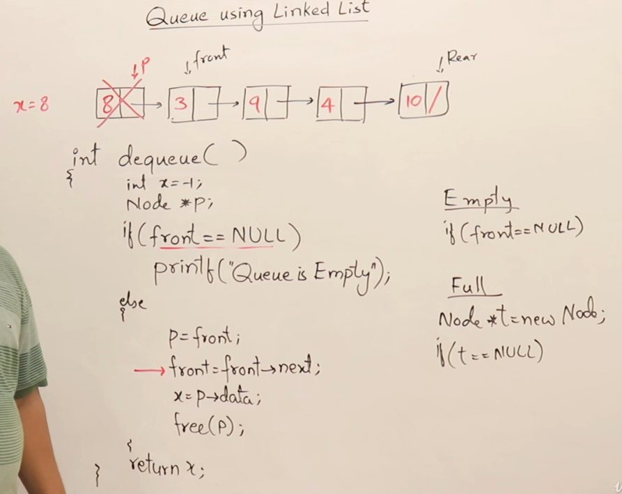

## Queue

## Introduction to Queue

## Queues using Array using single pointer

## Queue using two pointer

## Implementation of Queue using array

## Drawbacks of QUEUE using Array

## Circular Queue

## Queue Using linklist

## Double ended QUEUE DEQUEUE

## Priority Queues

## Queue Using 2 stack

