## Binary Search Tree
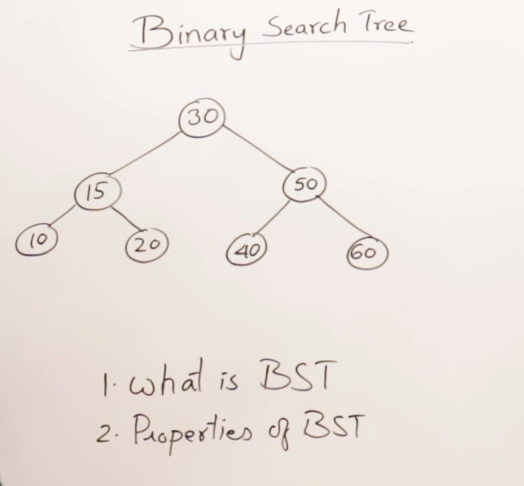
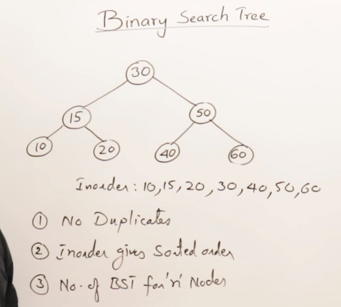
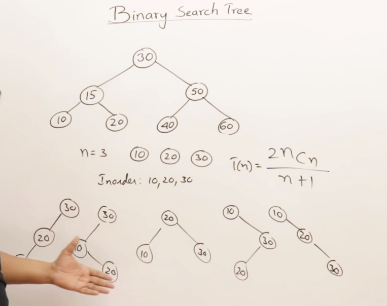
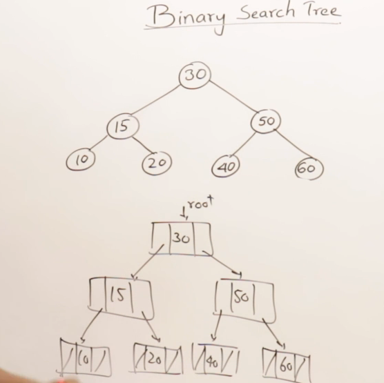

## Searching in a Binary Search Tree
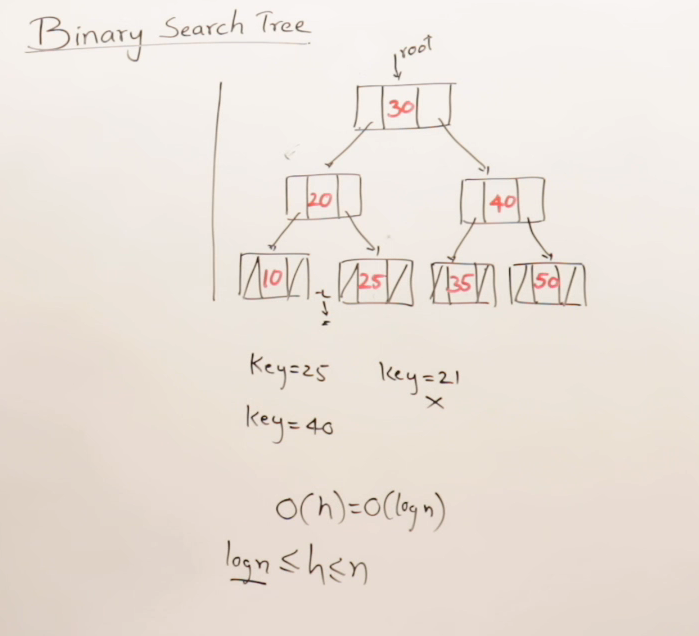
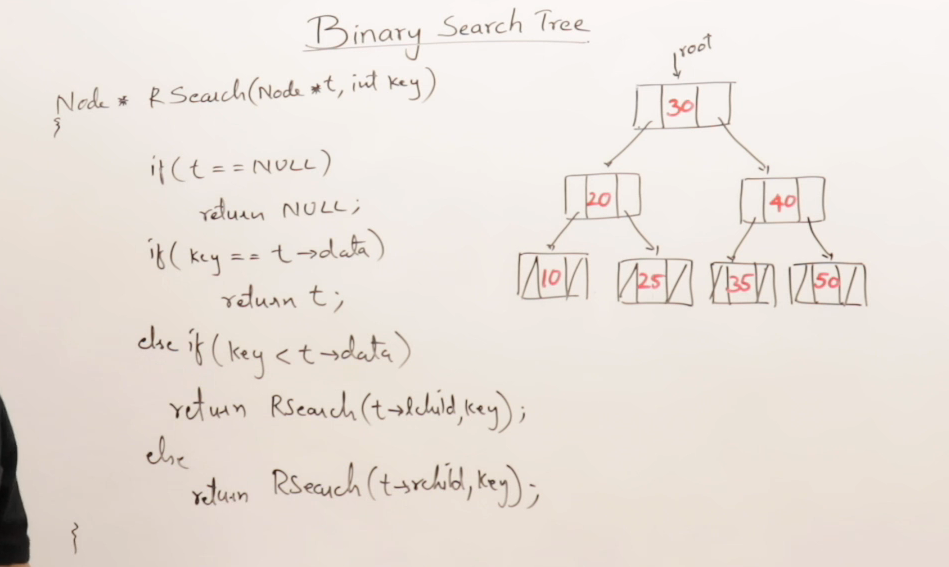
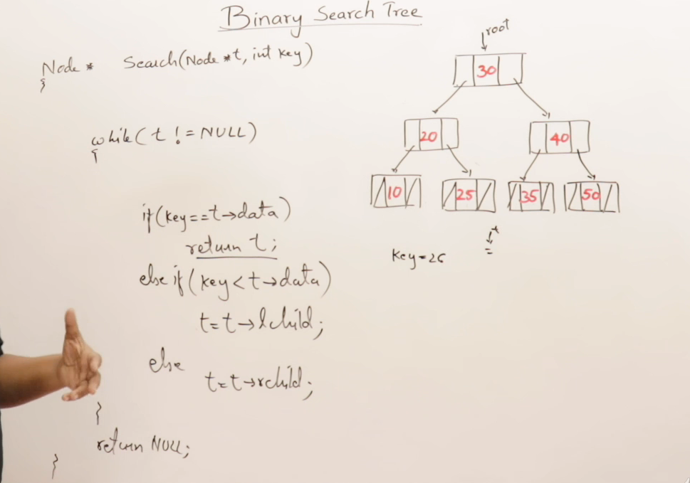

## Inserting in a Binary Search Tree
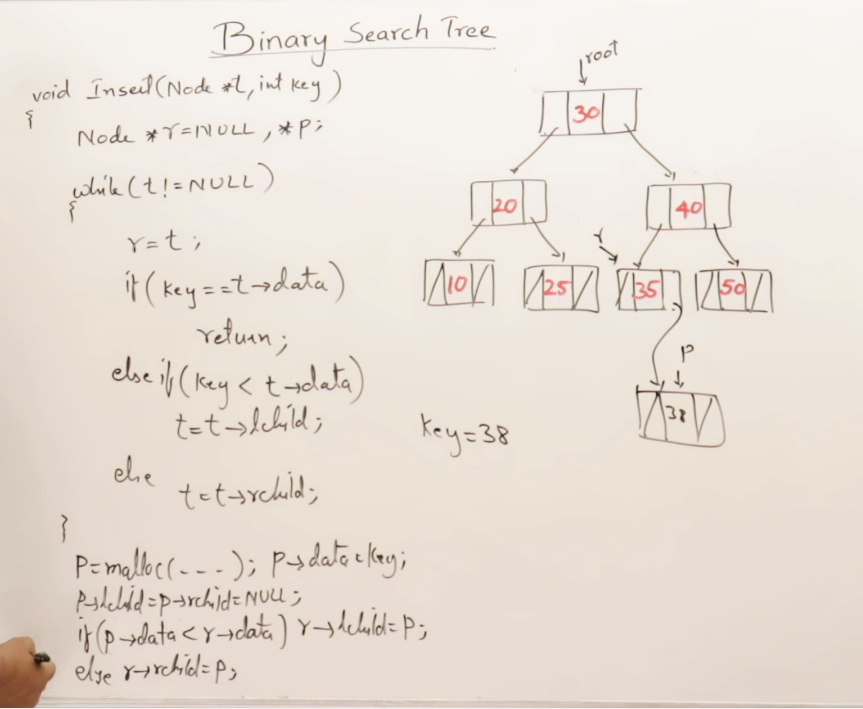

## Recursive Insert in Binary Search Tree
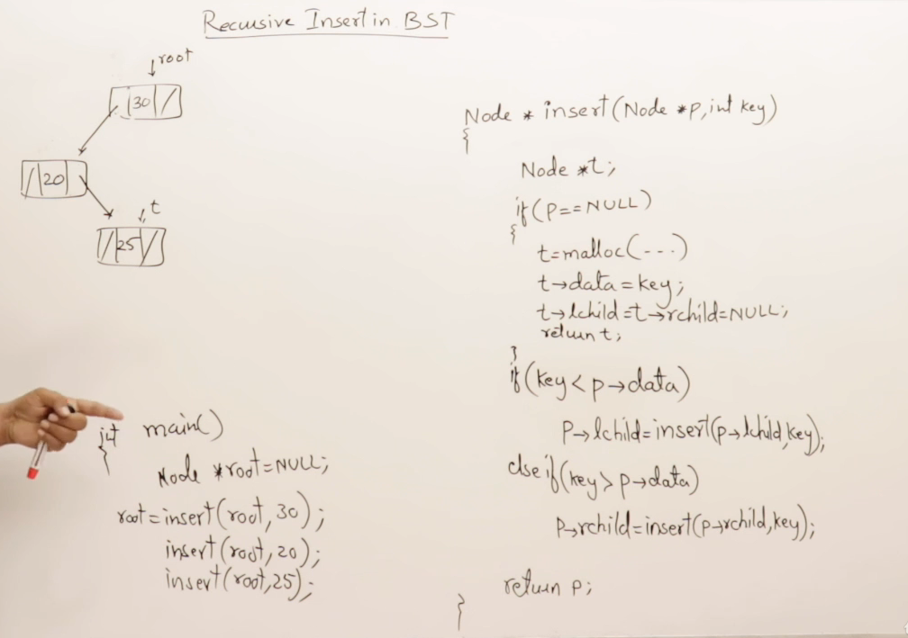

## Creating a Binary Tree
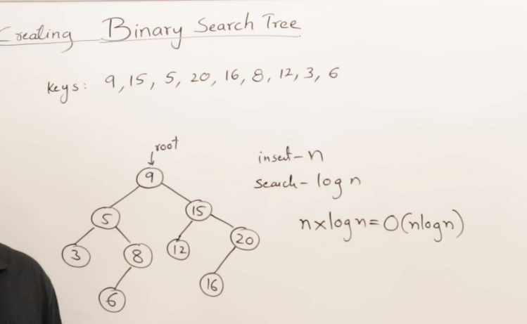

## Deleting from Binary Search tree
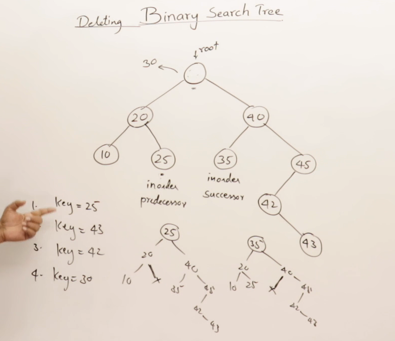
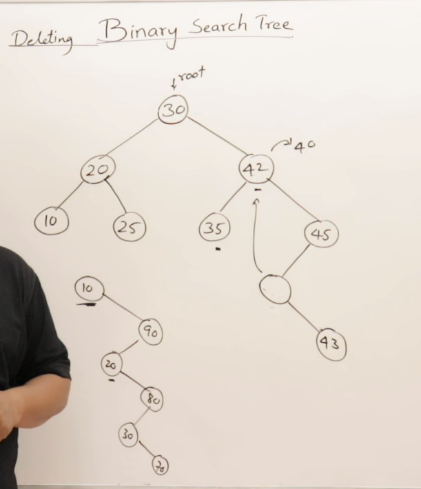
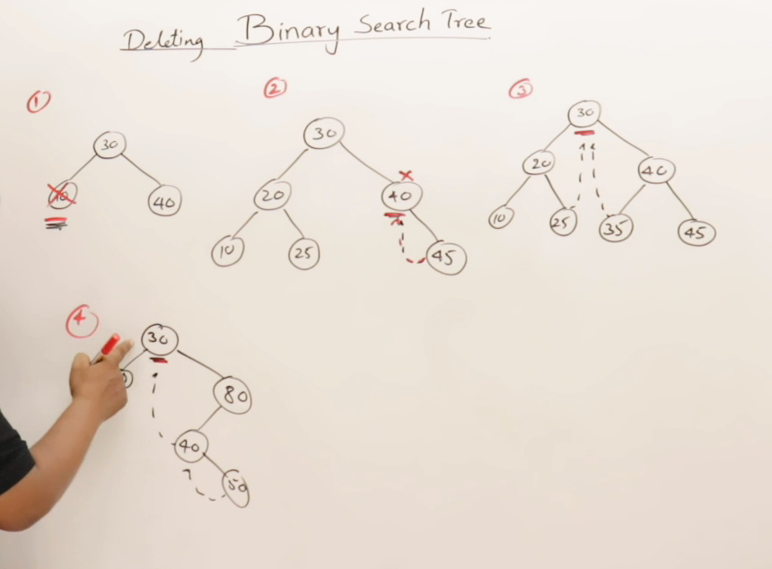

## Generating BST from preorder
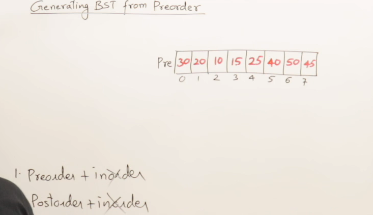
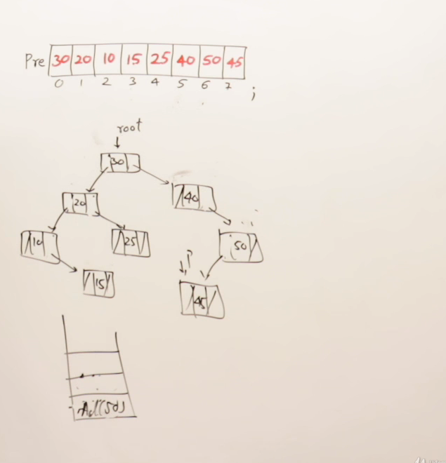

## Program for Generating BST from preorder
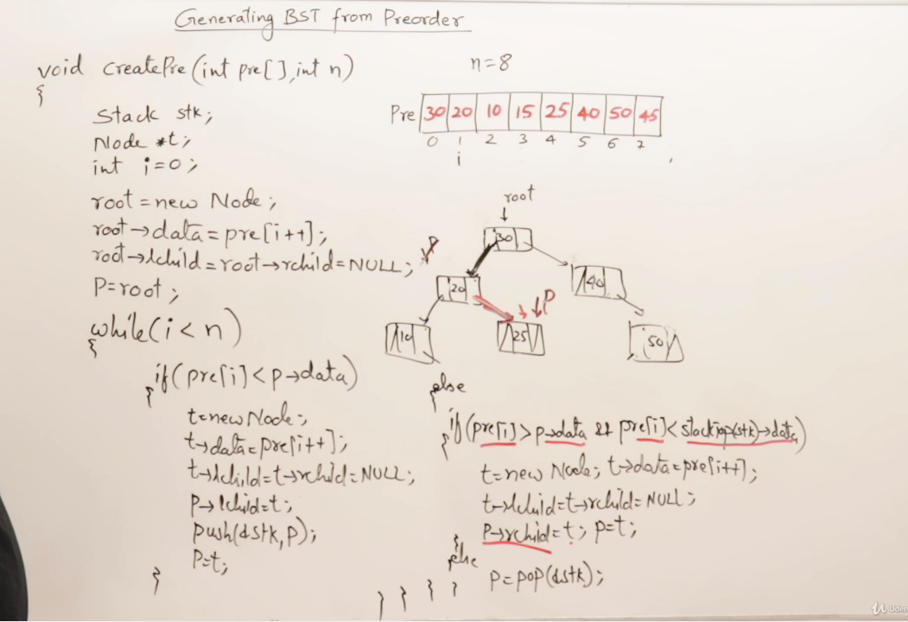

## Drawback of Binary Search Tree
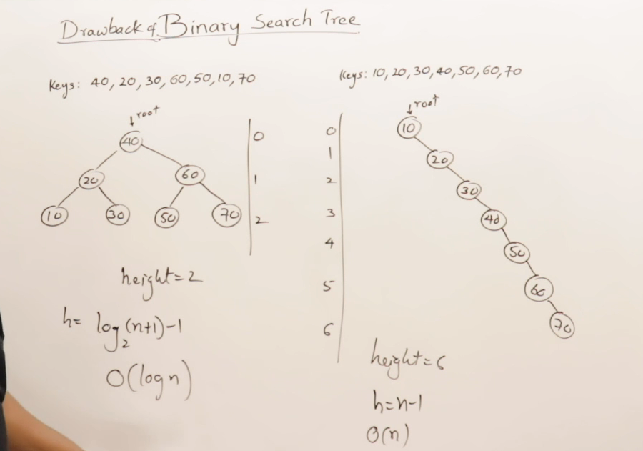