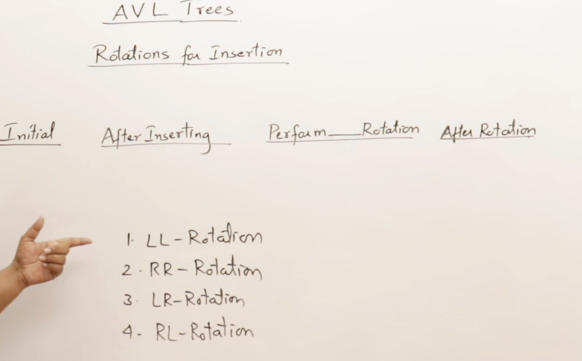
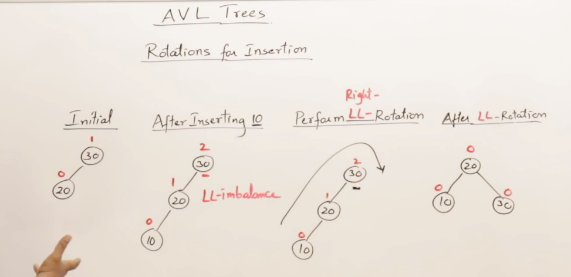

## AVL Tree
Height Balanced binary Tress

## Introduction to AVL Trees

## Inserting in AVL with Rotation

## General form of AVL Rotation

## Generating AVL Tree

## Deletion from AVL Tree with Rotation

## Height Analysis of AVL Trees

