## Binary Heap

## Introduction of Heap
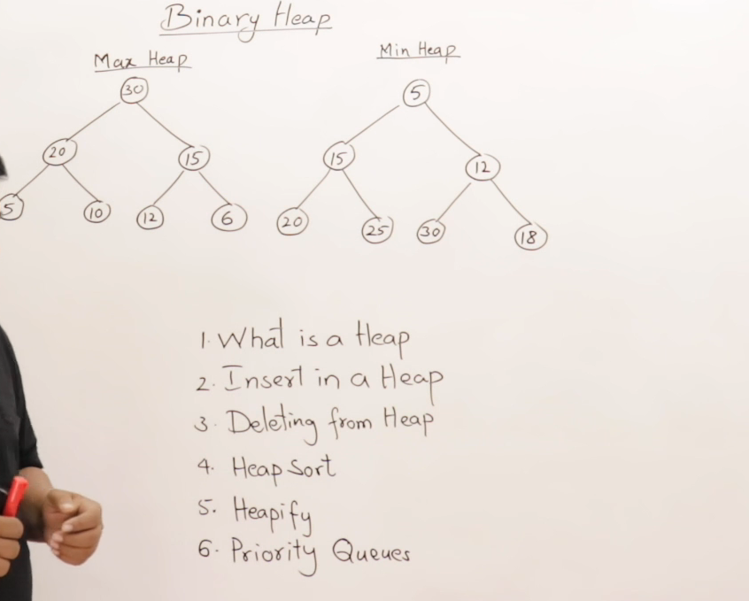
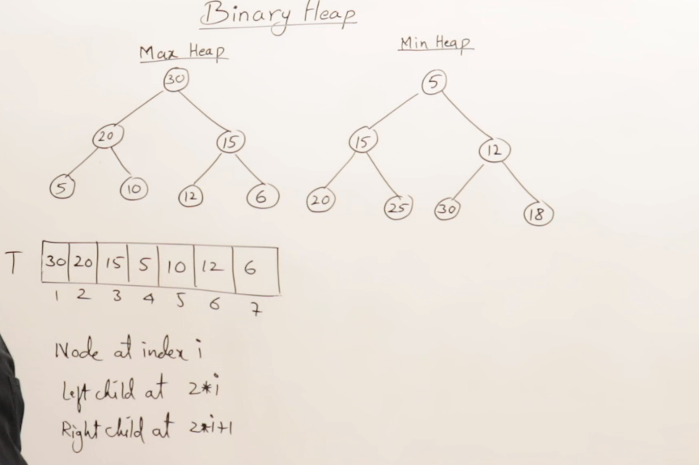
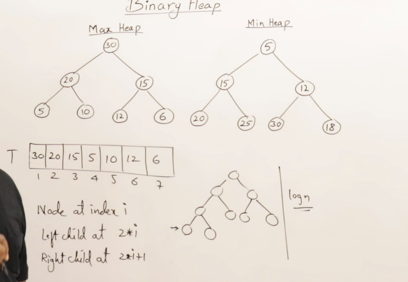

---

## Inserting in a Heap
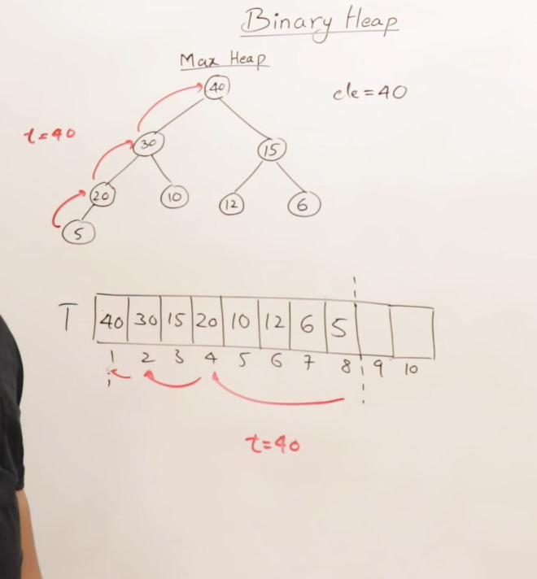
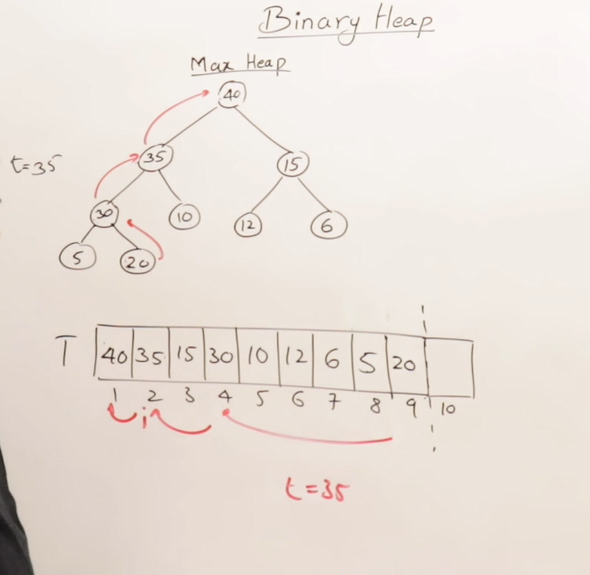

---

## Program to insert in a Heap
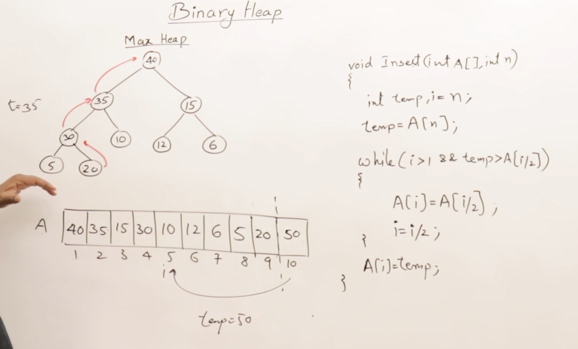

---

## Creating a Heap
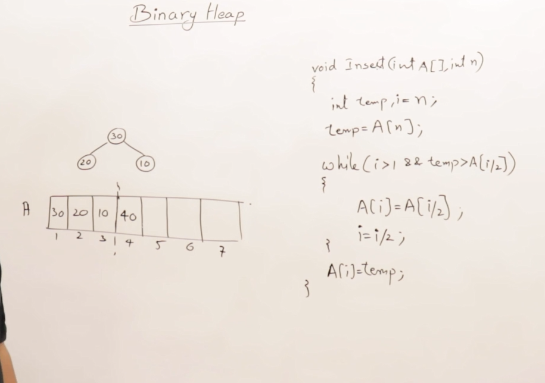
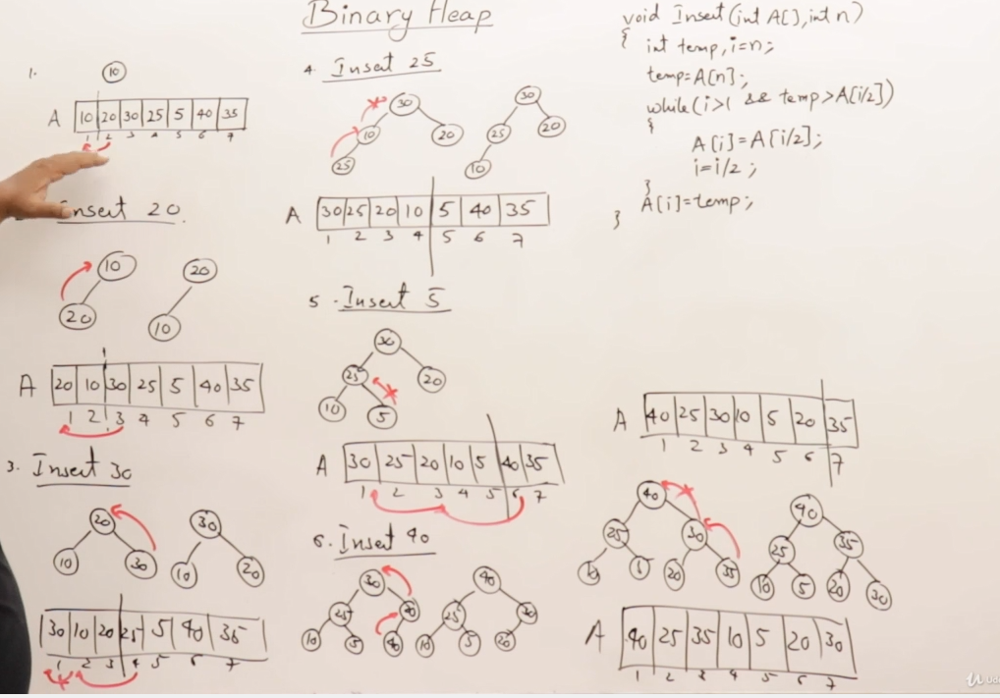
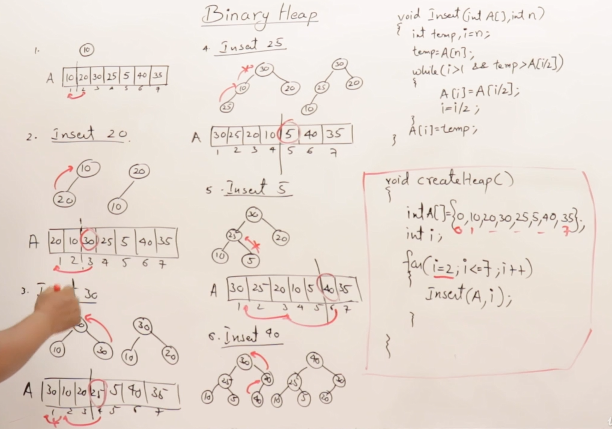
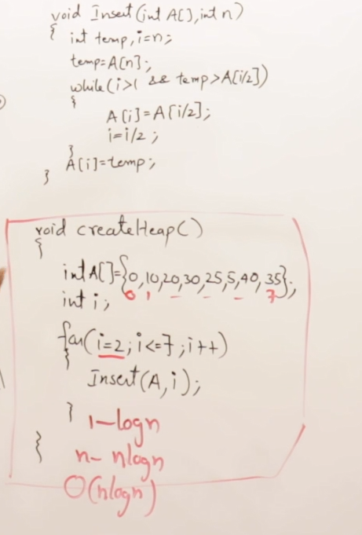

---

## Deletion from a Heap
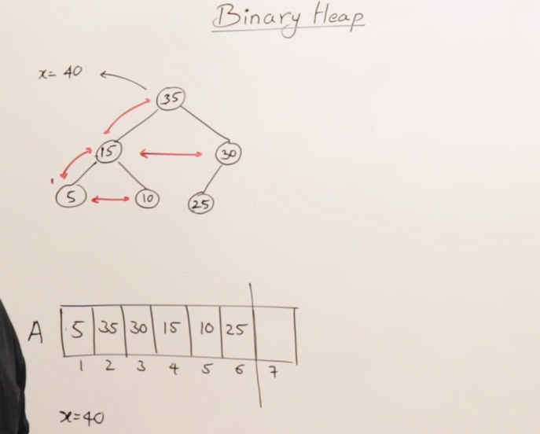
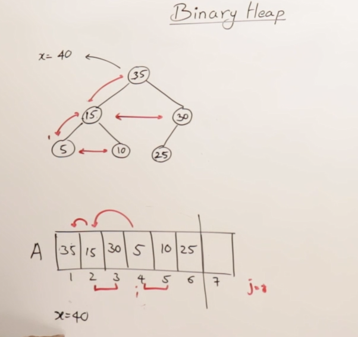
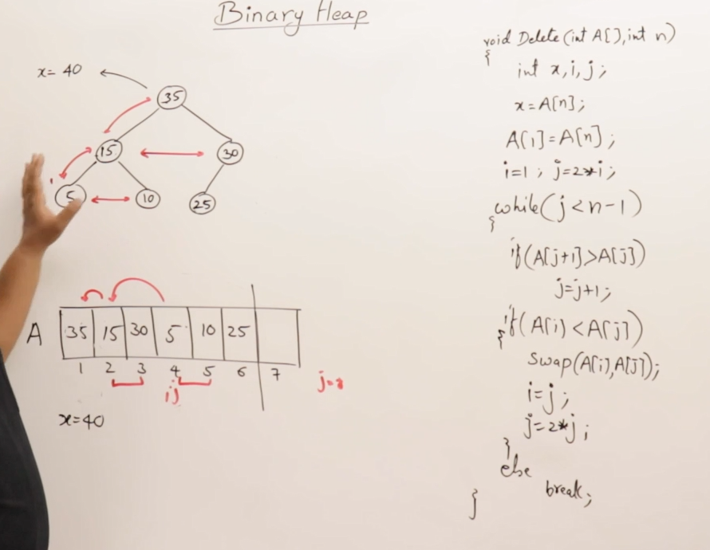
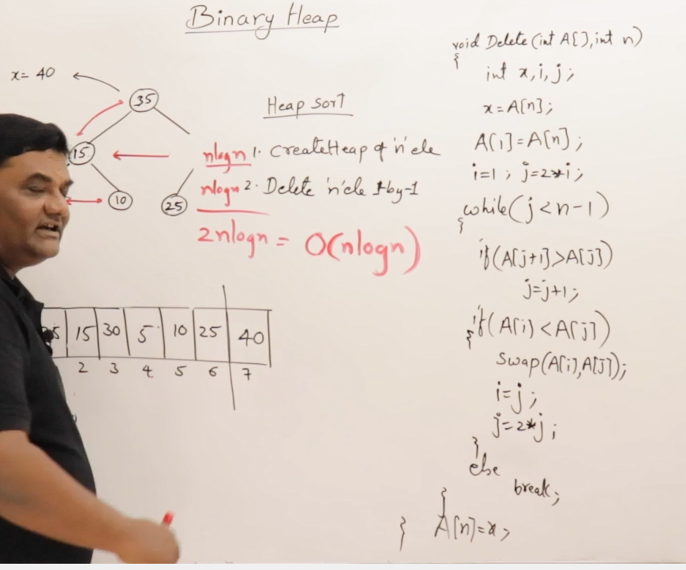

## Heapify
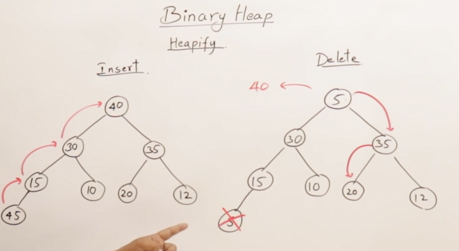
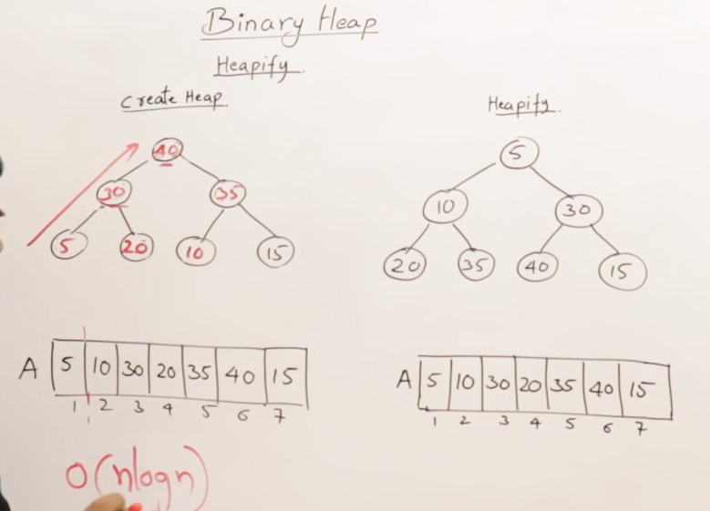
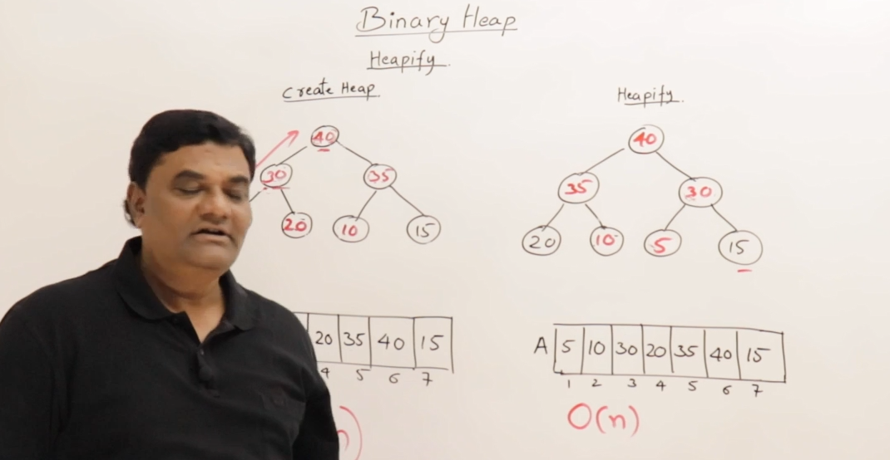

## Heap as Priority Queue
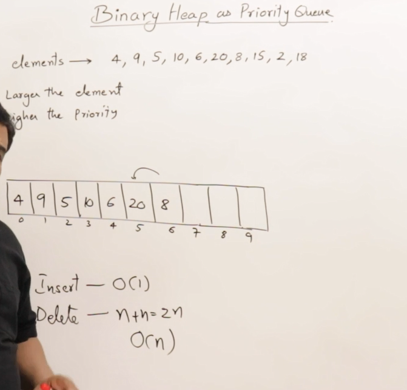
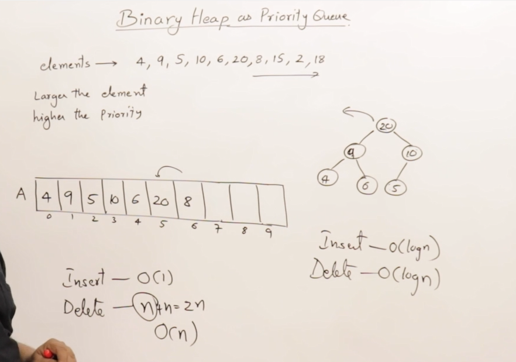


# 📚 Binary Heap

## 🔍 Overview
- What is a Heap?
- Insertion in a Heap
- Deletion from a Heap
- Understanding `Heapify`
- Priority Queues and their relation to Heaps

---

## 📘 What is a Heap?

A **Heap** is a special **complete binary tree** that satisfies one of the following properties:

### 🔸 1. Complete Binary Tree

A binary tree is *complete* if:
- All levels are fully filled **except possibly the last**.
- The last level has all keys as far left as possible.
- In array representation, **no blank spots** are allowed in between.

**Array Index Rule:**
```
Parent at index i:
Left Child  => 2i
Right Child => 2i + 1
```

### 🧠 Conceptual Diagram: Complete Binary Tree

```text
Index:    1   2   3   4   5   6   7
Values:  20  15  18  10  12  14  16
```

- Complete: No gaps between indices.
- If we remove a node (e.g., value at index 4), it becomes **incomplete**.

---

## 🏗️ Heap Types

### 🔹 Max Heap
- Every parent node has a value **greater than or equal to** its children.
- **Example:**  
  ```
       20
      /  \
    15    18
   / \    / \
  10 12  14 16
  ```

### 🔹 Min Heap
- Every parent node has a value **smaller than or equal to** its children.
- **Example:**
  ```
       5
      / \
     10 15
    / \
   20 25
  ```

---

## 🔁 Key Properties

- **Binary Heap is usually implemented using an array.**
- **Duplicates are allowed.**
- **Height of Heap = log(n)** (Because it's complete, height grows minimally).
- **Not used for search operations** (unlike Binary Search Trees).

---

## 🧮 Why Array Implementation?

Array is preferred because:
- Easy calculation of parent and child using indices.
- Space-efficient and cache-friendly.
- Avoids pointer overhead from linked representation.

---

## ⚙️ Operations (To Be Covered Later)

- **Insertion** into Heap
- **Deletion** from Heap
- **Heapify** procedure
- Using Heap for **Priority Queues**

---

## 📌 Summary

| Property         | Details                                      |
|------------------|----------------------------------------------|
| Type             | Complete Binary Tree                         |
| Usage            | Priority Queues, Heap Sort                   |
| Heap Types       | Max Heap, Min Heap                           |
| Representation   | Array (most common), Linked (rare)           |
| Efficiency       | Insert/Delete: O(log n), Search: Not Optimal |

Here’s a clean and clear summary of the transcript you provided. It's focused on **heap insertion in a max heap**, and formatted for easy understanding:

---

## 🛠️ Inserting an Element into a Max Heap

### 🎯 Goal:
Learn how to insert an element into a **Max Heap** while maintaining heap properties.

### 📌 Key Concepts:
- A **Max Heap** is a **complete binary tree** where every parent node is **greater than its children**.
- It is usually implemented as an **array**, with indexing starting at **1** for easier formula calculations.

---

### 🔢 Step-by-Step Insertion Procedure

#### 🧮 Example:
Inserting element `40` into the heap:

#### 1. **Insert at the Next Free Position**:
- Always insert the new element at the **next available index** to maintain **completeness** of the binary tree.
- For `40`, suppose it's inserted at index `8`.

#### 2. **Compare with Parent (Bubble Up)**:
- Compare the inserted element with its parent using index: `i // 2`.
- If the new element is **greater**, **swap** it with the parent.
- Continue this **bubble-up** process until the **heap property** is satisfied.

#### 3. **Repeat Until Root or Heap Property Maintained**:
- Keep moving the element up the tree until it is either at the root or **no longer greater** than its parent.

---

### 🔁 Inserting Another Element (`35`)

#### Steps:
- Insert `35` at index `9`.
- Compare it with its parent at `index 4`, then move up as needed (compare with `index 2`, and so on).
- Stop when the heap property is satisfied.

---

### 🧠 Notes:
- Always insert elements in **level order** (left to right).
- Use **temporary variables** to hold values during swaps.
- Maintain **complete binary tree structure** at all times.
- **Heapify-up** continues until no parent is smaller than the inserted element.

---

### ✅ Result:
After each insertion, elements are **rearranged** to restore the **max heap** property without violating the **complete binary tree** structure.

---

### 📌 Heap Insertion Procedure (Min/Max Heap)

To insert an element into a heap, follow these steps:

1. **Add the element at the end of the heap array**:
   - For example, insert `50` at index `n` (next available position).

2. **Initialize helper variables**:
   - Let `i = n` (current index of the new element).
   - Store the inserted element in a temporary variable: `temp = heap[i]`.

3. **Percolate up (heapify-up)**:
   - Repeat the following until either `i == 1` (reached the root) or `temp <= heap[i / 2]` (parent is greater for max heap or smaller for min heap):
     - Move the parent element `heap[i / 2]` down to `heap[i]`.
     - Set `i = i / 2`.

4. **Insert the `temp` at its correct position**:
   - Once the loop stops, assign `heap[i] = temp`.

---

### ⏱️ Time Complexity Analysis

- Each insertion involves moving up the tree (percolating).
- In a **complete binary heap**, the height is **log₂(n)**.
- Thus, the **time complexity for insertion** is:

  [O(log n)]

This log(n) complexity is both theoretically and practically confirmed from the loop behavior in the code — where `i` is repeatedly divided by 2.

---


# Max Heap Creation - In-Place Algorithm

This project demonstrates how to create a **max heap** using a simple, in-place algorithm. It builds upon the idea of inserting one element at a time into the heap while maintaining the heap properties.

---

## 📌 What is a Heap?

A **heap** is a special tree-based data structure that satisfies the heap property:

- In a **max heap**, for every node `i`, the value of `i` is **greater than or equal to** the values of its children.
- A heap is also a **complete binary tree**, meaning all levels are fully filled except possibly for the last, which is filled from left to right.

---

## 🧠 Concept

- Initially, only the **first element** of the array is considered to be in the heap.
- Remaining elements are inserted **one-by-one** into the heap using the insert operation.
- Each insertion maintains the **heap property** by comparing the newly added node with its parent and swapping them if needed.
- This process continues until all elements are added to the heap.

> **This is known as in-place heap creation** – it doesn't require extra memory or space, as the heap is built directly within the array.

---

## 📈 Example

Consider inserting the elements in the following order:

```
[30, 20, 10, 40, 15, 12, 25]
```

### Step-by-step Heap Building:

1. Begin with first element: `[30]` → Heap of size 1
2. Insert 20 → `[30, 20]`
3. Insert 10 → `[30, 20, 10]`
4. Insert 40 → Swaps with 10 → Then swaps with 30 → `[40, 30, 10, 20]`
5. Insert 15 → Compared but no swap needed → `[40, 30, 10, 20, 15]`
6. Insert 12 → Compared but no swap needed → `[40, 30, 12, 20, 15, 10]`
7. Insert 25 → Swaps with 12 → `[40, 30, 25, 20, 15, 10, 12]`

---

## 💡 In-Place Heap Creation Algorithm

No additional array or data structure is used. Only a single array is manipulated.

```cpp
void createHeap(int arr[], int n) {
    for (int i = 2; i <= n; i++) {
        insert(arr, i);
    }
}
```

Each element (starting from index 2) is inserted using the `insert` function, which ensures the max-heap property is maintained.

---

## ⚙️ Time Complexity

- **Insert Operation**: O(log n)
- **Creating Heap** (for `n` elements):  
  **O(n log n)** in worst-case  
  But can be optimized to **O(n)** using heapify (not covered here)

---

## 🧪 Demo Structure

- Elements are inserted one by one
- Every insertion step is followed by swapping (if needed) up the tree
- After all insertions, the array represents a valid max heap

---

## ✅ Final Heap Example

After inserting all elements:  
```
Input: [30, 20, 10, 40, 15, 12, 25]
Heap:  [40, 30, 25, 20, 15, 10, 12]
```

---

## 📚 References

- Heap Data Structure
- In-place algorithms
- Binary Tree properties

---

# 🧮 Heap Deletion & Heap Sort
---

## 📌 Key Concepts

### 🔺 Max Heap Recap
- A **Max Heap** is a complete binary tree where the **largest element is always at the root**.
- You can **only delete the root element**, not any arbitrary node.

---

## 🗑️ Deleting the Root from a Max Heap

### ✅ Steps:

1. **Delete the root (largest element).**
2. **Move the last element in the heap to the root's position.**
3. **Restore the Max Heap property** by *percolating down* the new root:
   - Compare with its children.
   - Swap with the **larger child** if it's smaller.
   - Repeat until the Max Heap property is restored.

### 🔁 Algorithm Summary:
```pseudo
delete(heap, size):
  x = heap[0]          // Save root element
  heap[0] = heap[size] // Move last to root
  size -= 1            // Reduce heap size

  i = 0
  while i has a child:
    j = index of larger child
    if heap[i] < heap[j]:
      swap(heap[i], heap[j])
      i = j
    else:
      break

  heap[size + 1] = x   // Store deleted value at end
```

---

## 📚 Example

Initial Max Heap:
```
         40
       /    \
     35      30
    /  \    /  \
  15   10  25   5
```

After deleting 40:
- Move 5 to root
- Reheapify: 5 → 35 → 15

New Heap:
```
         35
       /    \
     15      30
    /  \    / 
  5   10  25  
```

Deleted Elements: [40]

---

## 📦 Heap Sort

**Heap Sort** works by:
1. **Building a Max Heap** from an unsorted array.
2. **Deleting the root repeatedly**, storing each deleted element at the end.
3. The result is a sorted array in **ascending order**.

### 🎯 Steps:
1. Construct the heap.
2. Repeat:
   - Delete root (max)
   - Store it at the end
   - Reheapify
3. Done when all elements are removed from heap section.

### 🔁 Time Complexity
- **Build Heap:** O(n)
- **Delete (per element):** O(log n)
- **Total Heap Sort:** O(n log n)

---

## ✅ Key Takeaways

- You can only delete the **highest-priority (root)** element in a heap.
- After deleting, **restore the heap** using the last element and percolate down.
- Repeating this gives you **Heap Sort**, a powerful O(n log n) sorting algorithm.

---

## 🧠 Pro Tip

Use an array to represent the heap. After every deletion, store the deleted element in the last free index. Eventually, the array will become sorted in ascending order.

---
Here is an updated and detailed section for your **README.md** file based on the latest transcript, covering the **C implementation of Max Heap and Heap Sort**, including **insert**, **delete**, and **heap sort** logic:

---

## 🧑‍💻 Max Heap and Heap Sort in C

### 📋 Overview

This section presents the complete implementation of a **Max Heap** in C, covering the following operations:

- Insert elements into the heap
- Delete elements from the heap (only the root)
- Perform Heap Sort using heap operations

The heap is implemented using an array, and the sorting happens **in-place** using the heap property.

---

### 🧱 Initial Setup

- Heap is implemented using an array of size `n+1`.
- **Index 0 is unused** for easier parent-child calculations.
- Elements are stored from index 1 onward.
- For any element at index `i`:
  - Parent: `i / 2`
  - Left child: `2 * i`
  - Right child: `2 * i + 1`

---

### 🔧 Insert Operation

```c
void insert(int H[], int n) {
    int i = n, temp = H[i];
    while (i > 1 && temp > H[i / 2]) {
        H[i] = H[i / 2]; // Move parent down
        i = i / 2;       // Move up the tree
    }
    H[i] = temp;         // Place at correct position
}
```

- Inserts a new element at the end and **bubbles it up** to maintain max heap property.
- Called in a loop to build the heap from an array.

---

### ❌ Delete Operation (Root Element Only)

```c
int delete(int H[], int n) {
    int x = H[1];               // Element to delete (root)
    int i = 1, j = 2 * i;
    int temp = H[n];
    H[1] = temp;                // Move last element to root

    while (j <= n - 1) {
        if (j < n - 1 && H[j + 1] > H[j])
            j++;                // Select larger child
        if (H[i] < H[j]) {
            // Swap parent and child
            int t = H[i];
            H[i] = H[j];
            H[j] = t;
            i = j;
            j = 2 * i;
        } else {
            break;
        }
    }
    H[n] = x; // Store deleted value at the end (used for heap sort)
    return x;
}
```

- Removes the **root element**, replaces it with the last element, and **bubbles it down** to restore heap.
- The deleted element is moved to the end of the array (useful for heap sort).

---

### 🌀 Heap Sort Logic

```c
// Building the heap
for (int i = 2; i <= n; i++) {
    insert(H, i);
}

// Deleting from heap one by one
for (int i = n; i > 1; i--) {
    delete(H, i);
}
```

- First, build a max heap from the array.
- Then, repeatedly delete the root element.
- The deleted elements are stored at the end of the array, resulting in **ascending order**.

---

### ✅ Output Example

Given input elements:
```text
0 (ignored), 30, 35, 5, 40, 25, 10, 15
```

After Heap Sort:
```text
5 10 15 25 30 35 40
```

---

### 🧪 Notes

- `insert()` ensures the heap property during element addition.
- `delete()` always removes the max element (root) and places it at the last available index.
- The heap sort leverages this by **storing deleted elements at the end**, resulting in sorted order.

---

### 📌 Final Thoughts

- This C program is a simple and efficient implementation of **Max Heap and Heap Sort**.
- Great for understanding **heap data structures**, **priority queues**, and **sorting in-place**.

---

Here’s a detailed and well-structured addition to your **README.md** file based on the final transcript. This section covers the concept and implementation of the **heapify procedure** in Max Heaps and contrasts it with the traditional insert-based heap creation.

---

## ⚙️ Heapify in Max Heap (Efficient Heap Creation)

### 🧩 What is Heapify?

**Heapify** is a bottom-up procedure for converting a binary tree (usually represented as an array) into a valid **Max Heap**. It is more efficient than inserting elements one by one using the traditional insert operation.

---

### 🔍 Key Observations

#### 🔄 Insert-Based Heap Construction
- Insertion inserts one element at a time.
- Each new element is added at the end and bubbled **upwards (leaf to root)**.
- Each insert operation can take up to `O(log n)` time.
- Total time complexity: **O(n log n)**

#### 🔽 Heapify-Based Heap Construction
- Starts from the **last internal node** and proceeds **downward (root to leaves)**.
- Uses comparisons and swaps with children to maintain the max heap property.
- Most of the elements (leaves) are ignored in the process.
- Total time complexity: **O(n)**

---

### 📌 Insert vs. Delete vs. Heapify

| Operation     | Direction of Adjustment | Time per Element | Use Case                  |
|---------------|-------------------------|------------------|---------------------------|
| Insert        | Leaf → Root             | O(log n)         | Building heap incrementally |
| Delete (root) | Root → Leaf             | O(log n)         | Removing max element       |
| **Heapify**   | Root → Leaf             | O(1)–O(log n)    | **Efficient heap construction** |

---

### 🧠 How Heapify Works (Conceptually)

Given an array representation of a binary tree:
```text
Index:  1   2   3   4   5   6   7   8   9
Values: 5  10  30  20  35  25  40  15
```

To apply `heapify`, do the following:
1. Start from the last internal node (i.e., `n/2`) and move **backwards** to the root.
2. At each node, compare the value with its **largest child**.
3. If the parent is smaller, **swap** with the larger child and continue downwards.
4. Skip the leaves (they’re already heaps of size 1).

---

### 🛠️ Heapify Pseudocode

```c
void heapify(int H[], int n, int i) {
    int largest = i;
    int left = 2 * i;
    int right = 2 * i + 1;

    if (left <= n && H[left] > H[largest])
        largest = left;
    if (right <= n && H[right] > H[largest])
        largest = right;

    if (largest != i) {
        swap(H[i], H[largest]);
        heapify(H, n, largest); // Recursively heapify the affected subtree
    }
}
```

### 🔄 Build Max Heap using Heapify

```c
void buildHeap(int H[], int n) {
    for (int i = n / 2; i >= 1; i--) {
        heapify(H, n, i);
    }
}
```

---

### ✅ Benefits of Heapify

- **Efficient**: Runs in **O(n)** time.
- **Simple**: Easy to implement and avoids repeated insertions.
- **Scalable**: Best suited for large data sets needing heap sorting or priority queue processing.

---

### 📌 Visual Insight

- **Insert-based approach** adjusts from **leaf to root** for each element.
- **Heapify** adjusts from **root to leaf**, processing only internal nodes.
- Direction matters: 
  - Insertion: upward bubbling.
  - Heapify: downward pushing.

---

### 🧪 Final Result

After applying `buildHeap()` on the example array:
```text
Heapified Array (Max Heap): [40, 35, 30, 15, 10, 25, 5, 20]
```

All parent nodes are greater than their children. ✅

---

Here’s a detailed section you can add to your **README.md** to summarize the transcript about **Binary Heap as Priority Queue**. This includes the motivation, structure, operations, performance, and usage of heaps (Max Heap or Min Heap) to implement a priority queue efficiently.

---

## 📌 Binary Heap as a Priority Queue

A **priority queue** is an abstract data structure where each element has a priority. Elements are inserted arbitrarily, but deletion always removes the element with the **highest priority**.

---

### 🧠 Key Concepts

- **Each element** is associated with a priority.
- **Insertion** happens arbitrarily (element + priority).
- **Deletion** always removes the **highest-priority** element.
- **Highest priority** may depend on:
  - **Larger number = higher priority** → use a **Max Heap**.
  - **Smaller number = higher priority** → use a **Min Heap**.

---

### 🔄 Naive Implementation (Array-Based)

Inserting elements into an array is easy:
- Insertion: **O(1)** (append at end).
- Deletion:
  - Must **search** for max/min: **O(n)**.
  - **Shift** elements: up to **O(n)**.
  - **Total deletion time**: **O(n)** worst case.

> ❌ Not efficient for large-scale use.

---

### ✅ Efficient Priority Queue Using Binary Heap

A **Binary Heap** (Max or Min) provides efficient insertions and deletions:

| Operation | Max Heap Behavior                 | Time Complexity |
|-----------|-----------------------------------|-----------------|
| Insert    | Inserts at end and bubbles up     | `O(log n)`      |
| Delete    | Removes root and heapifies down   | `O(log n)`      |
| Find Max  | Always available at root (index 1)| `O(1)`          |

#### 📍 Why a Heap Works Well
- The **largest element** (Max Heap) is always at the root.
- When deleted, the last element replaces root, and **heapify-down** restores structure.
- Both **insert** and **delete** balance the tree via `log n` operations.

---

### ⚙️ Example: Max Heap as a Priority Queue

**Priorities:** 4, 9, 5, 10, 6, 8, 3

#### Insertions (Max Heap):
- Insert 4 → Root.
- Insert 9 → Bubbles to root (priority ↑).
- Insert 5 → No bubble.
- Insert 10 → Bubbles to top.
- Insert 6, 8, 3 → Heap adjusts via swaps.

The heap after insertions maintains the highest-priority (largest) at the top.

#### Deletions:
- Remove root (10).
- Replace with last element, heapify down.
- Next deletion removes next highest (9), and so on.

> ✅ Each deletion takes only **O(log n)**.

---

### 🧭 Priority Type vs. Heap Type

| Priority Rule                   | Heap Type |
|--------------------------------|-----------|
| Larger number = Higher priority | Max Heap  |
| Smaller number = Higher priority | Min Heap  |

> Choose heap type based on how your priority is defined.

---

### 🧮 Time Complexity Comparison

| Implementation     | Insert Time | Delete Time | Find Max/Min |
|--------------------|-------------|-------------|---------------|
| **Array (unsorted)**  | O(1)        | O(n)        | O(n)          |
| **Array (sorted)**    | O(n)        | O(1)        | O(1)          |
| **Binary Heap**       | O(log n)   | O(log n)   | O(1)          |

> 🏆 **Binary Heap** provides a **balanced** and **efficient** implementation for priority queues.

---

### 🏁 Conclusion

- Binary Heaps are optimal for implementing **Priority Queues**.
- Both **insertion and deletion** are efficient at `O(log n)` time.
- Choose **Max Heap** or **Min Heap** based on your application's priority rules.
- Widely used in scheduling, simulation systems, Dijkstra’s algorithm, etc.

---
