## Sorting Techniques

## Criteria used for Analysing Sorts
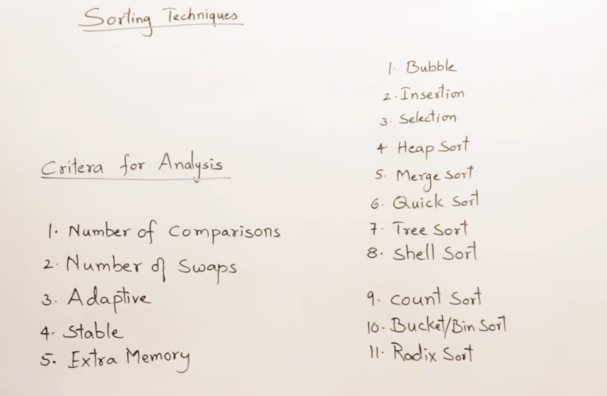
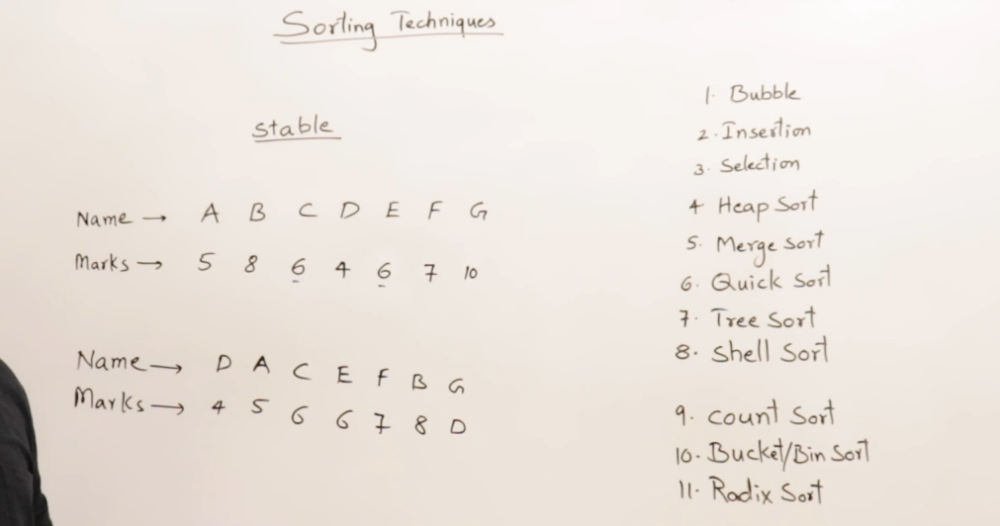
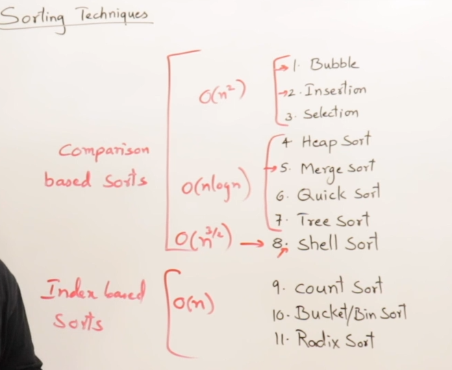

## Bubble Sort
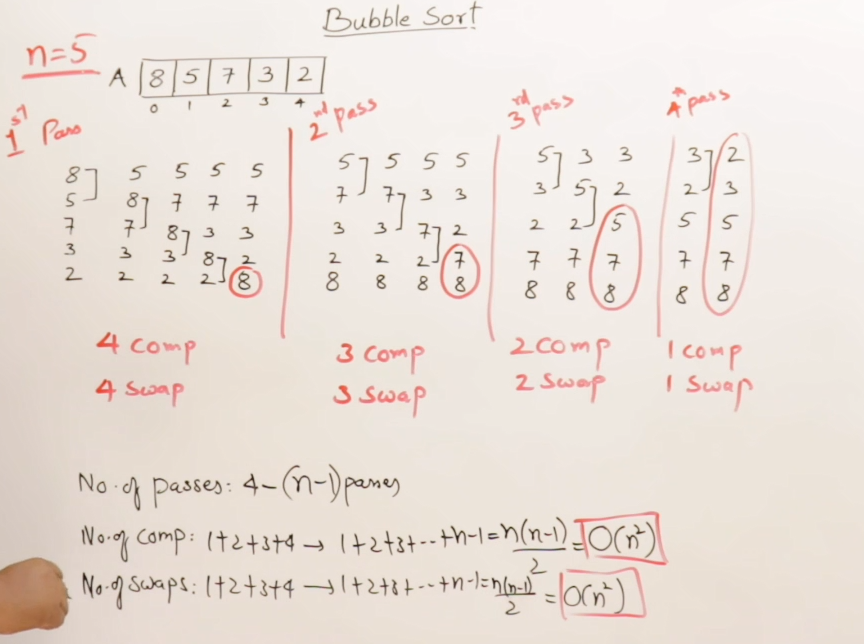
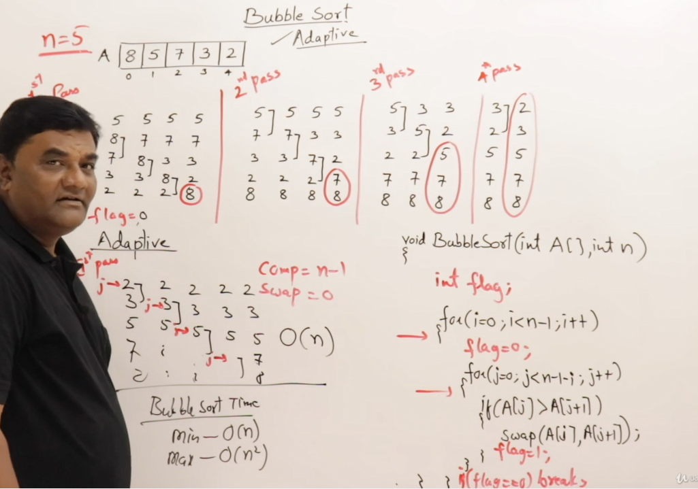
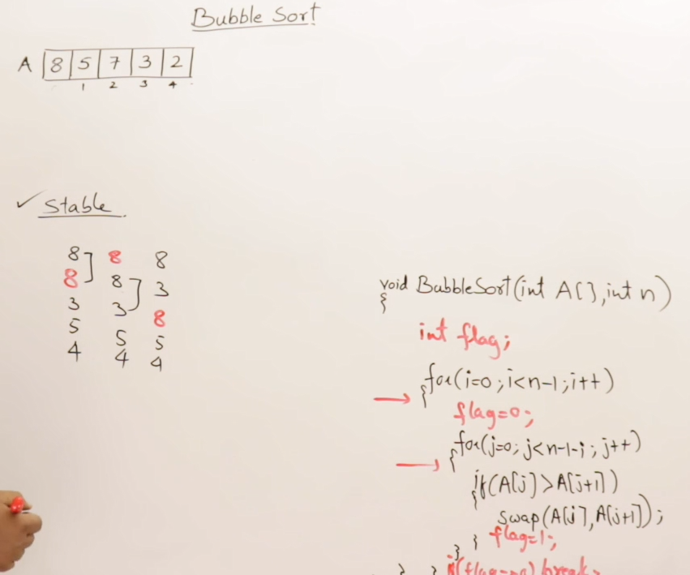

## Insertion Sort
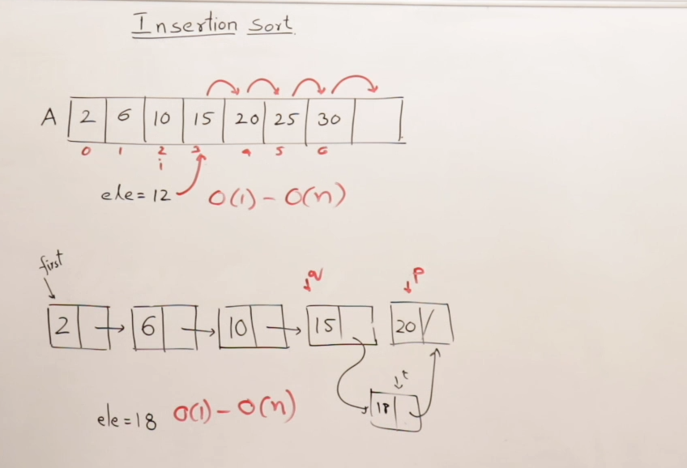
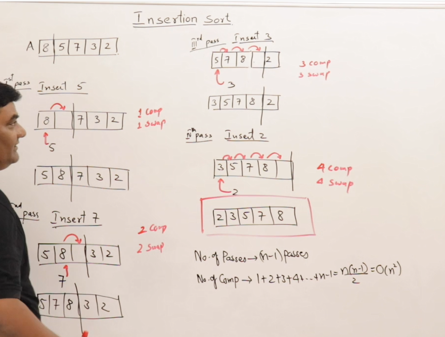
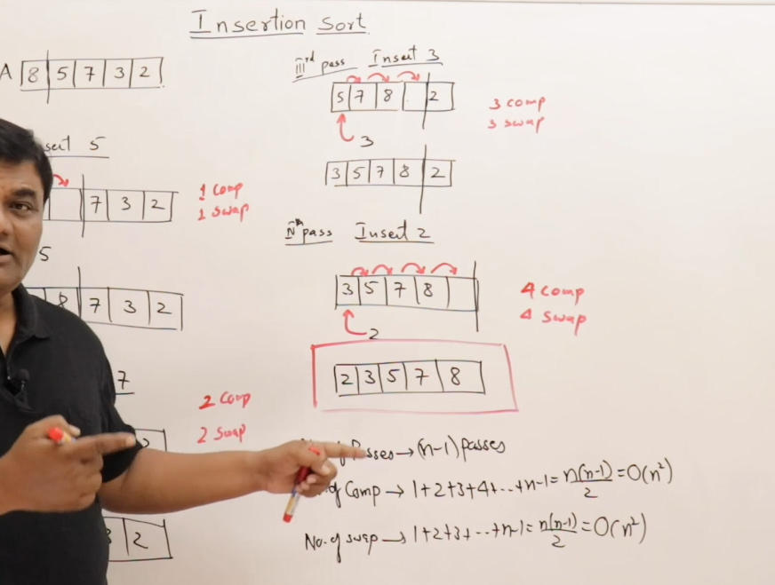

## Program for Insertion Sort
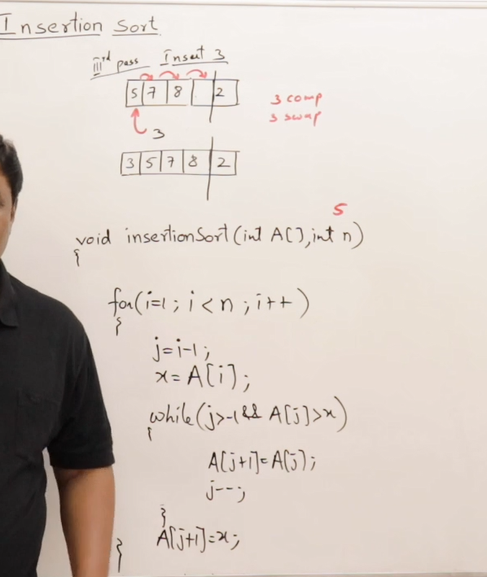

## Analysis of Insertion Sort
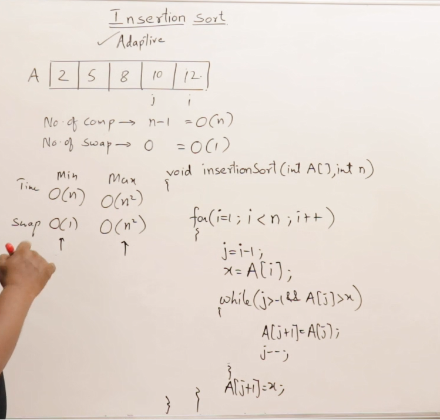


## Comparision of Bubble and Insertion Sort
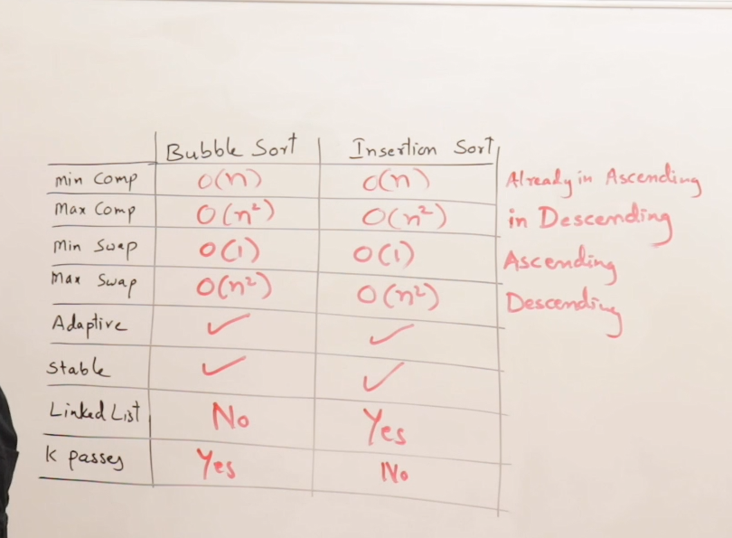


---

# 📚 Sorting Techniques - Overview & Analysis

This document provides an overview of various **sorting techniques**, the **criteria** used to analyze them, and a **categorization** based on their behavior and efficiency.

---

## 🔍 Introduction

Sorting techniques are essential for organizing data in a specific order (increasing or decreasing). There is no single "best" sorting algorithm — the choice depends on the context and the performance criteria required.

---

## 📊 Criteria for Analyzing Sorting Techniques

Sorting algorithms are analyzed based on several important factors:

1. **Number of Comparisons**
   - Refers to how many times elements are compared during sorting.
   - Determines **time complexity**.

2. **Number of Swaps**
   - Measures how often elements are swapped.
   - Helps estimate the **operational cost**.

3. **Adaptiveness**
   - An algorithm is **adaptive** if it performs better when the input list is already partially or fully sorted.
   - Adaptive algorithms take **less time** for sorted or nearly-sorted inputs.

4. **Space Complexity**
   - Indicates if the algorithm requires **extra memory** apart from the input data.
   - Algorithms that use more memory are often faster but less space-efficient.

5. **Stability**
   - A **stable** sorting algorithm maintains the relative order of equal elements (duplicates).
   - Crucial when sorting records on multiple keys (e.g., first by name, then by marks).
   - Example:
     - Original: C (6), E (6)
     - After sorting: C (6) should remain before E (6) if sorted based on marks only.

---

## 📦 Importance of Stability in Databases

- Stability is especially important when sorting **records** with multiple fields (e.g., student names and marks).
- Ensures **secondary sort keys** do not disturb the order established by primary keys.
- Common requirement in **database systems**.

---

## 🧮 Types of Sorting Algorithms

Sorting algorithms are categorized in two primary ways:

### 1. **Comparison-Based Sorting**
   These algorithms compare elements to determine order:
   - **Bubble Sort**
   - **Selection Sort**
   - **Insertion Sort**
   - **Merge Sort**
   - **Quick Sort**
   - **Heap Sort**
   - **Shell Sort**
   - **Tim Sort**

### 2. **Index-Based Sorting (Non-Comparison)**
   Use keys or positions for sorting:
   - **Counting Sort**
   - **Radix Sort**
   - **Bucket Sort**

---

## ⏱ Time Complexity Overview

- **O(n²) Algorithms (Slower)**:
  - Bubble Sort
  - Selection Sort
  - Insertion Sort

- **O(n log n) Algorithms (Faster)**:
  - Merge Sort
  - Quick Sort
  - Heap Sort

- **Faster but More Space-Consuming**:
  - Counting Sort
  - Radix Sort
  - Bucket Sort

---

## 🔧 Performance Summary

| Algorithm Type       | Time Complexity | Space Usage | Adaptive | Stable |
|----------------------|------------------|-------------|----------|--------|
| Bubble Sort          | O(n²)           | Low         | Yes      | Yes    |
| Selection Sort       | O(n²)           | Low         | No       | No     |
| Insertion Sort       | O(n²)           | Low         | Yes      | Yes    |
| Merge Sort           | O(n log n)      | High        | No       | Yes    |
| Quick Sort           | O(n log n) avg  | Low         | No       | No     |
| Heap Sort            | O(n log n)      | Low         | No       | No     |
| Counting Sort        | O(n + k)        | High        | No       | Yes    |
| Radix Sort           | O(nk)           | High        | No       | Yes    |
| Bucket Sort          | O(n + k)        | High        | No       | Depends|

> Note: Detailed stability/adaptiveness analysis will be done per algorithm.

---

## 🚀 What's Next

We’ll start exploring these sorting algorithms **one by one**, beginning with **Bubble Sort**. Each will be discussed and analyzed in terms of the criteria mentioned above.
---

## 📚 Bubble Sort: Explained

### 🔹 Overview
Bubble Sort is a simple comparison-based sorting algorithm. It repeatedly steps through the list, compares adjacent elements, and swaps them if they are in the wrong order. The process repeats until the list is sorted.

### 🔹 How It Works
- Given a list of `n` elements, Bubble Sort performs **n - 1 passes**.
- In each pass, it compares **adjacent elements** and swaps them if needed.
- After each pass, the **largest unsorted element** settles at its correct position (like a bubble rising to the top—hence the name).

### 🔹 Step-by-Step Example
Given array: `[5, 8, 7, 3, 2]`

- **Pass 1**: Largest element `8` moves to the end.
- **Pass 2**: Next largest `7` settles in second-last position.
- **Pass 3**: `5` moves to its correct spot.
- **Pass 4**: Final pass ensures all elements are sorted.

Total passes = `n - 1 = 5 - 1 = 4`

---

## 🔢 Time & Space Complexity

| Case           | Time Complexity | Swaps | Notes                    |
|----------------|-----------------|-------|---------------------------|
| Best (Sorted)  | O(n)            | 0     | With optimization (flag) |
| Worst Case     | O(n²)           | O(n²) |                         |
| Average Case   | O(n²)           | O(n²) |                         |
| Space          | O(1)            |       | In-place sorting         |

- **Comparisons**: `(n-1) + (n-2) + ... + 1 = n(n-1)/2` → **O(n²)**
- **Swaps**: Max = O(n²), actual depends on input

---

## 🔁 Code Logic (Pseudocode)
```python
def bubble_sort(arr):
    n = len(arr)
    for i in range(n - 1):           # n-1 passes
        flag = 0                     # Track swaps
        for j in range(n - 1 - i):   # Reduce comparisons each pass
            if arr[j] > arr[j + 1]:
                arr[j], arr[j + 1] = arr[j + 1], arr[j]
                flag = 1             # A swap occurred
        if flag == 0:                # No swaps => list is sorted
            break
```

---

## ✅ Properties

| Property     | Status       | Description                                                                 |
|--------------|--------------|-----------------------------------------------------------------------------|
| **Stable**   | ✅ Yes       | Equal elements maintain original order                                      |
| **Adaptive** | ✅ Yes       | Optimized version stops early if already sorted                             |
| **In-place** | ✅ Yes       | Does not require extra space                                                |
| **Simple**   | ✅ Yes       | Easy to implement and understand                                            |

---

## 💡 Interesting Observations

- **Why "Bubble" Sort?**  
  Heavier (larger) elements "sink" to the bottom (end of the list) while lighter ones "bubble" up during each pass—similar to bubbles rising in water.

- **Partial Sorting Use Case**:  
  If you need only the `k` largest elements (e.g., top 3), just perform `k` passes.

---

## 📈 Use Cases
While not efficient for large datasets, Bubble Sort is useful for:
- Teaching and learning sorting concepts
- Small or nearly sorted datasets
- Real-time systems with small inputs

---

## 🧮 Bubble Sort Implementation in C

### 📌 Overview
This project demonstrates the implementation of the **Bubble Sort** algorithm in C, using a simple integer array. The same project also shows how to improve the algorithm by making it **adaptive**.

---

### 🚀 Project Name
**SOX** (Sorting Operations in C)

---

### 🛠️ Features
- Implements basic **Bubble Sort**
- Enhances Bubble Sort to be **adaptive** using a flag
- Swaps elements using a separate `swap()` function
- Demonstrates sorting with debug points and small datasets

---

### 🧑‍💻 Code Structure

#### 1. **Main Function**
- Declares and initializes an array with random integers
- Calls the `bubbleSort()` function
- Prints the sorted array

#### 2. **bubbleSort(int arr[], int n)**
- Sorts the array using Bubble Sort logic
- Uses nested `for` loops to compare and swap elements
- Enhanced with an adaptive mechanism using a `flag`:
  - If no swaps occur during a pass, the algorithm exits early
  - Reduces unnecessary comparisons

#### 3. **swap(int *x, int *y)**
- Swaps the values of two integers using pointers
- Common utility function used inside `bubbleSort()`

---

### 📈 Adaptive Bubble Sort
- Introduces a `flag` variable
- Set to `0` at the start of each outer loop pass
- Set to `1` if a swap occurs
- If `flag` remains `0`, the array is already sorted → early exit

---

### 🧪 Testing & Debugging
- Run with different array sizes to see behavior
- Debug with breakpoints to observe:
  - How the array changes with each pass
  - When the adaptive condition exits early

---

### ✅ Output Example
**Input:** `int arr[] = {10, 3, 7, 2}`  
**Output:** `2 3 7 10`

---

### 🏁 Conclusion
- Bubble Sort is simple but can be inefficient
- The adaptive version improves performance when the array is nearly sorted
- Great for learning basic sorting and control flow in C

---
Here's a well-organized summary of the transcript, perfect for including in a **README** file about **Insertion Sort**:

---

## 📌 Insertion Sort – README

### 🧮 What is Insertion Sort?

**Insertion Sort** is a simple sorting technique based on the concept of inserting elements into their correct position, just like inserting a card into a sorted hand of cards.

---

### 🎯 Key Concepts

- **Insertion** means placing an element at its correct sorted position.
- The algorithm works by assuming that the left part of the array is sorted and then inserting the next element in its correct position.
- Involves **shifting** elements instead of swapping, to make space for the insertion.

---

### 📋 Array-Based Insertion Sort

#### Example:
Given a **sorted array**, insert an element (e.g., 12) in the correct position.

#### Steps:
1. Start from the **last index** of the array.
2. Compare each element with the new value (12).
3. **Shift elements** to the right until a smaller value is found.
4. Insert 12 in the freed space.

#### Visualization:
```
Initial:  [2, 6, 10, 15, 20, 25]
Insert:   12

Process:  Shift 25 → 20 → 15 → (stop at 10)
Result:   [2, 6, 10, 12, 15, 20, 25]
```

---

### 🔗 Linked List-Based Insertion

In a **singly linked list**, elements are not shifted. Instead, we:
1. **Traverse** the list using pointers `P` and `Q`.
2. Find the correct spot where the element (e.g., 18) should be inserted.
3. Insert the node by adjusting the `next` pointers.

#### Steps:
- Use two pointers:
  - `P` for current node.
  - `Q` for trailing node.
- Traverse until the correct insert position is found (`P->data > key`).
- Insert node after `Q` and point it to `P`.

---

### ⏱️ Time Complexity

#### For Arrays:
- **Best Case:** O(1) – element already in correct position.
- **Worst Case:** O(n) – element must be inserted at the beginning.

#### For Linked Lists:
- **Traversal Time:** O(n) – to find the position.
- **Insertion Time:** O(1) – just link the node.

#### Summary:
| Structure     | Min Time | Max Time |
|---------------|----------|----------|
| Array         | O(1)     | O(n)     |
| Linked List   | O(1)     | O(n)     |

---

### ✅ Conclusion

- Insertion sort is intuitive and efficient for **small or nearly sorted datasets**.
- It helps build the concept of **shifting** and **inserting** in-place.
- Prepares the foundation for understanding more advanced algorithms.

> Next step: Implement the full **Insertion Sort** algorithm based on this concept.

---

## 📌 Insertion Sort (Continued)

### 🧠 Core Concept

**Insertion Sort** builds the final sorted array one element at a time. It takes each element and places it in its correct position relative to the already sorted portion of the array.

---

### 🔁 How It Works (Recap and Continuation)

- For each element from index `1` to `n-1`:
  1. Store the current element in a temporary variable (e.g., `temp`).
  2. Compare `temp` with the elements on its left.
  3. Shift all elements greater than `temp` one position to the right.
  4. Insert `temp` at its correct position.

---

### 🔧 Detailed Steps

1. Start from the second element.
2. Compare with elements to the left.
3. If the left element is greater:
   - Shift it one position to the right.
   - Continue comparing until the right spot is found.
4. Insert the element at its correct position.

#### Example:
For input `[7, 3, 5, 2]`:
- Step 1: Compare 3 with 7 → shift 7 → insert 3 → `[3, 7, 5, 2]`
- Step 2: Compare 5 with 7 → shift 7 → insert 5 → `[3, 5, 7, 2]`
- Step 3: Compare 2 with 7, 5, 3 → shift all → insert 2 → `[2, 3, 5, 7]`

---

### ⏱️ Time Complexity

| Case       | Time Complexity |
|------------|-----------------|
| Best (Sorted)   | O(n)            |
| Average         | O(n²)           |
| Worst (Reversed)| O(n²)           |

- Best case occurs when the array is already sorted.
- Worst case occurs when the array is sorted in reverse order.

---

### ✅ Key Advantages

- Simple and easy to implement.
- Efficient for small datasets.
- Adaptive: performs well on nearly sorted data.
- In-place: uses no extra space.

---

### ❌ Limitations

- Not suitable for large datasets.
- Slower than more advanced algorithms like Quick Sort, Merge Sort.

---

### 🧪 Applications

- Useful when the data is **almost sorted**.
- Suitable in **online sorting**, where elements are received one at a time.

---

## 📌 Understanding Insertion (Before Insertion Sort)

Before diving into the **Insertion Sort algorithm**, it's essential to understand what **insertion** means in sorting, both in arrays and linked lists.

---

### 🧠 What is "Insertion"?

- Insertion involves placing an element into its **correct sorted position** within an already sorted collection.
- Just like inserting a playing card into the correct place in a sorted hand.

---

### 📋 Insertion in Arrays

#### 🔄 Concept:
- Start from the last element and shift elements **rightward** until you find the right spot for the new element.
- Once the right place is found (where the current element is smaller than the key), **insert** the new element.

#### 🧪 Example:
Insert `12` into `[2, 6, 10, 15, 20, 25]`.

**Steps:**
1. Start from the end.
2. Shift all elements larger than `12` one position right.
3. Stop at `10` (as it’s smaller).
4. Insert `12` after `10`.

**Result:** `[2, 6, 10, 12, 15, 20, 25]`

#### ✅ Key Points:
- You don't search for position explicitly.
- Just shift elements **until** you find a smaller one.
- Insert the value at the **free space**.

---

### 🔗 Insertion in Linked Lists

#### 🛠 Process:
- Unlike arrays, we don’t shift data; we **manipulate pointers**.
- Traverse the list with two pointers: `P` (current), `Q` (previous).
- Find the first node where `P->data > key`.
- Insert the new node **after Q** and point it to `P`.

#### 🔄 Example:
Insert `18` into sorted list: `2 → 6 → 10 → 15 → 20 → 25`

**Steps:**
1. Traverse with `P` and `Q`.
2. Stop when `P->data > 18`.
3. Insert `18` between `15` and `20`.

**Result:** `2 → 6 → 10 → 15 → 18 → 20 → 25`

---

### ⏱️ Time Complexity Comparison

| Structure     | Operation         | Best Case | Worst Case |
|---------------|-------------------|-----------|------------|
| **Array**     | Insertion         | O(1)      | O(n)       |
| **Linked List** | Traversal (P + Q) | O(1)      | O(n)       |
|               | Pointer Update    | O(1)      | O(1)       |

- In **arrays**, worst case occurs when inserting at the beginning (all elements shifted).
- In **linked lists**, no shifting, just **pointer changes** after traversal.

---

### 🧠 Summary

- Insertion is a **fundamental operation** in sorting.
- It helps build the logic for algorithms like **Insertion Sort**.
- Arrays require shifting elements.
- Linked lists only require finding the right spot and adjusting links.

> Next: Learn **Insertion Sort** which repeatedly uses this concept to sort an entire dataset.

---
Here’s a set of clear, structured notes from the transcript you provided — ideal for including in a **README** file to explain whether **Insertion Sort** is **adaptive** and **stable**:

---

## ✅ Insertion Sort: Is It Adaptive and Stable?

Before understanding insertion sort's behavior in various cases, let’s analyze its **adaptiveness** and **stability**.

---

### 🔄 Is Insertion Sort Adaptive?

**Definition:**  
An algorithm is **adaptive** if it performs better on **partially sorted** or **sorted** input.

#### 🧪 Example Execution on Sorted List:
Consider the list: `[5, 8, 10, 12, 15]`

- The algorithm starts from the **second element**.
- For each element, it performs **only one comparison**.
- **No shifting** is required because the list is already sorted.

#### ✅ Observations:
- For `n` elements, only `n - 1` comparisons.
- **Shifts (swaps)**: 0
- **Time Complexity (Best Case):**  
  - Comparisons: `O(n)`  
  - Swaps: `O(1)`  
- No special flags or extra logic required (unlike Bubble Sort).  
- **Conclusion:**  
  ✔️ Insertion Sort is **naturally adaptive**.

---

### 📉 Insertion Sort: Best vs Worst Case

| Case        | List Order                | Time Complexity | Swaps      |
|-------------|---------------------------|------------------|------------|
| **Best**    | Already sorted (ascending) | O(n)             | O(1)       |
| **Worst**   | Reversed (descending)      | O(n²)            | O(n²)      |

- Worst case involves **maximum comparisons and shifts**.

---

### 🔒 Is Insertion Sort Stable?

**Definition:**  
An algorithm is **stable** if it maintains the relative order of records with equal keys.

#### 🧪 Example with Duplicates:
List: `[5(black), 5(red), 8, 10]`  
- When inserting `5(red)`, it is placed **after** `5(black)`.
- No shifting occurs for equal elements.
- **Relative order is preserved**.

#### ✅ Conclusion:
✔️ Insertion Sort is **stable**.

---

### 🧠 Summary

- ✅ **Adaptive:** Performs better on sorted or nearly sorted data.
- ✅ **Stable:** Maintains order of equal elements.
- ⏱ **Time Complexity:**
  - Best Case: `O(n)`
  - Worst Case: `O(n²)`
- 🔁 **Swaps (Shifts):**
  - Best Case: `O(1)`
  - Worst Case: `O(n²)`

---

### 📌 Final Verdict

✔️ **Insertion Sort is both Adaptive and Stable**, making it a reliable sorting algorithm for small or partially sorted datasets.

---
Here's a clean and concise version of the transcript turned into **README notes** that explain the **Insertion Sort Algorithm Implementation in C (or C-like)**. You can include this as a section in a README for an educational or algorithm project:

---

## 🧮 Insertion Sort – Algorithm & Code Walkthrough

This section provides an overview of the **Insertion Sort algorithm implementation**, as demonstrated in the accompanying video tutorial.

---

### 🔁 What is Insertion Sort?

Insertion Sort builds the final sorted array one element at a time by:
1. Picking the next element,
2. Comparing it with previous sorted elements,
3. Shifting larger elements to the right,
4. Inserting the picked element at its correct position.

---

### 🔧 Function Definition

```c
void insertion_sort(int e[], int n)
```

- `e[]`: Array of elements
- `n`: Total number of elements

---

### 🧠 Variables Used

- `i`: Loop index (starts from `1` as the first element is already "sorted")
- `j`: Index used for comparing and shifting elements
- `x`: The current element being inserted

---

### 🔄 Algorithm Steps

1. **Loop through array** from index `1` to `n - 1`
2. **Store** the current element in `x`:
   ```c
   x = e[i];
   ```
3. **Initialize** `j` to `i - 1`
4. **Shift** all elements greater than `x` one position to the right:
   ```c
   while (j >= 0 && e[j] > x) {
       e[j + 1] = e[j];
       j--;
   }
   ```
5. **Insert** `x` at the correct sorted position:
   ```c
   e[j + 1] = x;
   ```

---

### 🧪 Sample Output

**Given Input:**  
`[11, 3, 7, 5, 9, 2]`

**After Sorting:**  
`[2, 3, 5, 7, 9, 11]`

---

### ✅ Final Notes

- The function modifies the original array in-place.
- This algorithm is best suited for **small datasets** or **nearly sorted arrays**.
- Time Complexity:
  - **Best case (sorted input):** O(n)
  - **Worst case (reversed input):** O(n²)

---
Here’s a clean and structured version of the **comparison between Bubble Sort and Insertion Sort**, formatted for a **README file**. This section is great for helping learners quickly understand the strengths and weaknesses of each algorithm.

---

## 🔄 Bubble Sort vs. Insertion Sort – Comparison

| Feature                        | **Bubble Sort**                  | **Insertion Sort**               |
|-------------------------------|----------------------------------|----------------------------------|
| **Best Case Time Complexity** | O(n) (Already sorted list)       | O(n) (Already sorted list)       |
| **Worst Case Time Complexity**| O(n²) (Descending list)          | O(n²) (Descending list)          |
| **Min Comparisons**           | O(n)                             | O(n)                             |
| **Max Comparisons**           | O(n²)                            | O(n²)                            |
| **Min Swaps**                 | 0                                | 0                                |
| **Max Swaps**                 | O(n²)                            | O(n²)                            |
| **Adaptive**                  | ✅ Yes                           | ✅ Yes                           |
| **Stable**                    | ✅ Yes                           | ✅ Yes                           |
| **Suitable for Linked Lists** | ❌ No                            | ✅ Yes                           |
| **Key Access (Key Passes)**   | ✅ Yes (Useful)                  | ❌ No (Not useful)               |

---

### 🔍 Key Insights

- **Similarity**: Both algorithms are *adaptive* and *stable*, which makes them unique among basic sorting algorithms.
- **Stability**: They maintain the relative order of equal elements.
- **Adaptivity**: Both perform better on nearly or fully sorted lists.
- **Insertion Sort** is better suited for **linked lists** as it does not require shifting elements, unlike **Bubble Sort**.
- **Bubble Sort** can make use of **key comparisons** more effectively than Insertion Sort.

---

### 🧠 Summary

- **Best for Learning**: Both are easy to understand and implement.
- **Use Insertion Sort** when:
  - Working with linked lists.
  - You expect the data to be partially sorted.
- **Avoid Bubble Sort** in performance-critical applications.

---
