## Sorting Techniques

## Criteria used for Analysing Sorts


## Bubble Sort


## Insertion Sort


## Program for Insertion Sort


## Analysis of Insertion Sort


## Comparision of Bubble and Insertion Sort


## Selection sort
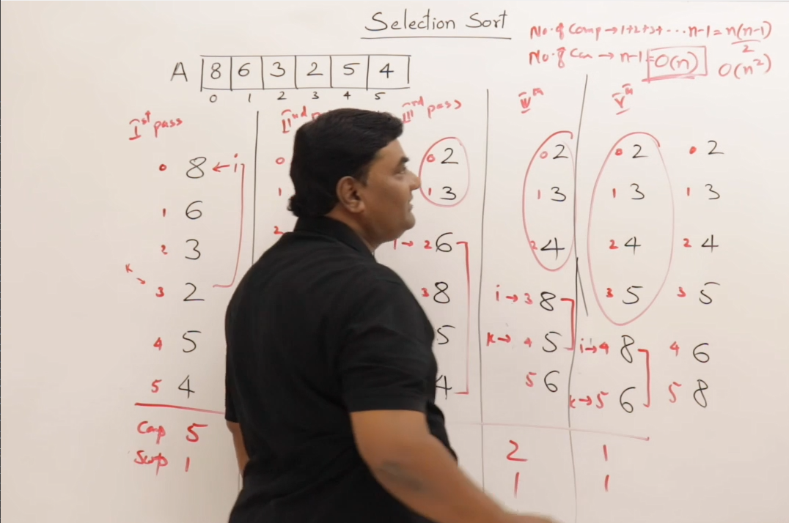
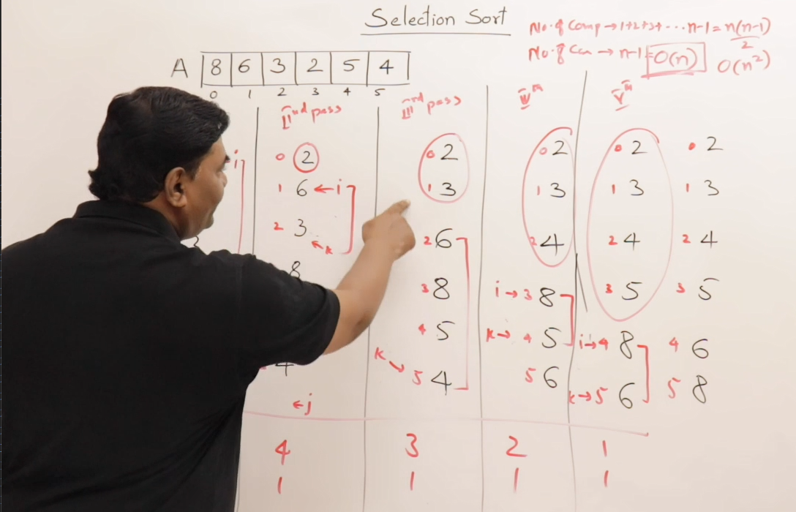

## Program of Selection sort
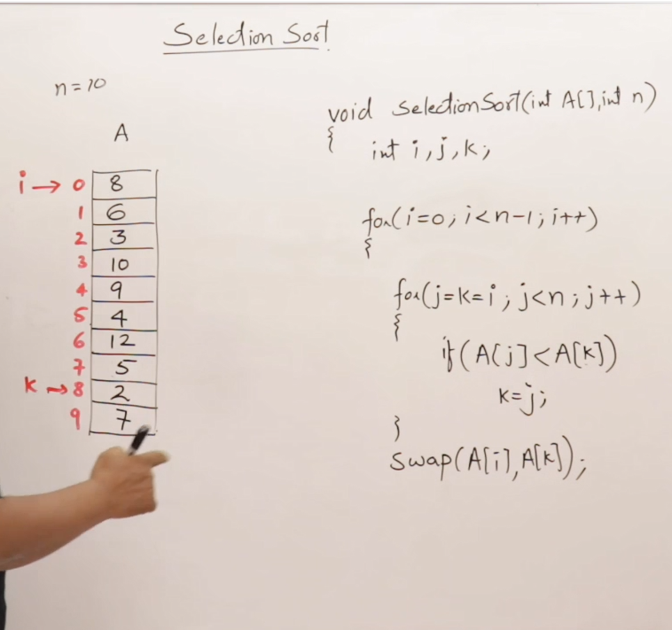
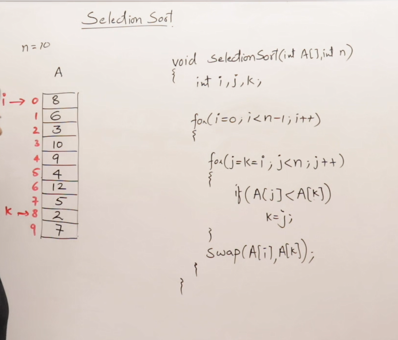

## Analysis of Selection sort
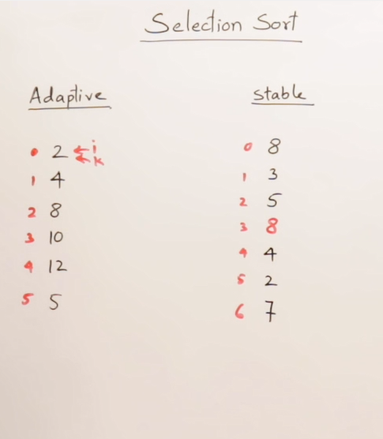
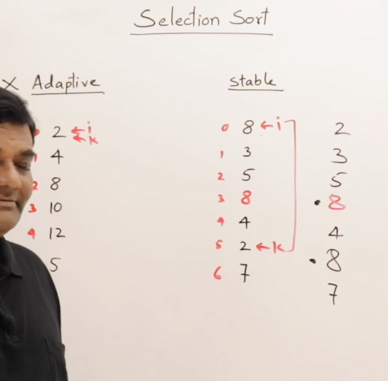

## Idea behind quick sort
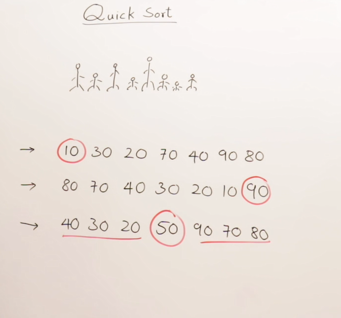

##  Quick sort
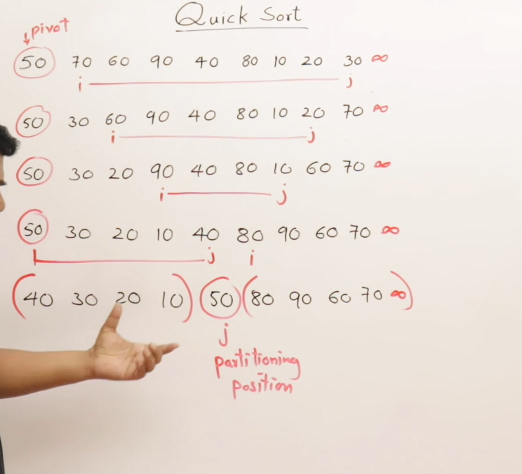

## Analysis of quick sort
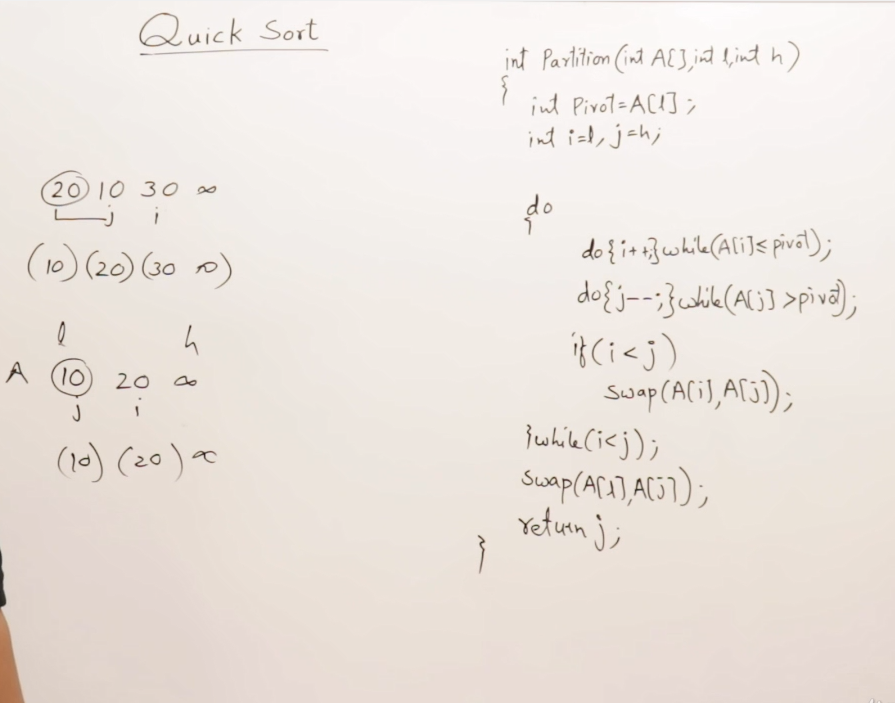
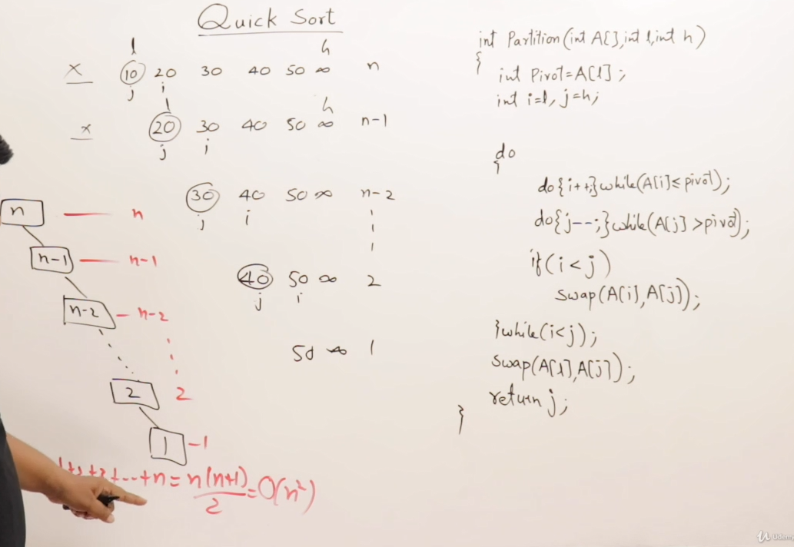

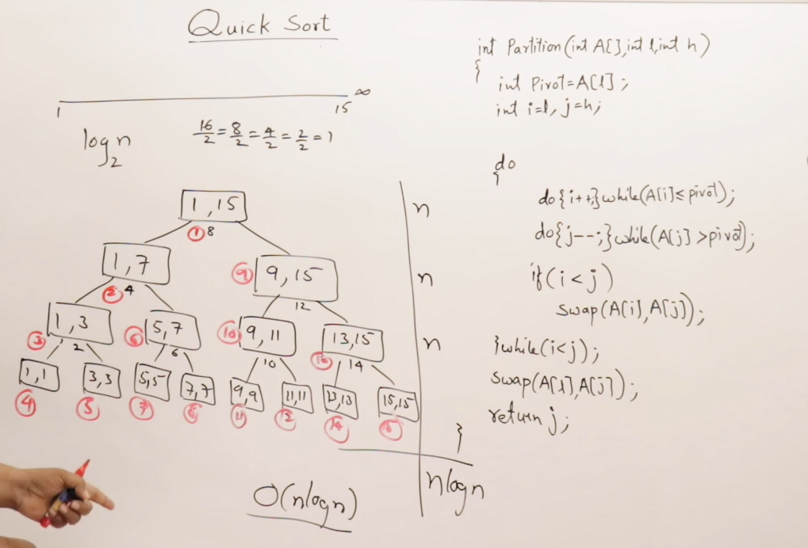
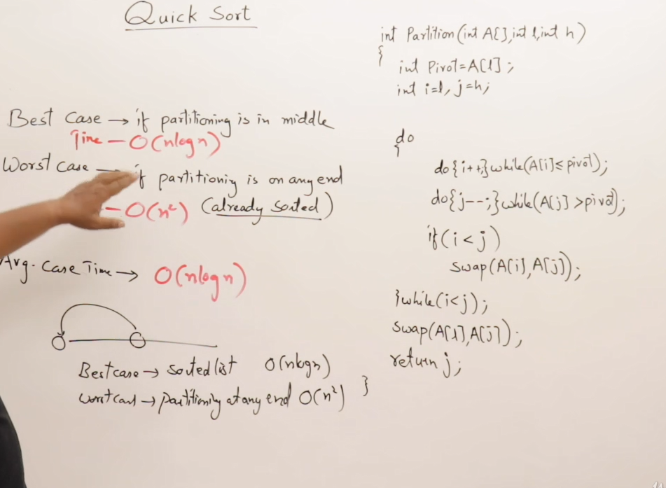
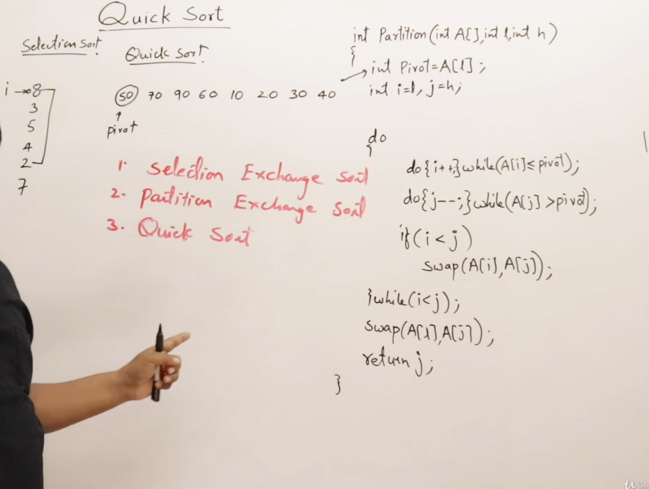


---

# 📚 Sorting Techniques - Overview & Analysis

This document provides an overview of various **sorting techniques**, the **criteria** used to analyze them, and a **categorization** based on their behavior and efficiency.

---

## 🔍 Introduction

Sorting techniques are essential for organizing data in a specific order (increasing or decreasing). There is no single "best" sorting algorithm — the choice depends on the context and the performance criteria required.

---

## 📊 Criteria for Analyzing Sorting Techniques

Sorting algorithms are analyzed based on several important factors:

1. **Number of Comparisons**
   - Refers to how many times elements are compared during sorting.
   - Determines **time complexity**.

2. **Number of Swaps**
   - Measures how often elements are swapped.
   - Helps estimate the **operational cost**.

3. **Adaptiveness**
   - An algorithm is **adaptive** if it performs better when the input list is already partially or fully sorted.
   - Adaptive algorithms take **less time** for sorted or nearly-sorted inputs.

4. **Space Complexity**
   - Indicates if the algorithm requires **extra memory** apart from the input data.
   - Algorithms that use more memory are often faster but less space-efficient.

5. **Stability**
   - A **stable** sorting algorithm maintains the relative order of equal elements (duplicates).
   - Crucial when sorting records on multiple keys (e.g., first by name, then by marks).
   - Example:
     - Original: C (6), E (6)
     - After sorting: C (6) should remain before E (6) if sorted based on marks only.

---

## 📦 Importance of Stability in Databases

- Stability is especially important when sorting **records** with multiple fields (e.g., student names and marks).
- Ensures **secondary sort keys** do not disturb the order established by primary keys.
- Common requirement in **database systems**.

---

## 🧮 Types of Sorting Algorithms

Sorting algorithms are categorized in two primary ways:

### 1. **Comparison-Based Sorting**
   These algorithms compare elements to determine order:
   - **Bubble Sort**
   - **Selection Sort**
   - **Insertion Sort**
   - **Merge Sort**
   - **Quick Sort**
   - **Heap Sort**
   - **Shell Sort**
   - **Tim Sort**

### 2. **Index-Based Sorting (Non-Comparison)**
   Use keys or positions for sorting:
   - **Counting Sort**
   - **Radix Sort**
   - **Bucket Sort**

---

## ⏱ Time Complexity Overview

- **O(n²) Algorithms (Slower)**:
  - Bubble Sort
  - Selection Sort
  - Insertion Sort

- **O(n log n) Algorithms (Faster)**:
  - Merge Sort
  - Quick Sort
  - Heap Sort

- **Faster but More Space-Consuming**:
  - Counting Sort
  - Radix Sort
  - Bucket Sort

---

## 🔧 Performance Summary

| Algorithm Type       | Time Complexity | Space Usage | Adaptive | Stable |
|----------------------|------------------|-------------|----------|--------|
| Bubble Sort          | O(n²)           | Low         | Yes      | Yes    |
| Selection Sort       | O(n²)           | Low         | No       | No     |
| Insertion Sort       | O(n²)           | Low         | Yes      | Yes    |
| Merge Sort           | O(n log n)      | High        | No       | Yes    |
| Quick Sort           | O(n log n) avg  | Low         | No       | No     |
| Heap Sort            | O(n log n)      | Low         | No       | No     |
| Counting Sort        | O(n + k)        | High        | No       | Yes    |
| Radix Sort           | O(nk)           | High        | No       | Yes    |
| Bucket Sort          | O(n + k)        | High        | No       | Depends|

> Note: Detailed stability/adaptiveness analysis will be done per algorithm.

---


## 📚 Bubble Sort: Explained

### 🔹 Overview
Bubble Sort is a simple comparison-based sorting algorithm. It repeatedly steps through the list, compares adjacent elements, and swaps them if they are in the wrong order. The process repeats until the list is sorted.

### 🔹 How It Works
- Given a list of `n` elements, Bubble Sort performs **n - 1 passes**.
- In each pass, it compares **adjacent elements** and swaps them if needed.
- After each pass, the **largest unsorted element** settles at its correct position (like a bubble rising to the top—hence the name).

### 🔹 Step-by-Step Example
Given array: `[5, 8, 7, 3, 2]`

- **Pass 1**: Largest element `8` moves to the end.
- **Pass 2**: Next largest `7` settles in second-last position.
- **Pass 3**: `5` moves to its correct spot.
- **Pass 4**: Final pass ensures all elements are sorted.

Total passes = `n - 1 = 5 - 1 = 4`

---

## 🔢 Time & Space Complexity

| Case           | Time Complexity | Swaps | Notes                    |
|----------------|-----------------|-------|---------------------------|
| Best (Sorted)  | O(n)            | 0     | With optimization (flag) |
| Worst Case     | O(n²)           | O(n²) |                         |
| Average Case   | O(n²)           | O(n²) |                         |
| Space          | O(1)            |       | In-place sorting         |

- **Comparisons**: `(n-1) + (n-2) + ... + 1 = n(n-1)/2` → **O(n²)**
- **Swaps**: Max = O(n²), actual depends on input

---

## 🔁 Code Logic (Pseudocode)
```python
def bubble_sort(arr):
    n = len(arr)
    for i in range(n - 1):           # n-1 passes
        flag = 0                     # Track swaps
        for j in range(n - 1 - i):   # Reduce comparisons each pass
            if arr[j] > arr[j + 1]:
                arr[j], arr[j + 1] = arr[j + 1], arr[j]
                flag = 1             # A swap occurred
        if flag == 0:                # No swaps => list is sorted
            break
```

---

## ✅ Properties

| Property     | Status       | Description                                                                 |
|--------------|--------------|-----------------------------------------------------------------------------|
| **Stable**   | ✅ Yes       | Equal elements maintain original order                                      |
| **Adaptive** | ✅ Yes       | Optimized version stops early if already sorted                             |
| **In-place** | ✅ Yes       | Does not require extra space                                                |
| **Simple**   | ✅ Yes       | Easy to implement and understand                                            |

---

## 💡 Interesting Observations

- **Why "Bubble" Sort?**  
  Heavier (larger) elements "sink" to the bottom (end of the list) while lighter ones "bubble" up during each pass—similar to bubbles rising in water.

- **Partial Sorting Use Case**:  
  If you need only the `k` largest elements (e.g., top 3), just perform `k` passes.

---

## 📈 Use Cases
While not efficient for large datasets, Bubble Sort is useful for:
- Teaching and learning sorting concepts
- Small or nearly sorted datasets
- Real-time systems with small inputs

---

## 🧮 Bubble Sort Implementation in C

### 📌 Overview
This project demonstrates the implementation of the **Bubble Sort** algorithm in C, using a simple integer array. The same project also shows how to improve the algorithm by making it **adaptive**.

---

### 🚀 Project Name
**SOX** (Sorting Operations in C)

---

### 🛠️ Features
- Implements basic **Bubble Sort**
- Enhances Bubble Sort to be **adaptive** using a flag
- Swaps elements using a separate `swap()` function
- Demonstrates sorting with debug points and small datasets

---

### 🧑‍💻 Code Structure

#### 1. **Main Function**
- Declares and initializes an array with random integers
- Calls the `bubbleSort()` function
- Prints the sorted array

#### 2. **bubbleSort(int arr[], int n)**
- Sorts the array using Bubble Sort logic
- Uses nested `for` loops to compare and swap elements
- Enhanced with an adaptive mechanism using a `flag`:
  - If no swaps occur during a pass, the algorithm exits early
  - Reduces unnecessary comparisons

#### 3. **swap(int *x, int *y)**
- Swaps the values of two integers using pointers
- Common utility function used inside `bubbleSort()`

---

### 📈 Adaptive Bubble Sort
- Introduces a `flag` variable
- Set to `0` at the start of each outer loop pass
- Set to `1` if a swap occurs
- If `flag` remains `0`, the array is already sorted → early exit

---

### 🧪 Testing & Debugging
- Run with different array sizes to see behavior
- Debug with breakpoints to observe:
  - How the array changes with each pass
  - When the adaptive condition exits early

---

### ✅ Output Example
**Input:** `int arr[] = {10, 3, 7, 2}`  
**Output:** `2 3 7 10`

---

### 🏁 Conclusion
- Bubble Sort is simple but can be inefficient
- The adaptive version improves performance when the array is nearly sorted
- Great for learning basic sorting and control flow in C

---
Here's a well-organized summary of the transcript, perfect for including in a **README** file about **Insertion Sort**:

---

## 📌 Insertion Sort – README

### 🧮 What is Insertion Sort?

**Insertion Sort** is a simple sorting technique based on the concept of inserting elements into their correct position, just like inserting a card into a sorted hand of cards.

---

### 🎯 Key Concepts

- **Insertion** means placing an element at its correct sorted position.
- The algorithm works by assuming that the left part of the array is sorted and then inserting the next element in its correct position.
- Involves **shifting** elements instead of swapping, to make space for the insertion.

---

### 📋 Array-Based Insertion Sort

#### Example:
Given a **sorted array**, insert an element (e.g., 12) in the correct position.

#### Steps:
1. Start from the **last index** of the array.
2. Compare each element with the new value (12).
3. **Shift elements** to the right until a smaller value is found.
4. Insert 12 in the freed space.

#### Visualization:
```
Initial:  [2, 6, 10, 15, 20, 25]
Insert:   12

Process:  Shift 25 → 20 → 15 → (stop at 10)
Result:   [2, 6, 10, 12, 15, 20, 25]
```

---

### 🔗 Linked List-Based Insertion

In a **singly linked list**, elements are not shifted. Instead, we:
1. **Traverse** the list using pointers `P` and `Q`.
2. Find the correct spot where the element (e.g., 18) should be inserted.
3. Insert the node by adjusting the `next` pointers.

#### Steps:
- Use two pointers:
  - `P` for current node.
  - `Q` for trailing node.
- Traverse until the correct insert position is found (`P->data > key`).
- Insert node after `Q` and point it to `P`.

---

### ⏱️ Time Complexity

#### For Arrays:
- **Best Case:** O(1) – element already in correct position.
- **Worst Case:** O(n) – element must be inserted at the beginning.

#### For Linked Lists:
- **Traversal Time:** O(n) – to find the position.
- **Insertion Time:** O(1) – just link the node.

#### Summary:
| Structure     | Min Time | Max Time |
|---------------|----------|----------|
| Array         | O(1)     | O(n)     |
| Linked List   | O(1)     | O(n)     |

---

### ✅ Conclusion

- Insertion sort is intuitive and efficient for **small or nearly sorted datasets**.
- It helps build the concept of **shifting** and **inserting** in-place.
- Prepares the foundation for understanding more advanced algorithms.

> Next step: Implement the full **Insertion Sort** algorithm based on this concept.

---

## 📌 Insertion Sort (Continued)

### 🧠 Core Concept

**Insertion Sort** builds the final sorted array one element at a time. It takes each element and places it in its correct position relative to the already sorted portion of the array.

---

### 🔁 How It Works (Recap and Continuation)

- For each element from index `1` to `n-1`:
  1. Store the current element in a temporary variable (e.g., `temp`).
  2. Compare `temp` with the elements on its left.
  3. Shift all elements greater than `temp` one position to the right.
  4. Insert `temp` at its correct position.

---

### 🔧 Detailed Steps

1. Start from the second element.
2. Compare with elements to the left.
3. If the left element is greater:
   - Shift it one position to the right.
   - Continue comparing until the right spot is found.
4. Insert the element at its correct position.

#### Example:
For input `[7, 3, 5, 2]`:
- Step 1: Compare 3 with 7 → shift 7 → insert 3 → `[3, 7, 5, 2]`
- Step 2: Compare 5 with 7 → shift 7 → insert 5 → `[3, 5, 7, 2]`
- Step 3: Compare 2 with 7, 5, 3 → shift all → insert 2 → `[2, 3, 5, 7]`

---

### ⏱️ Time Complexity

| Case       | Time Complexity |
|------------|-----------------|
| Best (Sorted)   | O(n)            |
| Average         | O(n²)           |
| Worst (Reversed)| O(n²)           |

- Best case occurs when the array is already sorted.
- Worst case occurs when the array is sorted in reverse order.

---

### ✅ Key Advantages

- Simple and easy to implement.
- Efficient for small datasets.
- Adaptive: performs well on nearly sorted data.
- In-place: uses no extra space.

---

### ❌ Limitations

- Not suitable for large datasets.
- Slower than more advanced algorithms like Quick Sort, Merge Sort.

---

### 🧪 Applications

- Useful when the data is **almost sorted**.
- Suitable in **online sorting**, where elements are received one at a time.

---

## 📌 Understanding Insertion (Before Insertion Sort)

Before diving into the **Insertion Sort algorithm**, it's essential to understand what **insertion** means in sorting, both in arrays and linked lists.

---

### 🧠 What is "Insertion"?

- Insertion involves placing an element into its **correct sorted position** within an already sorted collection.
- Just like inserting a playing card into the correct place in a sorted hand.

---

### 📋 Insertion in Arrays

#### 🔄 Concept:
- Start from the last element and shift elements **rightward** until you find the right spot for the new element.
- Once the right place is found (where the current element is smaller than the key), **insert** the new element.

#### 🧪 Example:
Insert `12` into `[2, 6, 10, 15, 20, 25]`.

**Steps:**
1. Start from the end.
2. Shift all elements larger than `12` one position right.
3. Stop at `10` (as it’s smaller).
4. Insert `12` after `10`.

**Result:** `[2, 6, 10, 12, 15, 20, 25]`

#### ✅ Key Points:
- You don't search for position explicitly.
- Just shift elements **until** you find a smaller one.
- Insert the value at the **free space**.

---

### 🔗 Insertion in Linked Lists

#### 🛠 Process:
- Unlike arrays, we don’t shift data; we **manipulate pointers**.
- Traverse the list with two pointers: `P` (current), `Q` (previous).
- Find the first node where `P->data > key`.
- Insert the new node **after Q** and point it to `P`.

#### 🔄 Example:
Insert `18` into sorted list: `2 → 6 → 10 → 15 → 20 → 25`

**Steps:**
1. Traverse with `P` and `Q`.
2. Stop when `P->data > 18`.
3. Insert `18` between `15` and `20`.

**Result:** `2 → 6 → 10 → 15 → 18 → 20 → 25`

---

### ⏱️ Time Complexity Comparison

| Structure     | Operation         | Best Case | Worst Case |
|---------------|-------------------|-----------|------------|
| **Array**     | Insertion         | O(1)      | O(n)       |
| **Linked List** | Traversal (P + Q) | O(1)      | O(n)       |
|               | Pointer Update    | O(1)      | O(1)       |

- In **arrays**, worst case occurs when inserting at the beginning (all elements shifted).
- In **linked lists**, no shifting, just **pointer changes** after traversal.

---

### 🧠 Summary

- Insertion is a **fundamental operation** in sorting.
- It helps build the logic for algorithms like **Insertion Sort**.
- Arrays require shifting elements.
- Linked lists only require finding the right spot and adjusting links.

> Next: Learn **Insertion Sort** which repeatedly uses this concept to sort an entire dataset.

---
Here’s a set of clear, structured notes from the transcript you provided — ideal for including in a **README** file to explain whether **Insertion Sort** is **adaptive** and **stable**:

---

## ✅ Insertion Sort: Is It Adaptive and Stable?

Before understanding insertion sort's behavior in various cases, let’s analyze its **adaptiveness** and **stability**.

---

### 🔄 Is Insertion Sort Adaptive?

**Definition:**  
An algorithm is **adaptive** if it performs better on **partially sorted** or **sorted** input.

#### 🧪 Example Execution on Sorted List:
Consider the list: `[5, 8, 10, 12, 15]`

- The algorithm starts from the **second element**.
- For each element, it performs **only one comparison**.
- **No shifting** is required because the list is already sorted.

#### ✅ Observations:
- For `n` elements, only `n - 1` comparisons.
- **Shifts (swaps)**: 0
- **Time Complexity (Best Case):**  
  - Comparisons: `O(n)`  
  - Swaps: `O(1)`  
- No special flags or extra logic required (unlike Bubble Sort).  
- **Conclusion:**  
  ✔️ Insertion Sort is **naturally adaptive**.

---

### 📉 Insertion Sort: Best vs Worst Case

| Case        | List Order                | Time Complexity | Swaps      |
|-------------|---------------------------|------------------|------------|
| **Best**    | Already sorted (ascending) | O(n)             | O(1)       |
| **Worst**   | Reversed (descending)      | O(n²)            | O(n²)      |

- Worst case involves **maximum comparisons and shifts**.

---

### 🔒 Is Insertion Sort Stable?

**Definition:**  
An algorithm is **stable** if it maintains the relative order of records with equal keys.

#### 🧪 Example with Duplicates:
List: `[5(black), 5(red), 8, 10]`  
- When inserting `5(red)`, it is placed **after** `5(black)`.
- No shifting occurs for equal elements.
- **Relative order is preserved**.

#### ✅ Conclusion:
✔️ Insertion Sort is **stable**.

---

### 🧠 Summary

- ✅ **Adaptive:** Performs better on sorted or nearly sorted data.
- ✅ **Stable:** Maintains order of equal elements.
- ⏱ **Time Complexity:**
  - Best Case: `O(n)`
  - Worst Case: `O(n²)`
- 🔁 **Swaps (Shifts):**
  - Best Case: `O(1)`
  - Worst Case: `O(n²)`

---

### 📌 Final Verdict

✔️ **Insertion Sort is both Adaptive and Stable**, making it a reliable sorting algorithm for small or partially sorted datasets.

---
Here's a clean and concise version of the transcript turned into **README notes** that explain the **Insertion Sort Algorithm Implementation in C (or C-like)**. You can include this as a section in a README for an educational or algorithm project:

---

## 🧮 Insertion Sort – Algorithm & Code Walkthrough

This section provides an overview of the **Insertion Sort algorithm implementation**, as demonstrated in the accompanying video tutorial.

---

### 🔁 What is Insertion Sort?

Insertion Sort builds the final sorted array one element at a time by:
1. Picking the next element,
2. Comparing it with previous sorted elements,
3. Shifting larger elements to the right,
4. Inserting the picked element at its correct position.

---

### 🔧 Function Definition

```c
void insertion_sort(int e[], int n)
```

- `e[]`: Array of elements
- `n`: Total number of elements

---

### 🧠 Variables Used

- `i`: Loop index (starts from `1` as the first element is already "sorted")
- `j`: Index used for comparing and shifting elements
- `x`: The current element being inserted

---

### 🔄 Algorithm Steps

1. **Loop through array** from index `1` to `n - 1`
2. **Store** the current element in `x`:
   ```c
   x = e[i];
   ```
3. **Initialize** `j` to `i - 1`
4. **Shift** all elements greater than `x` one position to the right:
   ```c
   while (j >= 0 && e[j] > x) {
       e[j + 1] = e[j];
       j--;
   }
   ```
5. **Insert** `x` at the correct sorted position:
   ```c
   e[j + 1] = x;
   ```

---

### 🧪 Sample Output

**Given Input:**  
`[11, 3, 7, 5, 9, 2]`

**After Sorting:**  
`[2, 3, 5, 7, 9, 11]`

---

### ✅ Final Notes

- The function modifies the original array in-place.
- This algorithm is best suited for **small datasets** or **nearly sorted arrays**.
- Time Complexity:
  - **Best case (sorted input):** O(n)
  - **Worst case (reversed input):** O(n²)

---


## 🔄 Bubble Sort vs. Insertion Sort – Comparison

| Feature                        | **Bubble Sort**                  | **Insertion Sort**               |
|-------------------------------|----------------------------------|----------------------------------|
| **Best Case Time Complexity** | O(n) (Already sorted list)       | O(n) (Already sorted list)       |
| **Worst Case Time Complexity**| O(n²) (Descending list)          | O(n²) (Descending list)          |
| **Min Comparisons**           | O(n)                             | O(n)                             |
| **Max Comparisons**           | O(n²)                            | O(n²)                            |
| **Min Swaps**                 | 0                                | 0                                |
| **Max Swaps**                 | O(n²)                            | O(n²)                            |
| **Adaptive**                  | ✅ Yes                           | ✅ Yes                           |
| **Stable**                    | ✅ Yes                           | ✅ Yes                           |
| **Suitable for Linked Lists** | ❌ No                            | ✅ Yes                           |
| **Key Access (Key Passes)**   | ✅ Yes (Useful)                  | ❌ No (Not useful)               |

---

### 🔍 Key Insights

- **Similarity**: Both algorithms are *adaptive* and *stable*, which makes them unique among basic sorting algorithms.
- **Stability**: They maintain the relative order of equal elements.
- **Adaptivity**: Both perform better on nearly or fully sorted lists.
- **Insertion Sort** is better suited for **linked lists** as it does not require shifting elements, unlike **Bubble Sort**.
- **Bubble Sort** can make use of **key comparisons** more effectively than Insertion Sort.

---

### 🧠 Summary

- **Best for Learning**: Both are easy to understand and implement.
- **Use Insertion Sort** when:
  - Working with linked lists.
  - You expect the data to be partially sorted.
- **Avoid Bubble Sort** in performance-critical applications.

---
# 🌟 Selection Sort Algorithm

## 🧐 Why is it called "Selection Sort"?

Because in each pass, we **select** the smallest (or largest) element from the unsorted portion and **place it in the correct position** in the sorted portion.

---

## 🔍 How It Works

For an array of `n` elements:

1. Start from index `i = 0`.
2. Assume the element at `i` is the minimum.
3. Loop `j` from `i + 1` to `n - 1`:
   - If `arr[j] < arr[k]`, update `k = j`.
4. After the loop, swap `arr[i]` and `arr[k]`.
5. Repeat for `i = 0` to `n - 2`.

---

## 🧪 Step-by-Step Example

Given the list:  
📦 `[8, 6, 3, 2, 5, 4]`

| Pass | Action                         | Array State             |
|------|--------------------------------|--------------------------|
| 1️⃣   | Swap 8 with 2 (min)             | `[2, 6, 3, 8, 5, 4]`     |
| 2️⃣   | Swap 6 with 3                  | `[2, 3, 6, 8, 5, 4]`     |
| 3️⃣   | Swap 6 with 4                  | `[2, 3, 4, 8, 5, 6]`     |
| 4️⃣   | Swap 8 with 5                  | `[2, 3, 4, 5, 8, 6]`     |
| 5️⃣   | Swap 8 with 6                  | `[2, 3, 4, 5, 6, 8]`     |

🎉 Sorted!

---

## 🧠 Real-Life Analogy

Imagine students are standing in a line and you want to arrange them based on marks 🎓:

- Pick the first position.
- Look through the rest to find who should stand there.
- Swap and repeat until the line is sorted.

---

## ⏱️ Time & Space Complexity

### 📊 Comparisons:
- Total = `n(n - 1)/2` = **O(n²)**  
- Fixed number of comparisons regardless of order

### 🔁 Swaps:
- Maximum = `n - 1` = **O(n)**  
- One of the few algorithms with **minimal swaps**

### 💾 Space:
- In-place sorting → **O(1)**

---

## 💡 Key Characteristics

| Feature          | Description                          |
|------------------|--------------------------------------|
| ⏳ Time           | O(n²) for all cases                 |
| 💽 Space          | O(1) (In-place)                     |
| 🔁 Swaps          | Only `n - 1` → very few             |
| 🧩 Stable         | ❌ Not stable (but can be made so)  |
| 🟢 Best Use Case  | When swap cost is high              |

---

## ✨ Highlights

- ✅ Simple to implement
- 🔄 Fixed comparisons
- 🔂 Very few swaps
- ❌ Not efficient for large datasets
- 🧠 Great for learning sorting logic!

---

## ✅ Summary

Selection Sort is great for learning and situations where you need:
- Few swaps
- Easy implementation
- Consistent performance

> 🧠 “Choose Selection Sort when **simplicity** and **minimal swaps** matter more than speed!”


```markdown
# ✨ Selection Sort Algorithm - Explained Step by Step

Selection Sort is a classic sorting algorithm that selects the smallest element from the unsorted portion of the list and places it in its correct position in the sorted portion.

---

## 🎥 Transcript Summary

This is a simplified and beautified explanation based on a lecture on **Selection Sort**. The goal is to walk you through how it works, using an example, and implement it using loops.

---

## 🧠 Key Idea

In **each pass**, we:
1. Select an index (starting from 0).
2. Find the **smallest element** in the remaining unsorted part.
3. Swap it with the element at the current index.
4. Repeat for all elements (except the last, which will already be in place).

---

## 🔁 Algorithm Steps

1. We loop from index `i = 0` to `n - 2` (total `n - 1` passes).
2. In each pass:
   - Set `k = i` (assume current index has the smallest element).
   - Loop through the rest of the array with index `j` from `i+1` to `n-1`.
   - If `arr[j] < arr[k]`, then update `k = j`.
3. After the inner loop, `k` will point to the smallest element.
4. Swap `arr[i]` with `arr[k]`.

---

## 🧪 Example

Given an array of `n = 10` elements, say:

📦 `arr = [29, 10, 14, 37, 13, 5, 3, 1, 18, 9]`

- In the **first pass**, the smallest element (`1`) is found and swapped with the first element.
- This continues for `n - 1` passes.

---

## 💻 Pseudocode

```cpp
for (int i = 0; i < n - 1; i++) {
    int k = i;
    for (int j = i + 1; j < n; j++) {
        if (arr[j] < arr[k]) {
            k = j;
        }
    }
    // Swap arr[i] and arr[k]
    swap(arr[i], arr[k]);
}
```

---

## 📊 Complexity Analysis

| Type          | Complexity     |
|---------------|----------------|
| 🕒 Time (Best) | O(n²)          |
| 🕒 Time (Avg)  | O(n²)          |
| 🕒 Time (Worst)| O(n²)          |
| 💾 Space       | O(1) (In-place)|
| 🔁 Swaps       | O(n)           |

---

## 📌 Notes from the Transcript

- ✅ Loop `i` goes from `0` to `n - 2` (outer loop).
- ✅ Loop `j` goes from `i + 1` to `n - 1` (inner loop).
- ✅ `k` keeps track of the index of the minimum element.
- ✅ After inner loop, swap `arr[i]` with `arr[k]`.
- ✅ Repeat until the array is sorted.
- ✅ Total of `n - 1` passes.

---

## 🎯 Conclusion

Selection Sort is:

- 📚 **Great for understanding sorting logic**
- 🛠️ **Simple to implement**
- 🔄 **Predictable performance**
- ⚠️ Not suitable for large datasets due to its O(n²) time complexity

> 💡 **Pro Tip:** Use Selection Sort when you need a simple algorithm and minimal swaps, even if performance isn’t the highest priority.


```markdown
# 🔍 Selection Sort: Adaptive & Stable? Let's Explore!

In this section, we explore whether **Selection Sort** is:
- 🧠 **Adaptive**: Does it perform better on sorted data?
- ⚖️ **Stable**: Does it maintain the relative order of equal elements?

---

## 🤔 What is Adaptive?

An algorithm is **adaptive** if it performs **faster when the input is already sorted**.

### 🔬 Let's Analyze

Given a sorted list:

📦 `arr = [2, 3, 5, 7, 8, 8, 9]`

Selection Sort:
- Still checks all elements.
- Still performs all comparisons.
- Performs swaps—even if it ends up swapping an element with itself!

### ❌ Conclusion: **Not Adaptive**

> Even if the list is sorted, Selection Sort performs the same number of operations 😓

Unlike **Bubble Sort**, where we can detect if no swaps occurred and stop early, Selection Sort **lacks a mechanism** to recognize an already sorted list.

---

## ⚖️ What is Stability?

An algorithm is **stable** if:
> 🎯 "Equal elements retain their **original relative order** after sorting."

### 🧪 Test Case: Check Stability

Let’s consider:

```
arr = [
  (8, "Black"),
  (2, "Blue"),
  (3, "Green"),
  (5, "Yellow"),
  (8, "Red"),
  ...
]
```

Selection Sort finds the smallest element and swaps it with the first element.

✅ First pass:
- Finds `2 (Blue)` and swaps it with `8 (Black)`

🔁 Resulting list after one pass:
```
[
  (2, "Blue"),
  (8, "Red"),
  (3, "Green"),
  ...
]
```

> 😱 Oops! `"Black"` and `"Red"` switched places!

### ❌ Conclusion: **Not Stable**

> Equal elements **do not** retain their original order. Stability is lost.

---

## 📌 Summary

| Property      | Status       | Reason                                                                 |
|---------------|--------------|------------------------------------------------------------------------|
| 🧠 Adaptive    | ❌ No         | Performs same operations even when list is sorted                      |
| ⚖️ Stable      | ❌ No         | Swapping doesn't preserve order of duplicate elements                  |

---

## 💪 Strengths of Selection Sort

Despite its drawbacks, Selection Sort has some nice qualities:

| Strength                             | Description                                                        |
|--------------------------------------|--------------------------------------------------------------------|
| 🔁 Minimal Swaps                     | It makes at most `n - 1` swaps, which can be useful in certain cases |
| 👁️ Easy to Understand                | Simple to follow, great for learning                               |
| 🛠️ In-place Sorting                  | Requires no extra space                                            |
| 🧼 Clean Intermediate Steps           | Shows smallest element at the correct position in each pass        |

---

## 🔚 Final Thoughts

🟡 **Selection Sort** is a basic sorting algorithm with clear steps, but it lacks adaptability and stability.

> Use it where swap count matters more than time or stability 🧩

---

Here’s a clean, well-structured set of notes suitable for a `README.md` file based on your transcript, explaining the **Quick Sort algorithm** in a simple and intuitive way:

---


## 🔍 What is Quick Sort?

Quick Sort is a highly efficient and commonly used sorting algorithm. Though it may seem complex at first glance, it’s actually quite logical and intuitive once understood.

---

## 💡 Basic Idea

The core concept of Quick Sort is based on **finding the correct (sorted) position of an element** in a list.

### ✨ Key Observation:
An element is in its **sorted position** if:
- All elements before it are **less than** it.
- All elements after it are **greater than** it.

---

## 👁 Visual Understanding

Consider a list of numbers. If you glance at a list and spot a number such that:
- All smaller numbers are on the left, and
- All larger numbers are on the right,

Then that number is already in its correct place—even if the rest are not sorted.

---

## 📚 Real-life Analogy

Imagine students are standing in random order. The teacher asks them to form a line in **increasing order of height**.

There are two ways:
1. **Teacher-directed sort:** Teacher arranges every student one by one.
2. **Quick Sort-style:** Each student finds their own correct position such that:
   - Shorter students stand to the left,
   - Taller students stand to the right.

This second way is **quicker**, hence the name **Quick Sort**!

---

## 🔄 How It Works – Step by Step

1. **Choose a Pivot Element** (any element, typically the last or middle).
2. **Partitioning**:
   - Re-arrange the array so all elements smaller than pivot go to the left.
   - All elements larger than pivot go to the right.
3. The pivot is now at its **correct sorted position**.
4. **Recursively apply** this process to the left and right subarrays.

---

## 🧠 Partitioning Visualization

Let’s say you're the pivot in the line of students. You:
- Ask everyone shorter to stand to your left,
- Ask everyone taller to go to your right,
- Ignore whether they are sorted amongst themselves for now.

Now you’re in the correct position, and Quick Sort continues sorting the left and right groups similarly.

---

## ✅ Key Insight

> Quick Sort is not about immediately sorting the entire array — it’s about gradually putting elements in their correct position via partitioning.

---

## 📝 Summary

- Quick Sort is **efficient and divide-and-conquer based**.
- Works by **partitioning** the array using a pivot.
- Elements are sorted relative to the pivot.
- Recursive sorting on subarrays continues until the full array is sorted.

---

# Quick Sort – Partitioning Procedure Explained

## 📌 Goal
To sort a list using **Quick Sort**, where we repeatedly **place one element (pivot) at its correct position**, ensuring:
- All smaller elements are on its **left**
- All greater elements are on its **right**

---

## 🧠 Step-by-Step Breakdown

### 1. Choose a Pivot
- Select the **first element** in the list as the **pivot**.
- Think of it like a student finding their correct place in a height-based lineup.

> **Example:** If `50` is the pivot, we must place it so:
> - All numbers < 50 are to the **left**
> - All numbers > 50 are to the **right**

---

### 2. Initialize Two Pointers
- **I** starts from the **left** and looks for elements **greater than the pivot**.
- **J** starts from the **right** and looks for elements **less than or equal to the pivot**.

```plaintext
Initial array: [50, 30, 60, 90, 40, 80, 20, 70]
Pivot = 50
```

---

### 3. The Partitioning Process
- Move pointer `I` **forward** until it finds a number **greater than** the pivot.
- Move pointer `J` **backward** until it finds a number **less than or equal to** the pivot.
- If both such numbers are found and `I < J`, **swap** them.
- Continue this until `I > J`.

📌 To avoid index issues, **add a sentinel value** like `∞` (infinity) at the end of the array.

> This helps ensure the search for a greater value always stops, even if nothing greater exists.

---

### 4. When I > J
- This means all elements have been compared and swapped accordingly.
- Now, **swap the pivot** with the element at position `J`.
- The pivot is now in its **final sorted position**.

> ✅ This is called the **Partitioning Procedure**.

---

### 5. Recursive Step
- Apply the same Quick Sort logic on the:
  - Left subarray (elements < pivot)
  - Right subarray (elements > pivot)

Repeat this process until all elements are sorted.

---

## 🔁 Quick Sort Logic Summary

1. **Choose a pivot**
2. **Partition the array** such that:
   - Smaller elements go left
   - Larger elements go right
3. **Recursively apply** quick sort to the subarrays

---

## 📌 Edge Cases
- If a sublist has **fewer than two elements**, no sorting is needed.
- A sorted pivot can act as an "infinity" or end marker for a sublist during recursion.

---

## ✍️ Partitioning Procedure – Pseudocode

```python
function partition(arr, start, end):
    pivot = arr[start]
    i = start + 1
    j = end

    while i <= j:
        while arr[i] <= pivot and i < end:
            i += 1
        while arr[j] > pivot:
            j -= 1
        if i < j:
            swap(arr[i], arr[j])

    swap(arr[start], arr[j])
    return j  # Pivot is now at index j
```

---

## 🧩 Final Thoughts

- Quick Sort is **efficient** due to divide-and-conquer.
- The **partitioning logic** is key and might seem confusing at first.
- Visualization (pivot, I, J pointers) makes it easier to understand.
- The recursion continues until all pivots are placed correctly.

---


# Quick Sort: Edge Cases and Time Complexity Analysis

This note focuses on understanding how **Quick Sort** performs in specific scenarios:
1. When the list contains only a few elements
2. When the list is already sorted
3. When the list is sorted in descending order

---

## 🔹 Quick Sort on 3 Elements

**Example:** `[20, 10, 30]`  
Assume:
- `pivot = 20`
- `i` starts from left
- `j` starts from right

**Steps:**
1. Move `i` to find an element greater than `pivot (20)` → finds `30`
2. Move `j` to find an element ≤ `pivot` → finds `10`
3. Since `i > j`, swap pivot with `j` (which has value `10`)
4. Partition: 
   - Left: `[10]`
   - Pivot: `20`
   - Right: `[30]`

**Conclusion:** List is now `[10, 20, 30]` — sorted.

---

## 🔹 Quick Sort on 2 Elements

**Example:** `[10, 20]`  
- `pivot = 10`
- `i` and `j` initialized at appropriate ends

**Steps:**
1. `i` doesn’t find any greater element
2. `j` doesn’t find anything smaller or equal
3. Since `i > j`, swap pivot with element at `j` (which is itself)
4. Result is already sorted

**Conclusion:** Nothing changes. Quick Sort terminates quickly.

---

## 🔹 Quick Sort on Already Sorted List (Ascending)

**Example:** `[10, 20, 30, 40, 50]`  
- Worst-case scenario for Quick Sort
- Always selecting the **first** element as the pivot

**Step-by-Step Partitioning:**
- Each pivot swaps with itself
- Partition results in:
  - Left: empty
  - Right: remaining `n-1` elements

**Comparisons Count:**
- First partition: `n` comparisons
- Second partition: `n - 1` comparisons
- …
- Last partition: `1` comparison

**Total Comparisons:**  
`1 + 2 + 3 + ... + n = n(n + 1)/2 = O(n²)`

**Conclusion:**  
- This is the **worst-case** time complexity:  
  **`Time Complexity = O(n²)`**

---

## 🔹 Quick Sort on Descending List

**Example:** `[50, 40, 30, 20, 10]`  
- Still choosing the **first** element as pivot (`50` initially)
- Infinity is assumed as the end boundary

**Steps:**
1. First pivot (`50`) compares with others
2. Finds element (`10`) smaller → swap pivot with it
3. `50` is now placed in its correct position
4. The remaining list `[40, 30, 20, 10]` is sorted recursively

**Partitioning continues similarly, pushing largest element to correct place each time.**

**Conclusion:**  
Even for a descending list, if pivot is poorly chosen (like the first element), Quick Sort degenerates to **O(n²)** time.

---

## 🔹 Summary: Time Complexity

| Scenario                  | Time Complexity |
|---------------------------|-----------------|
| Best Case (Balanced splits) | `O(n log n)`    |
| Average Case               | `O(n log n)`    |
| Worst Case (Sorted/Reverse Sorted List) | `O(n²)`          |

> ✅ **Tip:** To avoid the worst-case, use techniques like:
> - Randomized pivot selection
> - Median-of-three pivot strategy

---

# Quick Sort – Best Case Analysis and Conclusion

## 📘 Assumptions

- A list of **15 elements** is taken for analysis.
- Indexing is considered from **1 to 15** (for ease of understanding).
- **Best case assumption**: partitioning always occurs exactly in the **middle** of the list.

---

## 🔍 How Quick Sort Works (Best Case)

1. **Initial Step**:
   - The list is divided in the middle.
   - Example: Partition at position 8, creating two equal halves:  
     - Left: 1 to 7  
     - Right: 9 to 15

2. **Recursive Partitioning**:
   - Each sublist is again split in the middle.
   - Example:  
     - Left sublist: 1–7 becomes → 1–3, 5–7  
     - Right sublist: 9–15 becomes → 9–11, 13–15

3. **Further Recursive Calls**:
   - Continue recursively until sublists have 1 element each.
   - Once single-element sublists are reached, no more partitioning is needed.

---

## 🔁 Recursion Call Order

Quick Sort is recursive, and the order of calls can be tracked as:

- First call → splits the entire list
- Second, third, etc. → split the resulting halves
- Eventually reaches 1-element sublists where no action is needed

---

## 📊 Time Complexity Analysis

- Every level involves **n comparisons** (where `n` is the number of elements involved).
- Since the list is **divided into two** at each level, the total number of levels is `log₂n`.

### Time Complexity:
- **Best Case Time**:  
  ```
  Comparisons per level × number of levels = n × log n
  ```
  ⇒ **O(n log n)**

---

## ✅ Final Conclusion

| Case       | Partitioning Location | Time Complexity | List Example                |
|------------|------------------------|------------------|-----------------------------|
| **Best**   | Always in the middle   | O(n log n)       | Balanced partitions         |
| **Worst**  | Always at one end      | O(n²)            | Already sorted list         |
| **Average**| Random partitioning    | O(n log n)       | Most generic unsorted lists |

- Worst case arises when the list is already sorted, and partitioning occurs at the ends.
- Best case is ideal when partitioning occurs in the middle.

---

## 🧠 Optimization Insights

### 🔄 Change Pivot Selection Strategy

1. **Default**: First element is chosen as pivot.
2. **Improved**: Choose the **middle element** as pivot.
   - Makes a sorted list the best case (partitioning always in the middle).
3. **Randomized Quick Sort**: Randomly select any element as the pivot.
   - Reduces the chance of hitting the worst case.

---

> ⚠️ Even with pivot optimization, **worst-case time** of Quick Sort is still O(n²) for some specific order of elements.

---


