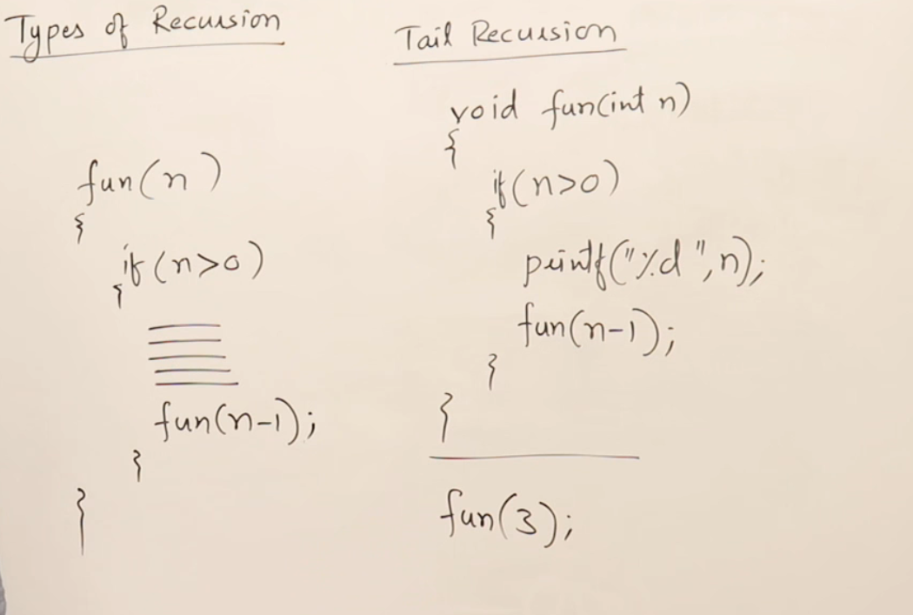

# Recursion

Many functions and procedures can be implemented using recursion, allowing them to be written as recursive functions.


A function that calls itself is called a recursive function. Inside a recursive function, there must be a base condition to terminate the recursion.


## Generalizing Recursion

Recursion consists of two phases: the **calling phase** and the **returning phase**. 

While both loops and recursion involve repetition, a loop has only an ascending phase, whereas recursion has both ascending and descending phases.


## How recursion uses stack

Model of memory divided into three parts heap, stack and main memory.
For n toatal will be n+1 activation records.


## Recurrence Relation - Time complexity of Recursion

Every statement in a program take one unit of time. We don't mention seconds or milliseconds of time. 


## TailHead

```ruby
Head Recursion
#include <stdio.h>
void fun(int n){
  if(n>0){
    fun(n-1);
    printf("%d ",n);
  }
}

int main() {
  int x=3;
  fun(x);
  return 0;
}

Tail Recursion
#include <stdio.h>
void fun(int n)
{
  if(n>0){
    printf("%d ",n);
    fun(n-1);
  }
}

int main() {
  int x=3;
  fun(x);
  return 0;
}

```

## Static and Global variable in Recursion


## Types of Recursion


## Tail Recursion
In tail recursion in returing time it doesn't perform any operation.


Tail recursion can be easily converted in the form of loop.


## Head Recursion
In head recursion the function doesn't do any operation at the time of calling, it's perform operation at returing time.


Head Recursion can be easily converted by looking the function into loop. As it doing operation at returing time.


## Tree Recursion
If a function calling itself more than one time, then it is tree recursion


RECURSION NOTES: - 

Recursion is a programming technique where a function calls itself in order to solve a problem. It is a powerful tool for solving problems that can be broken down into smaller, similar sub-problems. 

## How Recursion Works

A recursive function typically has two main components:
1. **Base Case**: The condition under which the function stops calling itself. This prevents infinite recursion.
2. **Recursive Case**: The part of the function where it calls itself with a modified argument, moving towards the base case.

### Example: Factorial Function

The factorial of a non-negative integer `n` is the product of all positive integers less than or equal to `n`. It is denoted by `n!`.

#### Factorial Function in Pseudocode
```
function factorial(n):
    if n == 0:
        return 1
    else:
        return n * factorial(n - 1)
```

### Diagram of Recursive Calls

Consider the calculation of `factorial(3)`:

```
factorial(3)
|
|---> 3 * factorial(2)
          |
          |---> 2 * factorial(1)
                    |
                    |---> 1 * factorial(0)
                              |
                              |---> 1 (base case)
```

The recursive calls can be visualized as a tree:

```
factorial(3)
  |
  +---> 3 * factorial(2)
          |
          +---> 2 * factorial(1)
                    |
                    +---> 1 * factorial(0)
                              |
                              +---> 1 (base case)
```

## Advantages of Recursion
- Simplifies code for problems that have a natural recursive structure (e.g., tree traversal, factorial calculation).
- Reduces the need for complex loops and auxiliary data structures.

## Disadvantages of Recursion
- Can lead to high memory usage due to the call stack.
- May result in stack overflow if the base case is not reached or the recursion depth is too large.

## Conclusion

Recursion is a fundamental concept in computer science that provides a clear and concise way to solve problems that can be divided into similar sub-problems. Understanding how to implement and optimize recursive functions is essential for efficient problem-solving.
