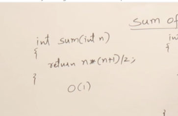
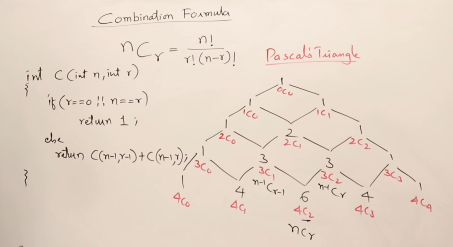

# Recursion

Many functions and procedures can be implemented using recursion, allowing them to be written as recursive functions.


A function that calls itself is called a recursive function. Inside a recursive function, there must be a base condition to terminate the recursion.


## Generalizing Recursion

Recursion consists of two phases: the **calling phase** and the **returning phase**. 

While both loops and recursion involve repetition, a loop has only an ascending phase, whereas recursion has both ascending and descending phases.


## How Recursion Uses Stack

Model of memory divided into three parts: heap, stack, and main memory. For `n` total, there will be `n+1` activation records.


## Recurrence Relation - Time Complexity of Recursion

Every statement in a program takes one unit of time. We don't mention seconds or milliseconds of time.


## TailHead

```ruby
Head Recursion
#include <stdio.h>
void fun(int n){
  if(n>0){
    fun(n-1);
    printf("%d ",n);
  }
}

int main() {
  int x=3;
  fun(x);
  return 0;
}

Tail Recursion
#include <stdio.h>
void fun(int n)
{
  if(n>0){
    printf("%d ",n);
    fun(n-1);
  }
}

int main() {
  int x=3;
  fun(x);
  return 0;
}
```

## Static and Global Variables in Recursion


## Types of Recursion


## Tail Recursion
In tail recursion, during the returning time, it doesn't perform any operation.


Tail recursion can be easily converted into the form of a loop.


## Head Recursion
In head recursion, the function doesn't do any operation at the time of calling; it performs operations at returning time.


Head recursion can be easily converted into a loop by looking at the function.


## Tree Recursion
If a function calls itself more than once, then it is tree recursion.


## Indirect Recursion
In indirect recursion, there are multiple functions where it forms a circular loop of functions.


## Nested Recursion

In nested recursion, the recursive function's parameter passed is a recursive call. We can call recursion inside recursion.


## Sum of First n Natural Numbers




## Factorial of a Given Number


## Power Using Recursion (Exponent Using Recursion)


[Power using recursion](/4-Recursion/programs/cpp/8-program.cpp)

## Taylor Series Using Recursion


[Taylor Series using recursion](/4-Recursion/programs/cpp/9-program.cpp)

## Taylor Series Using Horner's Rule


[Taylor series using Horner's Rule](/4-Recursion/programs/cpp/10-program.cpp)

## Fibonacci Series Using Recursion


[Fibonacci Series using Memoization](/4-Recursion/programs/cpp/11-program.cpp)

## Combination Formula Using Recursion




[Combination Formula using recursion](/4-Recursion/programs/cpp/12-program.cpp)

## Tower of Hanoi Problem


## quiz problem


---

## Recursion Notes

Recursion is a programming technique where a function calls itself in order to solve a problem. It is a powerful tool for solving problems that can be broken down into smaller, similar sub-problems.

### How Recursion Works

A recursive function typically has two main components:
1. **Base Case**: The condition under which the function stops calling itself. This prevents infinite recursion.
2. **Recursive Case**: The part of the function where it calls itself with a modified argument, moving towards the base case.

#### Example: Factorial Function

The factorial of a non-negative integer `n` is the product of all positive integers less than or equal to `n`. It is denoted by `n!`.

##### Factorial Function in Pseudocode
```pseudocode
function factorial(n):
    if n == 0:
        return 1
    else:
        return n * factorial(n - 1)
```

### Diagram of Recursive Calls

Consider the calculation of `factorial(3)`:

```
factorial(3)
|
|---> 3 * factorial(2)
          |
          |---> 2 * factorial(1)
                    |
                    |---> 1 * factorial(0)
                              |
                              |---> 1 (base case)
```

The recursive calls can be visualized as a tree:

```
factorial(3)
  |
  +---> 3 * factorial(2)
          |
          +---> 2 * factorial(1)
                    |
                    +---> 1 * factorial(0)
                              |
                              +---> 1 (base case)
```

### Advantages of Recursion
- Simplifies code for problems that have a natural recursive structure (e.g., tree traversal, factorial calculation).
- Reduces the need for complex loops and auxiliary data structures.

### Disadvantages of Recursion
- Can lead to high memory usage due to the call stack.
- May result in stack overflow if the base case is not reached or the recursion depth is too large.

## Conclusion

Recursion is a fundamental concept in computer science that provides a clear and concise way to solve problems that can be divided into similar sub-problems. Understanding how to implement and optimize recursive functions is essential for efficient problem-solving.
