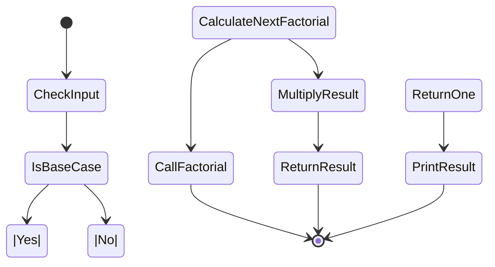

# Recursion

## What is Recursion?
Any function which calls itself is called **recursive**.It is important to ensure that the recursion terminates. Each time the function calls itself with a
slightly simpler version of the original problem. The sequence of smaller problems must
eventually converge on the base case.

## Why Recursion?
- Recursive code is generally shorter
and easier to write than iterative code. Generally, loops are turned into recursive functions when
they are compiled or interpreted.
- Recursion is most useful for tasks that can be defined in terms of similar subtasks. For example,
sort, search, and traversal problems

## Format of a Recursive Function
- This case, where the function does not recur, is called the base case.
- The function calls itself to perform a subtask, is referred to as the ecursive case.

### C++ Example

```cpp
if(test for the base case)
  return some base case  value
else if(test for another base case)
  return some other base case value
// recursive case
else
  return(some work and then recursive call)
```

As an example consider the factorial function: n! is the product of all integers between n and 1.
The definition of recursive factorial looks like:

```cpp
n! = 1  if  n = 0
n! = n*(n-1)! if n > 0
```
###### [CALCULATE FACTORIAL OF A POSITIVE INTEGER USING RECURSION](../4-Recursion/recursion.md)

### Recursion and Memory (Visualization)
- The recursive solutions look simple but visualization and tracing takes time.

```mermaid
graph TD;
    A(PrintNumbers) --> B(PrintNumberN);
    A --> C(CheckIfBaseCase);
    C --> D(BaseCaseReached);
    D --> E(Return);
    C --> F(DecrementNumber);
    F --> G(CallPrintNumbersRecursively);
    G --> B;
````
---
```mermaid
stateDiagram-v2
    [*] --> CheckBaseCase
    CheckBaseCase --> IsBaseCase
    IsBaseCase --> |Yes| ReturnOne
    IsBaseCase --> |No| CalculateFactorial
    CalculateFactorial --> CallFactorial
    CallFactorial --> [*]
    CalculateFactorial --> MultiplyResult
    MultiplyResult --> ReturnResult
    ReturnResult --> [*]


```
---

---

