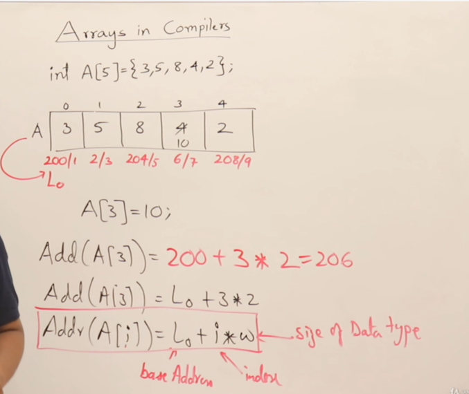

## Array
Array is the collection of element or group of element. Array are vector variable.

## Declaration of Array
Array can be declared in multiple ways.

## Static vs Dynamic Arrays
Static Array means size of array is static and dynamic array means size of array id dynamic.
Array of memory is created in stack of the main memory.
when you declaring a varibale it will go inside stack only.
For accessing anything from heap we need a pointer.

Once size of the array is declared it cannot be resized.

## How to increase array size
Take a new pointer and create a new size of bigger size array and transfer all the old array to the new array.
if you don't delete unused memory it will cause memory leak.

## 2D Array

## Arrays Representations

Formula is relative formula based on base address.

## Row Major Formulae for 2D arrays

## Column Major Formulae for 2D arrays

## Formulas for nD Arrays
 

## Formulas for 3D Arrays

