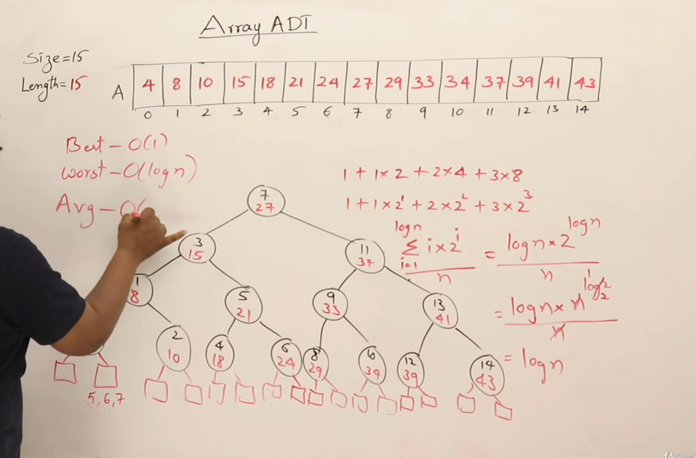
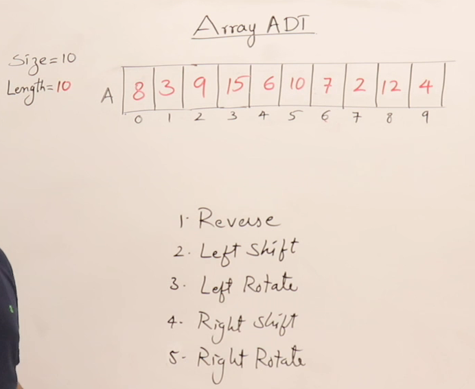
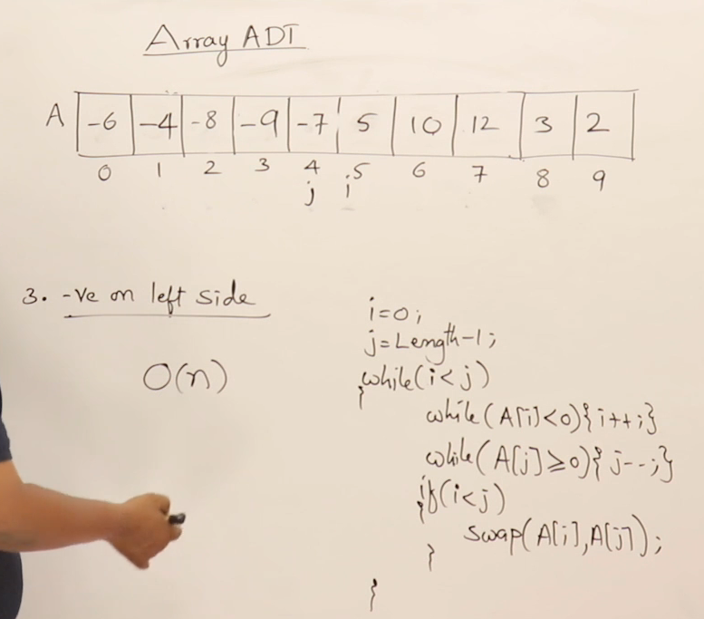
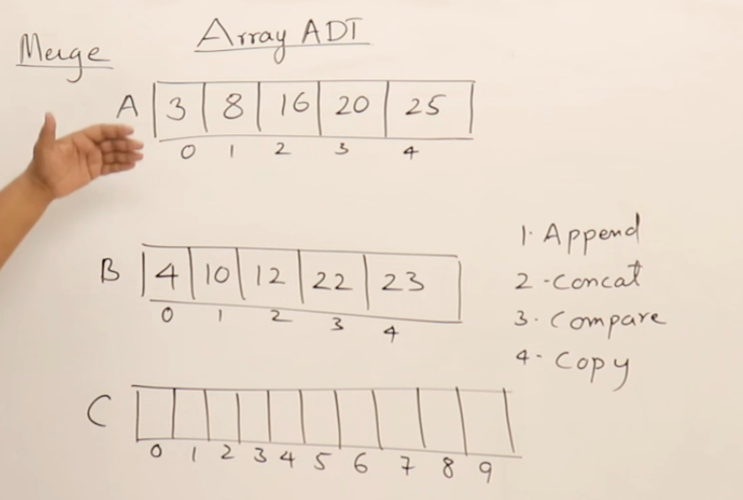
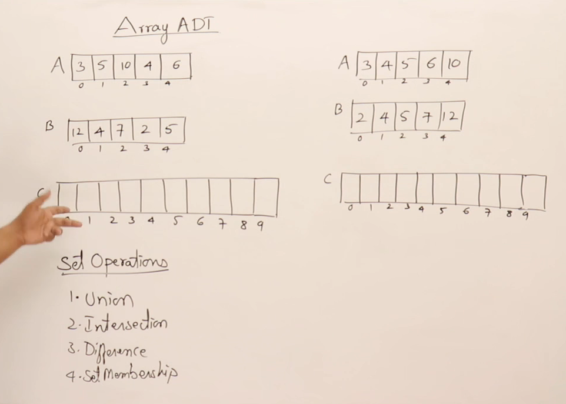

## Array ADT

## Inserting in an Array
### Display

#### Add & Append

#### Insert

#### Delete

## Linear Search

## Improvement of Linear saearch

## Binary Search

## Binary Search Algorithms

## Analysis BinarySearch

## Average case Analysis of Binary Search

## Get,Set,Avg,Max function in  Array

## Reverse and Shift an Array

## Check if Array is sorted

## Mering Array

## Set operations on Array

## Union Operation

## Intersection Operation

## Difference Operation

### Programs finding missing elements

### Programs finding multiple missing elements

## Program to find missing element in unsorted Array

## Finding Duplicate elements

## Finding Duplicate elements in array by other method of hashing

## Finding Duplicate elements in unsorted array by other method of hashing

## Finding pair of element in unsorted array with sum K

## Finding pair of element in sorted array with sum K

## Finding max and min element in single scan
