## Matrix

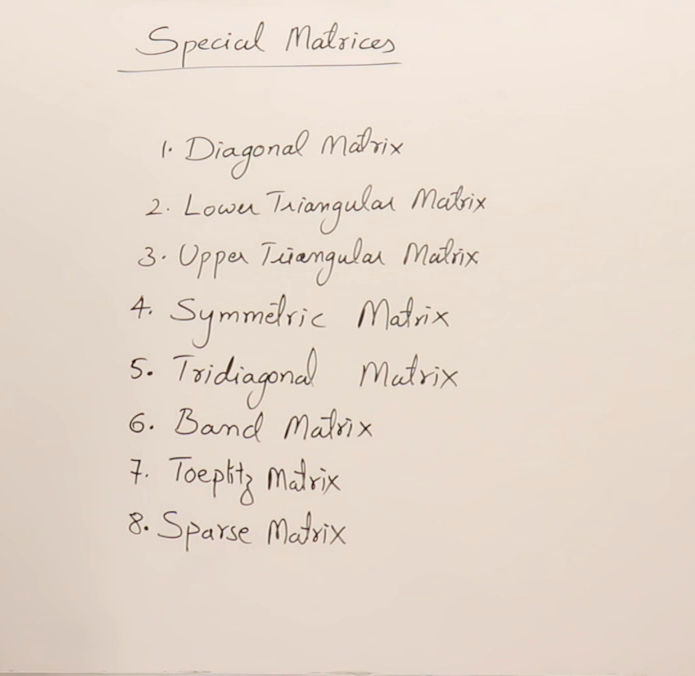

## Diagonal Matrix in C
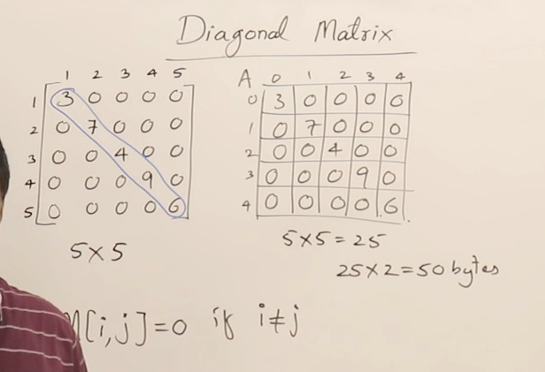
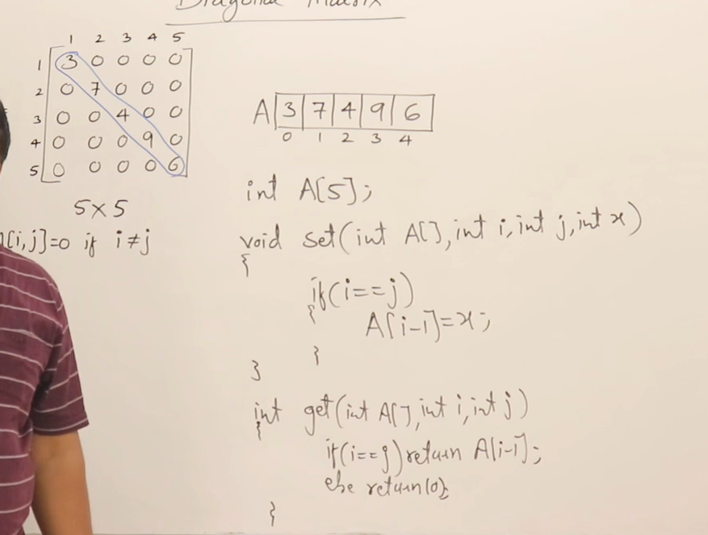

## Diagonal Matrix in CPP
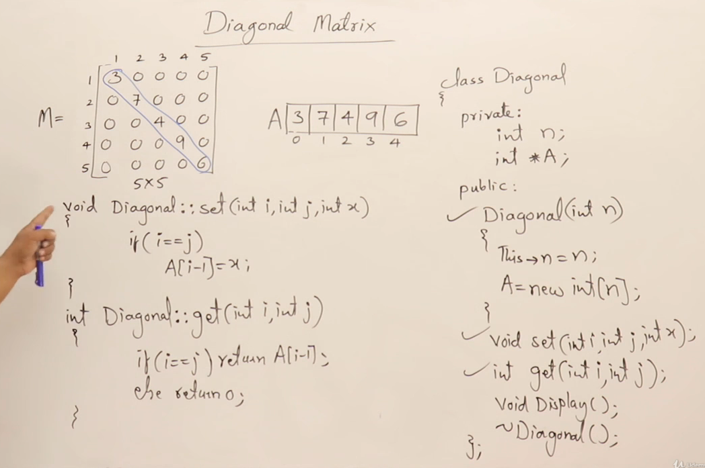
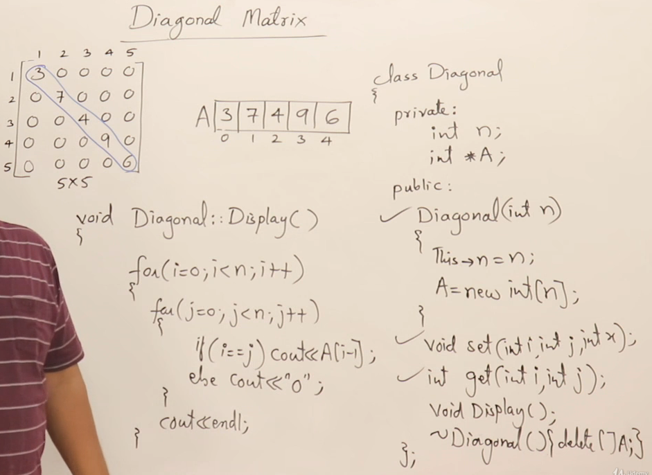

## lower Triangular Matrix
### Row Major Formulae
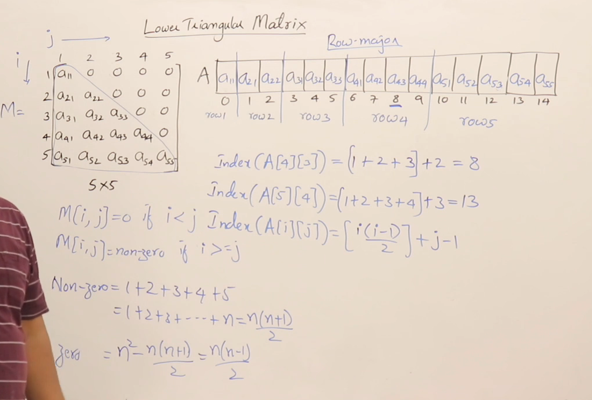

### Column Major formulae
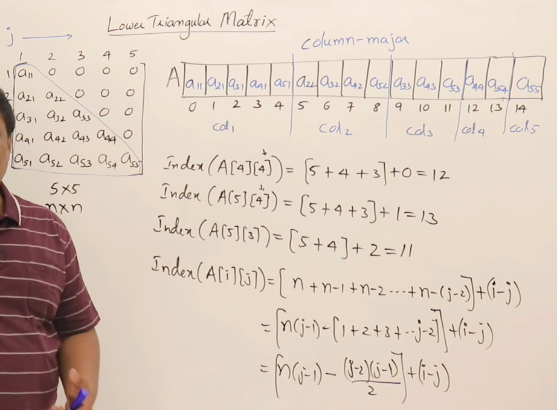

## Upper Triangular Matrix
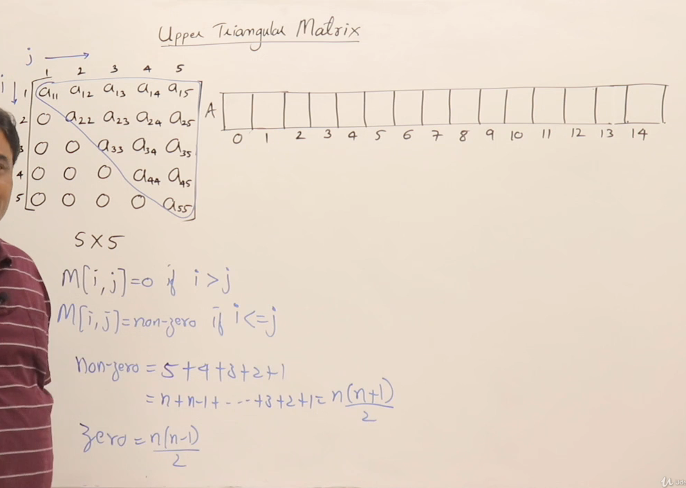

### Row Major Formulae
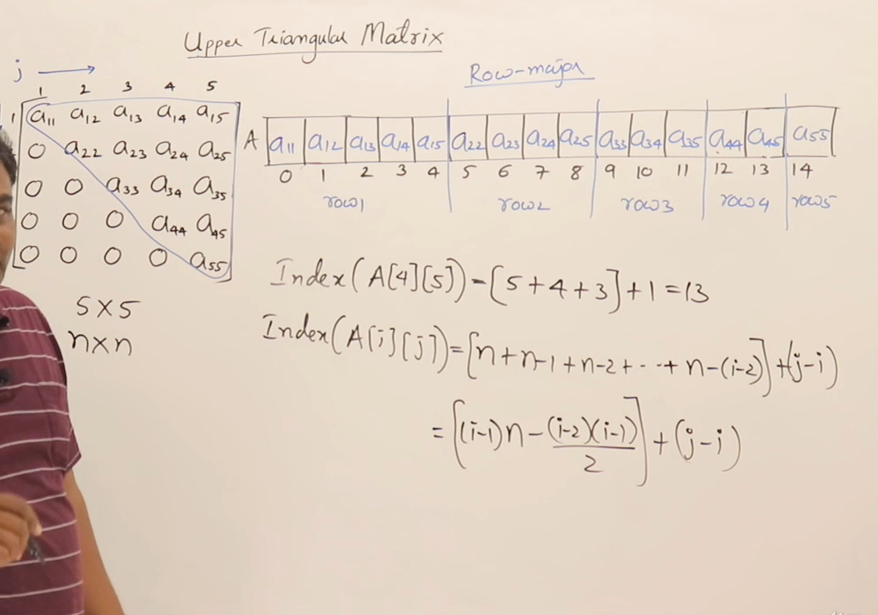

### Column Major formulae
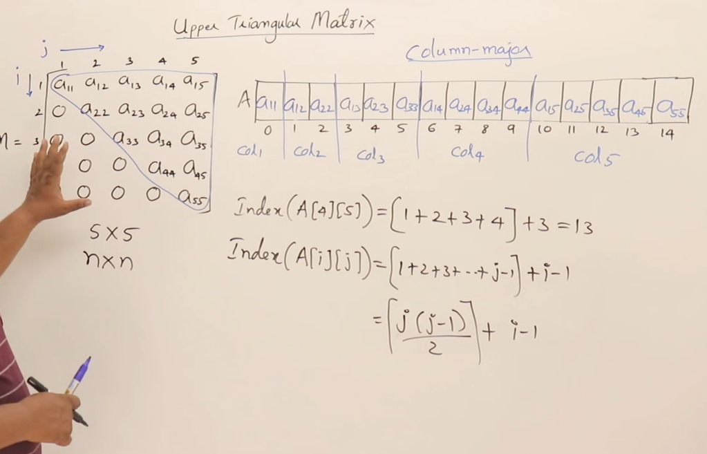

## Symmetrix Matrix
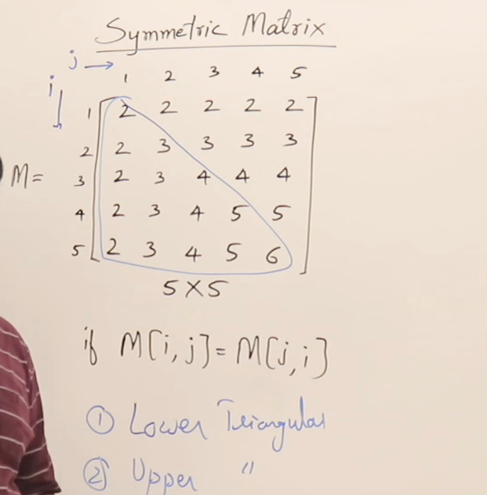

## Tri-Diagonal Matrix
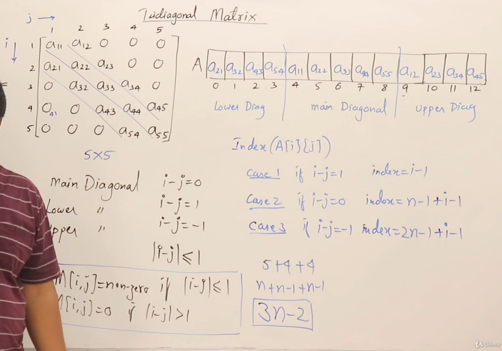

## Square Band Matrix
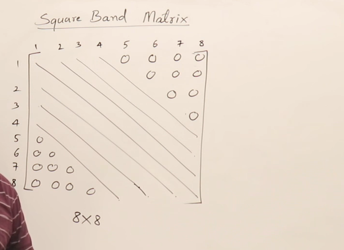

## Toeplitz Matrix
Element in the diagonal is same
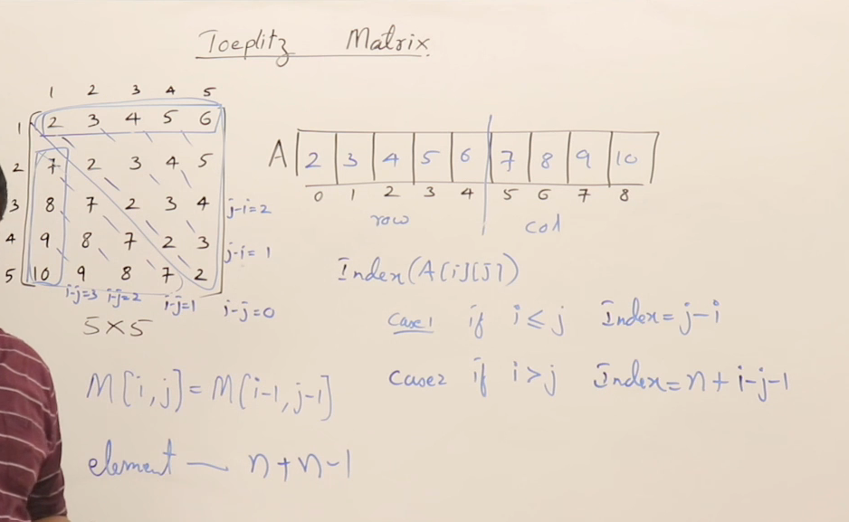

## Menu Driven Program Overview