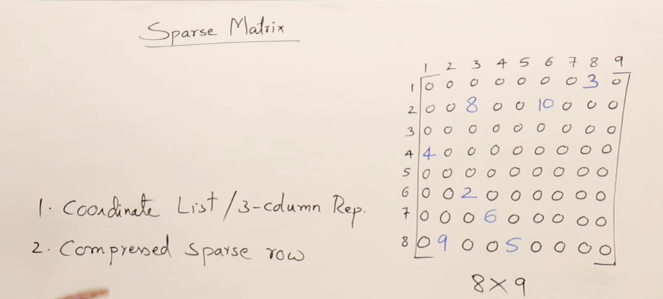
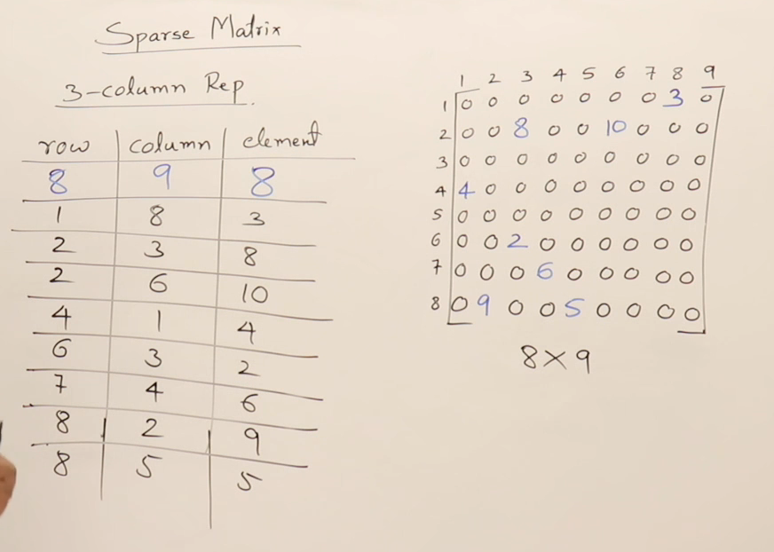
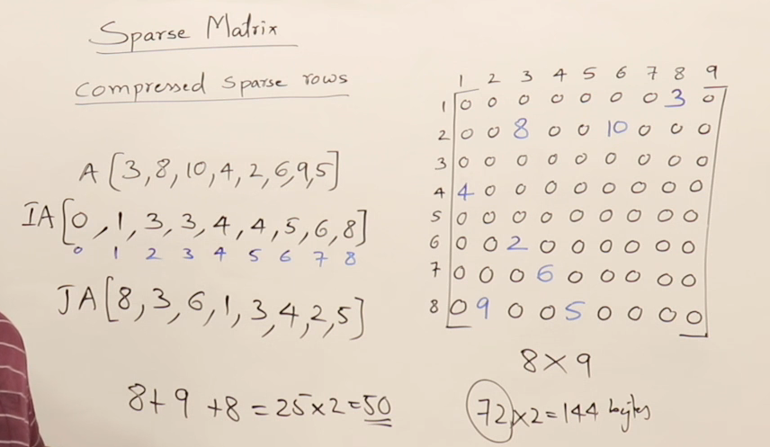
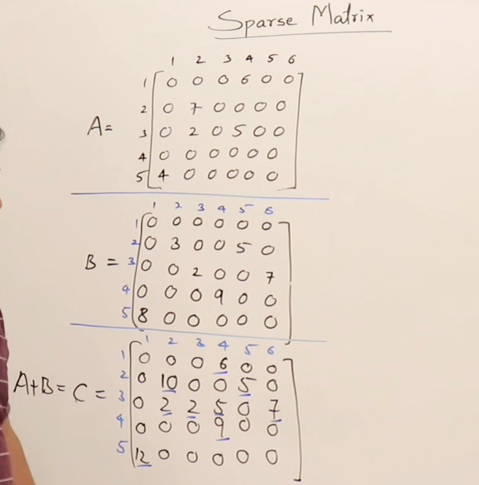
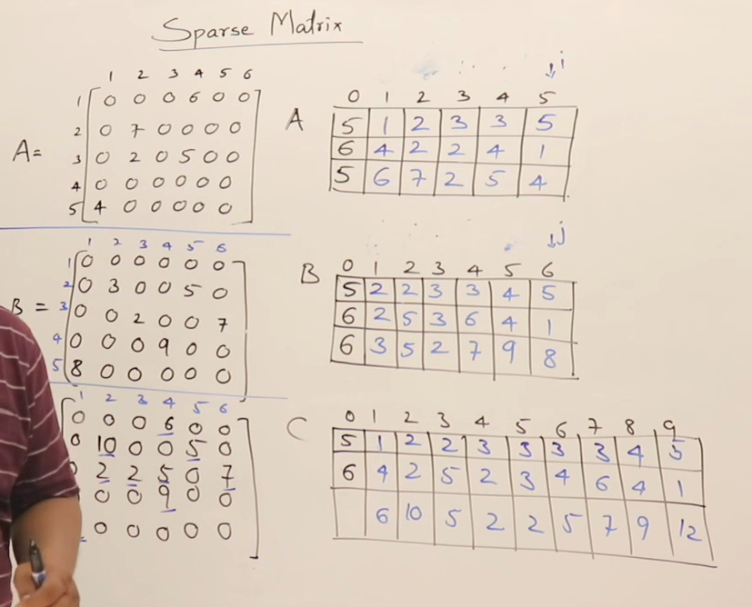
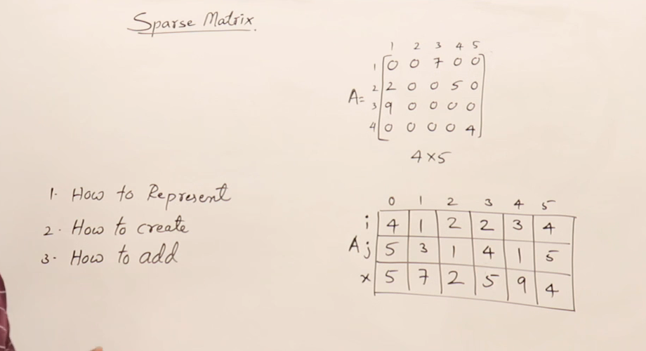
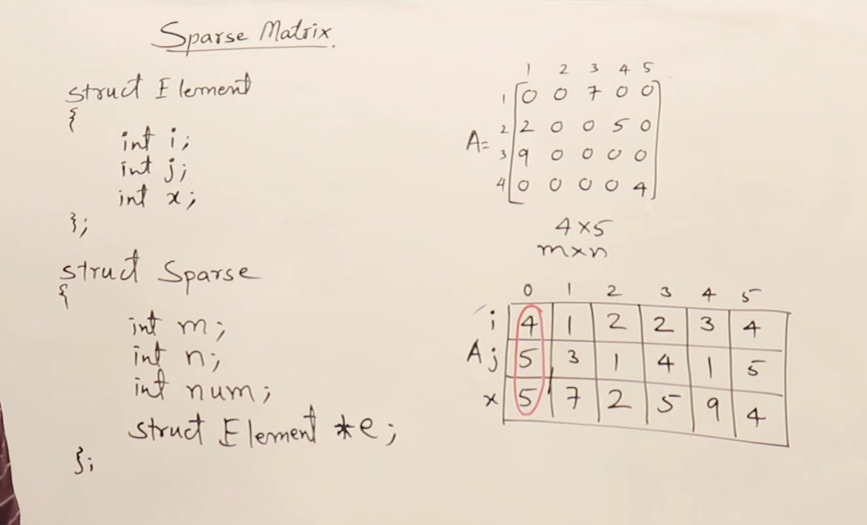
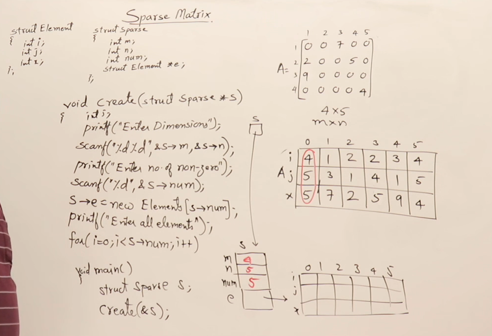
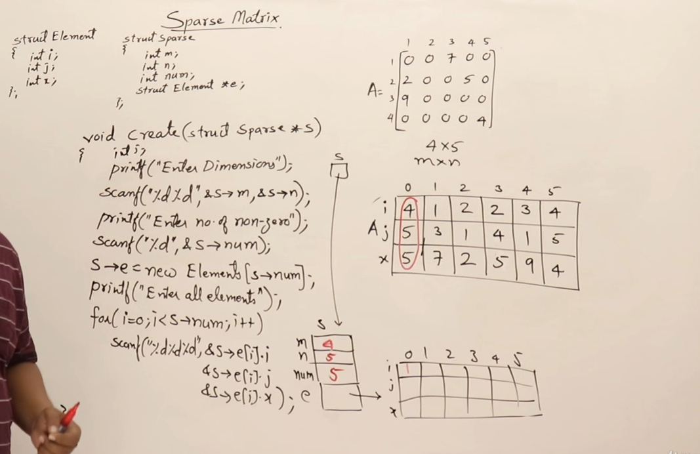

## Sparse Matrix

### Sparse Matrix Representation




## Addition of Sparse Matrices



## Array Representation Of Sparse Matrix







---
## Notes on Sparse Matrices

### Definition
A sparse matrix is a matrix with a significant number of zero elements compared to non-zero elements.

### Key Points

#### Example
Consider an 8x9 matrix with only 8 non-zero elements, e.g., 3, 8, 10, 4, 2, 6, 9, and 5.

#### Problem with Sparse Matrices
Storing all elements (including zeros) wastes space and processing time. The goal is to store only non-zero elements efficiently.

### Applications
Sparse matrices are found in statistical data or salary data with many zero values.

### Solutions for Efficient Storage
Two main methods for storing sparse matrices:

#### 1. Coordinate List (3-Column Representation)
Requires 3 attributes for every non-zero element:
- Row Number
- Column Number
- Value (Element)

**Example Representation:**

| Row | Col | Value |
|-----|-----|-------|
| 1   | 8   | 3     |
| 2   | 3   | 8     |
| 4   | 6   | 10    |

The first row can store metadata like the number of rows, columns, and non-zero elements.

**Advantage:** Easy to implement and read.

#### 2. Compressed Sparse Row (CSR) Method
Uses 3 arrays:
- **List of Non-Zero Elements:** Stores non-zero elements in the order they appear.
    - Example: [3, 8, 10, 4, 2, 6, 9, 5]
- **Row Pointers Array:** Cumulative count of non-zero elements row-wise.
    - Example for 8x9 matrix: [0, 1, 3, 3, 4, 4, 5, 6, 8]
- **Column Indices Array:** Indicates the column number of each non-zero element.
    - Example: [8, 3, 6, 1, 2, 4, 5]

**Steps to Create Row Pointers Array:**
1. Start with 0.
2. Add the count of non-zero elements row-wise, keeping cumulative totals.

### Comparison of Memory Usage

#### Traditional Storage
For an 8x9 matrix with 72 elements (each integer = 2 bytes):
- **Memory Usage:** 72 × 2 = 144 bytes.

#### Coordinate List (or CSR)
- Non-zero elements = 8.
- Metadata = 3 (rows, columns, count).
- **Total:** 24 elements × 2 bytes = 48 bytes.
- **Memory Saved:** 70% reduction.

### Operations on Sparse Matrices
**Addition/Subtraction:** Both methods can be extended to perform operations like addition or subtraction by aligning non-zero elements based on their coordinates.

### Advantages of Sparse Matrix Representations
- Significant memory savings.
- Faster processing time due to fewer elements to handle.
---
## Notes on Sparse Matrix Addition

### Overview
Objective: To perform the addition of two sparse matrices represented using coordinate list representation.
Sparse matrices are matrices where the majority of the elements are zero. Non-zero elements are represented using their row index, column index, and value.

### Key Points

#### Matrix Conditions for Addition:
- Matrices must have the same dimensions.
- Dimensions are checked before performing the addition.

#### Example Matrices:
- Matrix A (5x6) with 5 non-zero elements.
- Matrix B (5x6) with 6 non-zero elements.
- Resultant Matrix C is also 5x6 with non-zero elements derived from the addition.

### Manual Addition Procedure

#### Element-Wise Addition:
- Add the corresponding elements of A and B.
- If an element exists only in one matrix, retain it as is in C.

**Example:**
\[ A_{ij} + B_{ij} = C_{ij} \]

Non-zero elements of A and B are iterated and processed row by row.

#### Iterating Elements:
- Compare row indices and then column indices of elements in both matrices.
- Based on the comparison:
  - If row and column indices match: Add values.
  - If indices do not match: Include the non-zero element from the appropriate matrix in C.

### Coordinate List Representation
**Representation format:** \[row, column, value\]

**Matrix A Example:**
\[ [5, 6, 5], [1, 4, 6], [2, 2, 7], [3, 4, 5], [3, 2, 2], [5, 1, 4] \]

**Matrix B Example:**
\[ [5, 6, 6], [2, 2, 3], [3, 2, 2], [3, 4, 5], [4, 4, 9], [5, 1, 8], [5, 6, 7] \]

### Steps for Addition Using Coordinate Lists

#### Initialize Result Matrix:
- Create an empty list for Matrix C with dimensions (5x6).
- Reserve space for \(\max(m+n)\) non-zero elements, where \(m, n\) are non-zero elements of A and B.

#### Iterate Through Non-Zero Elements:
- Compare the current element of A and B:
  - Case 1: Row and column indices match.
    - Add the values and append the result to C.
  - Case 2: Row indices differ.
    - Append the smaller element to C and move to the next element in that matrix.
  - Case 3: Column indices differ for the same row.
    - Append the smaller column's element to C.
- Repeat until all elements in A and B are processed.

#### Update Dimensions and Non-Zero Count:
- Update the dimensions and total number of non-zero elements in Matrix C after addition.

### Algorithm Efficiency
- **Time Complexity:** \(O(m+n)\) where \(m\) and \(n\) are the number of non-zero elements in A and B.
- **Space Complexity:** \(O(m+n)\) for storing non-zero elements in C.

### Programming Perspective
- Use arrays or lists to represent sparse matrices.
- Perform addition using nested loops or iterators.
- Update row, column, and value dynamically while iterating.

### Practical Example of Coordinate List Addition
**Start with:**

**Matrix A:** \[ [1, 4, 6], [2, 2, 7], [3, 4, 5], [3, 2, 2], [5, 1, 4] \]

**Matrix B:** \[ [2, 2, 3], [3, 2, 2], [3, 4, 5], [4, 4, 9], [5, 1, 8], [5, 6, 7] \]

**After addition, Matrix C:**
\[ [5, 6, 9], [1, 4, 6], [2, 2, 10], [3, 2, 4], [3, 4, 10], [4, 4, 9], [5, 1, 12], [5, 6, 7] \]

---
## Array Representation Sparse Matrices
- **Definition:** Sparse matrices have most elements as zero.
- **Importance:** Efficient representation saves memory and computation time.

#### Representation of Sparse Matrices
- **Matrix Dimensions:**
    - `m`: Number of rows.
    - `n`: Number of columns.
    - `num`: Number of non-zero elements.
- **Non-Zero Elements:**
    - Represented as triples: (row_number, column_number, value).

#### Data Structures for Sparse Matrices
- **Struct Element:**
    - Fields: `i` (row), `j` (column), `x` (value).
- **Struct Sparse:**
    - Fields:
        - `m`: Rows.
        - `n`: Columns.
        - `num`: Non-zero elements.
        - `e`: Array of Element (dynamically allocated).

#### Creating Sparse Matrices
- **Steps:**
    - Define a Sparse matrix object in the main function.
    - Use a create function to populate:
        - Dimensions (`m`, `n`).
        - Number of non-zero elements (`num`).
        - Array of elements (`e`).
- **Dynamic Memory Allocation:**
    - Use `new` or `malloc` for the array of elements.

### Code Highlights

#### Main Function
- Create and initialize a Sparse matrix object.

#### Create Function
- Reads matrix dimensions, number of non-zero elements, and their details from the user.
- Allocates memory dynamically for the elements array.

#### Example Input for Sparse Matrix
- **Dimensions:** 4 x 5 (4 rows, 5 columns).
- **Non-zero elements:** 5.
- **Non-zero entries:**
    - (1, 3, 7)
    - (2, 4, 5)
    - (3, 1, 9)
    - (4, 2, 8)
    - (4, 4, 6)

### Code Snippets

#### Struct Definitions
```cpp
struct Element {
        int i; // Row number
        int j; // Column number
        int x; // Value
};

struct Sparse {
        int m, n, num; // Dimensions and non-zero count
        Element *e;    // Pointer to elements array
};
```

#### Create Function
```cpp
void create(Sparse *s) {
        // Read dimensions
        printf("Enter dimensions (rows and columns): ");
        scanf("%d %d", &s->m, &s->n);

        // Read number of non-zero elements
        printf("Enter number of non-zero elements: ");
        scanf("%d", &s->num);

        // Allocate memory for elements
        s->e = new Element[s->num];

        // Read non-zero elements
        printf("Enter non-zero elements (row, column, value):\n");
        for (int i = 0; i < s->num; i++) {
                scanf("%d %d %d", &s->e[i].i, &s->e[i].j, &s->e[i].x);
        }
}
```


