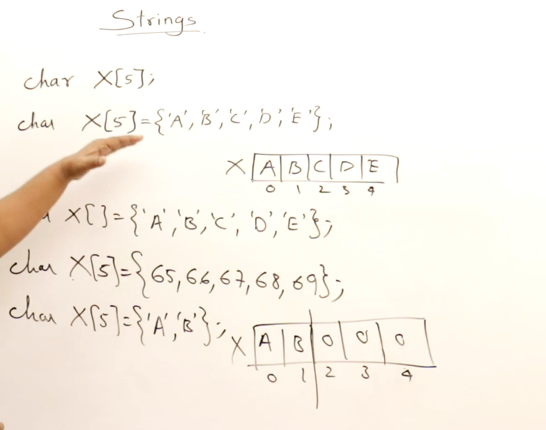
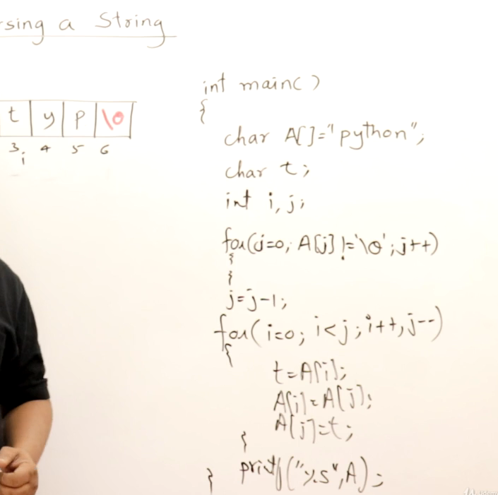

## String

## ASCII and Unicodes
Unicodes.org we can find all the codes related to same

## Initilization and declaring strings

## Finding length of the string

## Changing cases of a string

### Toggle the cases of string

## Counting vowels and consonents

## Counting words in string

## Validating a string

## Reversing a string using extra array

## Reversing a string without using extra space

