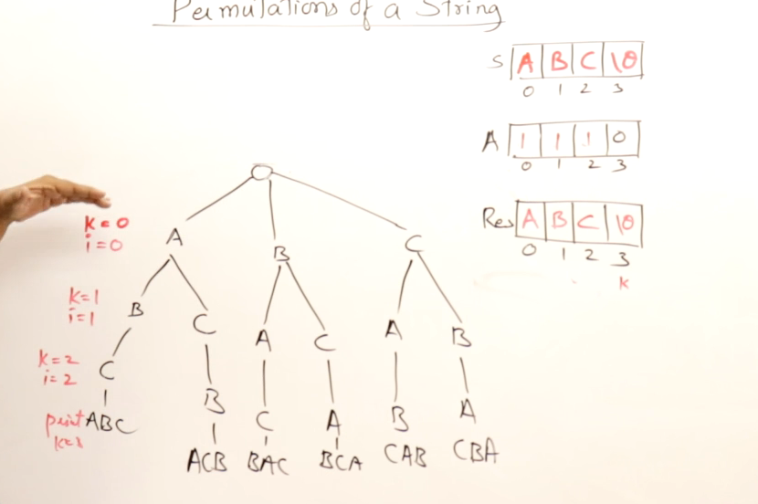

## String

## ASCII and Unicodes

## Initilization and declaring strings

## Finding length of the string

## Changing cases of a string

### Toggle the cases of string

## Counting vowels and consonents

## Counting words in string

## Validating a string

## Reversing a string using extra array

## Reversing a string without using extra space

## Comparing strings and checking Palindrome

## Finding duplicate in a string

## finding a duplicate in a string using bits

 ### Merging and Masking
 Setting the bit on in the memory is called merging and checking bits on and off is called masking

## Check if 2 strings are Anagram

## Finding permutation of a string

