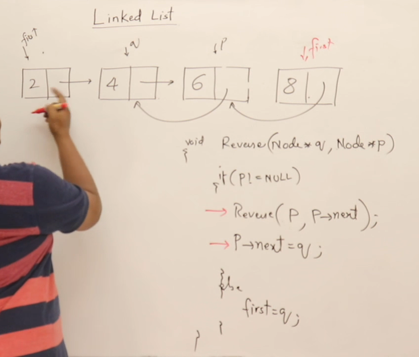
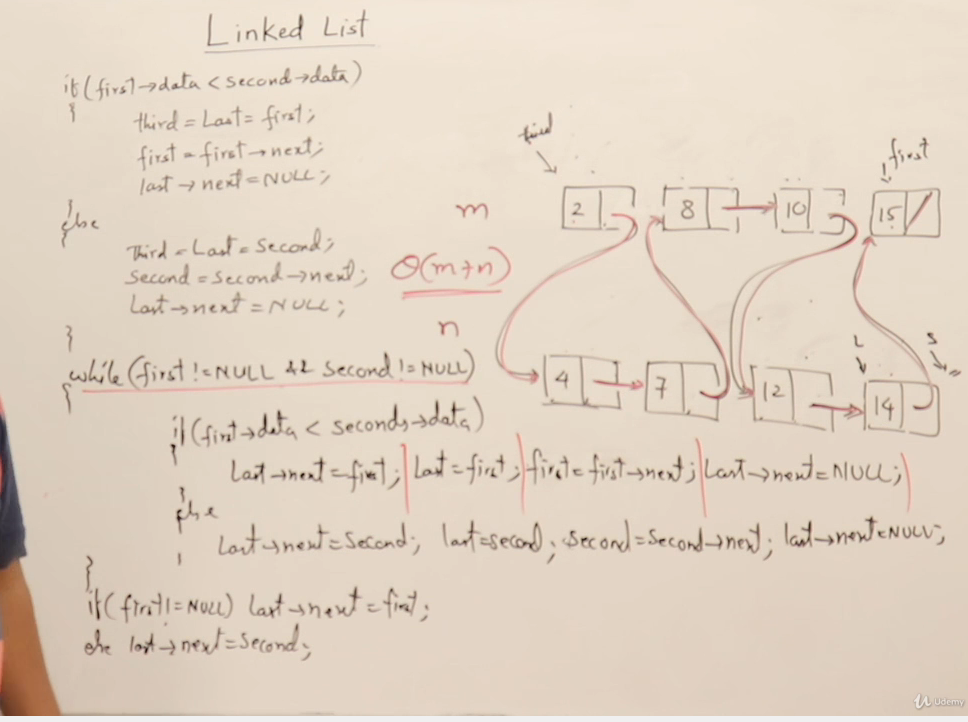

## Linklist
## Why we need Dynamic data structure

## About Linklist

## More about Linklist

## Display Linklist

## Recursive Display of link list

## Counting Nodes in link list

## Sum of all element in linklist

## Maximum element in linklist

## Searching in a linklist

## Inserting in linklist

## Creating Linklist using insert

## Inserting in a sorted Linked List

  
## Deleting from LinkList

## Check if link list is sorted

## Removing duplicated from sorted element

## Reversing a linklist

### sliding pointer

### Recursive for reversing linklist

## Concatenationing 2 linnklists

## Merging two link list

## Checking loop in linklist

