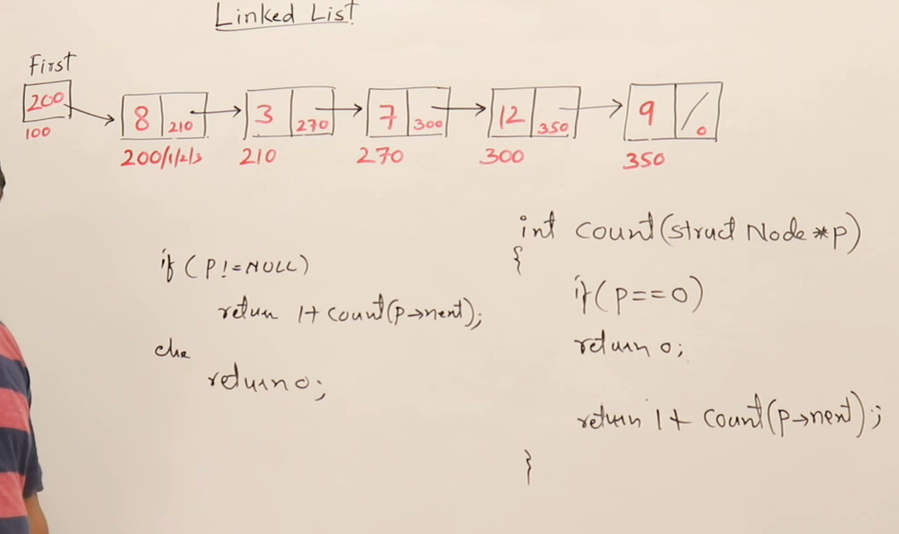

## Linklist
## Why we need Dynamic data structure

## About Linklist

## More about Linklist

## Display Linklist

## Recursive Display of link list

## Counting Nodes in link list

## Sum of all element in linklist

## Maximum element in linklist

## Searching in a linklist

## Inserting in linklist

## Creating Linklist using insert

## Inserting in a sorted Linked List

  
## Deleting from LinkList

## Check if link list is sorted

## Removing duplicated from sorted element

## Reversing a linklist

### sliding pointer

### Recursive for reversing linklist

## Concatenationing 2 linnklists

## Merging two link list

## Checking loop in linklist

## Circular Link List

## Display Circular Link List

## Delete Circular Link List

## Doubly Link List

## Inserting in doubly link list

## Deleting from doubly linklist

## Reversing doubly link list

## Circilar doubly link list

## Comparision of LinkedList

# Comparison of Various Types of Linked Lists

## Introduction
This document compares different types of linked lists based on various criteria such as space complexity, insertion, deletion, and traversal operations.

## Types of Linked Lists
1. **Singly Linked List (Linear)**
   - Each node has a single pointer to the next node.
   
2. **Circular Singly Linked List**
   - The last node points back to the first node, forming a circular structure.
   
3. **Doubly Linked List (Linear)**
   - Each node has two pointers: one pointing to the next node and another pointing to the previous node.
   
4. **Circular Doubly Linked List**
   - A doubly linked list where the last node points to the first, forming a circular structure.

## Comparison Criteria

### 1. Space Complexity
- Singly Linked List: **O(n)** (One pointer per node)
- Circular Singly Linked List: **O(n)** (Same as singly linked list)
- Doubly Linked List: **O(2n)** (Two pointers per node)
- Circular Doubly Linked List: **O(2n)** (Same as doubly linked list)

### 2. Traversal
- **Singly Linked List**: Forward traversal only.
- **Circular Singly Linked List**: Forward traversal; circular access possible.
- **Doubly Linked List**: Forward and backward traversal.
- **Circular Doubly Linked List**: Forward and backward traversal; circular access possible.

### 3. Insertion Operations

#### Inserting at the Beginning
- **Singly Linked List**: O(1) (Modify one pointer)
- **Circular Singly Linked List**: O(n) (Modify last node pointer)
- **Doubly Linked List**: O(1) (Modify two pointers)
- **Circular Doubly Linked List**: O(1) (Modify four pointers)

#### Inserting at Any Other Position
- **All types**: O(n) in worst case (traversing to the correct position)

### 4. Deletion Operations

#### Deleting the Head Node
- **Singly Linked List**: O(1) (Move head pointer)
- **Circular Singly Linked List**: O(n) (Modify last node pointer)
- **Doubly Linked List**: O(1) (Modify two pointers)
- **Circular Doubly Linked List**: O(1) (Modify four pointers)

#### Deleting Any Other Node
- **All types**: O(n) in worst case (traversing to the node before deletion)

### 5. Special Considerations
- If a **pointer to a node** is already given, deleting that node in a singly linked list requires O(n) time to update the previous node’s pointer.
- In a **doubly linked list**, deleting a node when given its pointer takes **O(1)** time since the previous node can be accessed directly.

### 6. Use Cases
- **Singly Linked List**: Used in queues, stacks, and where traversal is unidirectional.
- **Circular Singly Linked List**: Suitable for buffering applications, round-robin scheduling.
- **Doubly Linked List**: Used when bidirectional access is required, such as in a browser history or navigation system.
- **Circular Doubly Linked List**: Used in applications requiring constant circular movement, like a music playlist.

## Comparision of Array and linked list

# Comparison of Arrays and Linked Lists

## Introduction
This document provides a detailed comparison of Arrays and Linked Lists, covering their structures, memory allocation, operations, and efficiency.

## Physical Structures
- There are two fundamental physical data structures:
  1. **Array**
  2. **Linked List**
- Other logical structures are built using these fundamental structures.

## Memory Allocation
- **Arrays**: Can be created in both **stack** and **heap** memory.
- **Linked Lists**: Always created in **heap** memory.

## Size and Growth
- **Arrays**: Fixed size. Once created, the size cannot be changed. To increase size, a new array must be created.
- **Linked Lists**: Dynamic size. They can grow as long as heap memory is available.

## Space Utilization
- **Arrays**: Occupies space equal to the size of stored data.
- **Linked Lists**: Requires extra space for storing pointers to the next node, leading to additional memory consumption.

## Accessibility
- **Arrays**: Can be accessed randomly using an index.
- **Linked Lists**: Can only be accessed sequentially, requiring traversal from the first node to reach a specific element.

## Speed of Access
- **Arrays**: Faster access as they allow **random access**.
- **Linked Lists**: Slower access due to **sequential traversal**.

## Insertion and Deletion
- **Arrays**:
  - Insertion at the end is efficient (O(1)).
  - Insertion in the middle requires shifting elements (O(n)).
  - Deletion at the end is efficient (O(1)).
  - Deletion in the middle requires shifting elements (O(n)).
- **Linked Lists**:
  - Insertion at the beginning is efficient (O(1)).
  - Insertion in the middle requires traversal (O(n)).
  - Deletion at the beginning is efficient (O(1)).
  - Deletion in the middle requires traversal (O(n)).
  - No shifting of elements is required, only pointer manipulation.

## Data Movement
- **Arrays**: Moving elements involves shifting data, which is costly if the data size is large.
- **Linked Lists**: Only pointers are modified, making data movement more efficient.

## Searching
- **Arrays**:
  - Supports both **linear search** (O(n)) and **binary search** (O(log n)).
- **Linked Lists**:
  - Only supports **linear search** (O(n)).
  - Binary search is inefficient due to sequential access, making it O(n log n) instead of O(log n).

## Sorting
- Sorting algorithms perform better on arrays due to direct indexing.
- Linked lists may require additional steps for efficient sorting.

## Summary
| Feature            | Array                      | Linked List               |
|--------------------|---------------------------|---------------------------|
| Memory Location   | Stack / Heap               | Heap                      |
| Size              | Fixed                      | Dynamic                    |
| Extra Space       | No extra memory required  | Requires extra pointers    |
| Access Speed      | Fast (random access)       | Slow (sequential access)  |
| Insertion         | O(1) at end, O(n) in middle | O(1) at beginning, O(n) in middle |
| Deletion         | O(1) at end, O(n) in middle | O(1) at beginning, O(n) in middle |
| Searching         | O(n) (linear), O(log n) (binary) | O(n) (linear only) |
| Sorting          | Efficient (direct indexing) | Less efficient |

Arrays are preferred when random access and fixed-size storage are required. Linked lists are better for dynamic storage with frequent insertions and deletions.

## Finding middle element of the link list

## Find Intersection of 2 linked list

