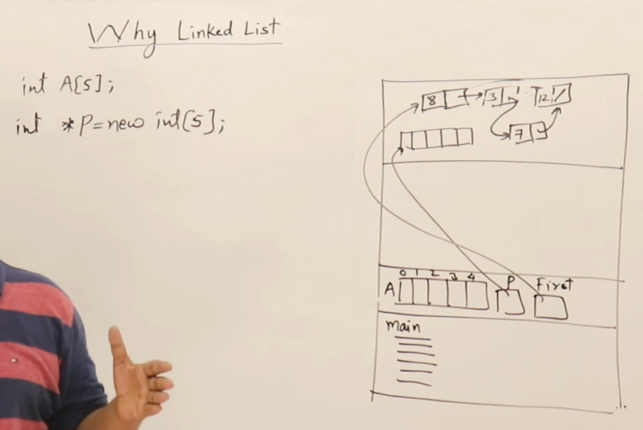

## Linklist
## Why we need Dynamic data structure



## About Linklist


## More about Linklist


## Display Linklist


## Recursive Display of link list


## Counting Nodes in link list


## Sum of all element in linklist


## Maximum element in linklist


## Searching in a linklist


## Inserting in linklist


## Creating Linklist using insert


## Inserting in a sorted Linked List

  
## Deleting from LinkList


## Why we need Dynamic data structure

### Introduction to Linked Lists

#### Why Do We Need Linked Lists?

##### Problems with Arrays:

**Fixed Size:**
- When creating an array, we must specify its size at compile time.
- Cannot increase or decrease the size dynamically.
- If the size is underestimated, it may be insufficient.
- If overestimated, memory gets wasted.

**Runtime Uncertainty:**
- Users decide the number of elements dynamically during runtime.
- The programmer cannot predict the exact size beforehand.

### Difference Between Arrays and Linked Lists

#### Arrays:
- Can be created inside stack or heap.

**Stack Allocation:**
```cpp
int A[5];  // Fixed size array in stack
```
- Stored inside the activation record of the main function.

**Heap Allocation:**
```cpp
int *B;
B = new int[5];  // Dynamic allocation in heap
```
- Memory allocated dynamically at runtime.

**Contiguous Memory:**
- Array elements are stored side by side in memory.
- Can be accessed using an index.
- Provides random access to elements.

**Analogy for Arrays:**
- Imagine a bench with a fixed capacity.
- Once built, the number of seats cannot be changed.
- If fewer people sit, space is wasted; if more arrive, there's no room.

#### Linked Lists:
- Overcomes the limitation of fixed size in arrays.
- Can dynamically grow and shrink at runtime.
- Elements are stored in heap memory and linked using pointers.

**Structure of a Linked List Node:**
- Each node consists of:
    - Data (Value of the element)
    - Pointer (Address of the next node)
```cpp
struct Node {
    int data;  
    Node* next;  // Pointer to next node
};
```

**Analogy for Linked Lists:**
- Imagine people bringing their own chairs instead of sitting on a fixed bench.
- Each new person links their chair to the previous one, forming a chain.

### Advantages of Linked Lists:

**Dynamic Size:**
- No need to specify size beforehand.

**Efficient Insertions & Deletions:**
- Can insert/remove elements anywhere by updating pointers.
- Unlike arrays, shifting elements is not required.

**Insertion Example:**
- Create a new node.
- Adjust pointers to link it in the correct position.
- Example: Inserting 7 between 3 and 2
    - Before: 8 → 3 → 2
    - Insert 7: 8 → 3 → 7 → 2

**Deletion Example:**
- Update the previous node's pointer to skip the deleted node.
- Free memory of the removed node.
- Example: Deleting 3
    - Before: 8 → 3 → 2
    - After: 8 → 2

### Key Points:
- Arrays are fixed-size and require contiguous memory.
- Linked Lists are dynamic and flexible with memory allocation.
- Linked Lists allow efficient insertion and deletion compared to arrays.
- They are stored in the heap, and nodes are linked via pointers.

## About Linklist

### Introduction to Linked List
- A linked list is a collection of nodes.
- Each node contains:
  - Data
  - Pointer to the next node.
- The first node’s address is stored in a pointer called `head`.
- The nodes are not stored contiguously in memory; they are linked via pointers.

### Structure of a Node
- Each node has:
  - Data (can be of any type: int, float, etc.)
  - A pointer to the next node.
- Defined in C using struct:
  ```c
  struct Node {
      int data;
      struct Node* next;
  };
  ```
- It is a **self-referential structure** since it contains a pointer to a structure of the same type.

### Memory Allocation of Nodes
- Nodes are created dynamically in the heap using:
  ```c
  struct Node* newNode = (struct Node*)malloc(sizeof(struct Node));
  ```
  OR in C++:
  ```cpp
  Node* newNode = new Node;
  ```
- The `head` pointer stores the address of the first node.
- The size of a node depends on:
  - Integer data (typically 4 bytes)
  - Pointer (typically 4 bytes)
  - Total size of the node = 8 bytes (in a 32-bit system)

### Creating and Accessing a Node
- Assign data:
  ```c
  newNode->data = 10;
  ```
- Set next pointer to NULL:
  ```c
  newNode->next = NULL;
  ```
- Accessing elements:
  - Use `->` operator to access members of the struct.

### Characteristics of Linked List
- **Dynamic Memory Allocation**: Nodes are created at runtime.
- **Non-contiguous Storage**: Nodes can be anywhere in memory.
- **Efficient Insertion/Deletion**: No need to shift elements as in an array.
- **Requires Extra Memory**: Each node stores a pointer along with data.

### Key Points:
- Linked list is a powerful data structure used for dynamic memory management.
- The key concepts include defining nodes, creating nodes dynamically, and linking them together.
- Understanding pointers and memory allocation is essential for working with linked lists.

## More about Linklist

### Understanding Pointer Assignments
1. **Pointer Assignment:**
   - `Q = B;` → Assigns `B` to `Q`, so both point to the same node.
   - `Q = B->next;` → `Q` now points to the next node of `B`.
   - `B = B->next;` → Moves `B` to the next node.

### Moving to the Next Node
- `B = B->next;`
  - Updates `B` to point to the next node.
  - This statement is commonly used in linked list traversal.

### Null Assignments and Checking Pointers
1. **Setting a Pointer to NULL:**
   - `B = NULL;` or `B = 0;` → Marks `B` as not pointing to any node.

2. **Checking if a Pointer is NULL:**
   - `if (B == NULL)`: True if `B` does not point to any node.
   - `if (B == 0)`: Equivalent to the above.
   - `if (!B)`: A shorthand check if `B is NULL`.

3. **Checking if a Pointer is Not NULL:**
   - `if (B != NULL)`: True if `B` is pointing to a node.
   - `if (B != 0)`: Equivalent to the above.
   - `if (B)`: A shorthand check if `B is not NULL`.

### Checking the Last Node
1. **Checking if a Node is the Last Node:**
   - `if (B->next == NULL)`: True if `B` is the last node.

2. **Checking if a Node is Not the Last Node:**
   - `if (B->next != NULL)`: True if `B` has a next node.

### Key Points:
- Assigning pointers allows traversal through the linked list.
- Checking NULL conditions helps determine if a node exists.
- Moving to the next node (`B = B->next`) is fundamental for traversal.
- Checking `B->next == NULL` helps identify the last node.

## Display Linklist

### Traversing and Displaying a Linked List

1. **Introduction**
   - A linked list consists of nodes, each containing data and a pointer to the next node.
   - To display all elements, we need to traverse the linked list.

2. **Traversing a Linked List**
   - Definition: Visiting all nodes one by one.
   - Steps to Traverse:
     - Start from the first node (head of the list).
     - Use a temporary pointer (P) to avoid disturbing the original list.
     - Move to the next node using `P = P->next`.
     - Continue until the pointer becomes NULL.

3. **Using a Loop for Traversal**
   - Why a while loop?
     - The number of nodes is unknown, so a while loop is preferred over a for loop.
   - Termination Condition:
     - Continue while `P != NULL`.
     - Stop when `P == NULL`.
   ```c
   while (P != NULL) {
       P = P->next;  // Move to next node
   }
   ```

4. **Operations While Traversing**
   - Displaying all nodes
   - Counting nodes
   - Summing elements
   - Searching for an element
   - Other operations on linked lists

5. **Code to Display a Linked List**
   ```c
   void display(struct Node* P) {
       while (P != NULL) {
           printf("%d ", P->data);  // Print node data
           P = P->next;  // Move to next node
       }
   }
   ```
   - How it Works?
     - Prints data of the current node.
     - Moves to the next node.
     - Repeats until the list ends (NULL).

6. **Calling the Display Function**
   ```c
   display(first);  // Calling the function with the head node
   ```
   - `first` is the pointer to the first node.
   - This function will print all elements in the linked list.

7. **Key**
   - Traversing is key to working with linked lists.
   - A while loop ensures all nodes are visited.
   - Operations like printing, counting, searching, and summing can be performed during traversal.
