## Stack
## Introduction to STACK
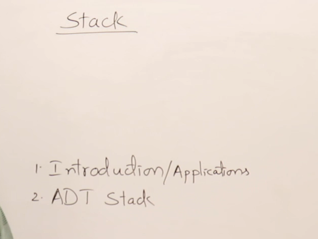
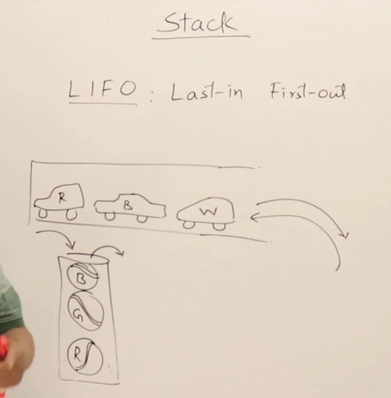
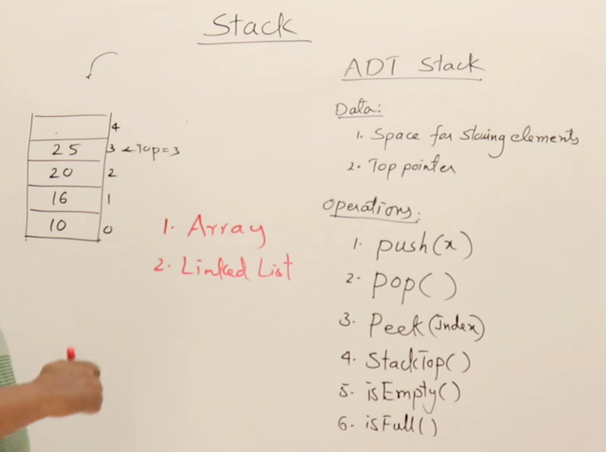

## Stack Using Array
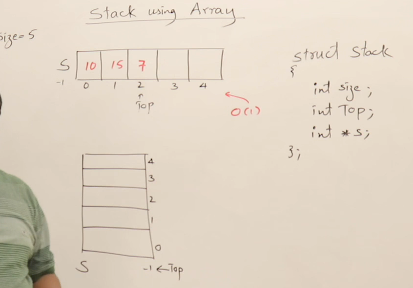
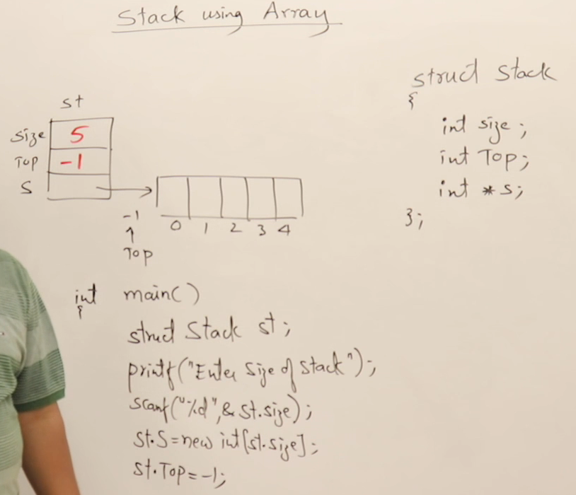
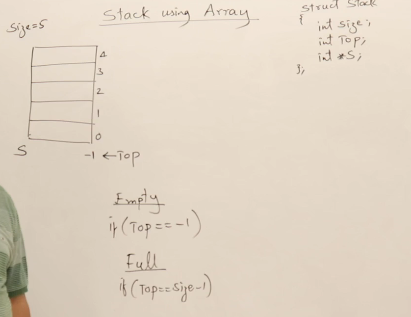

## Implementation of stask using Array
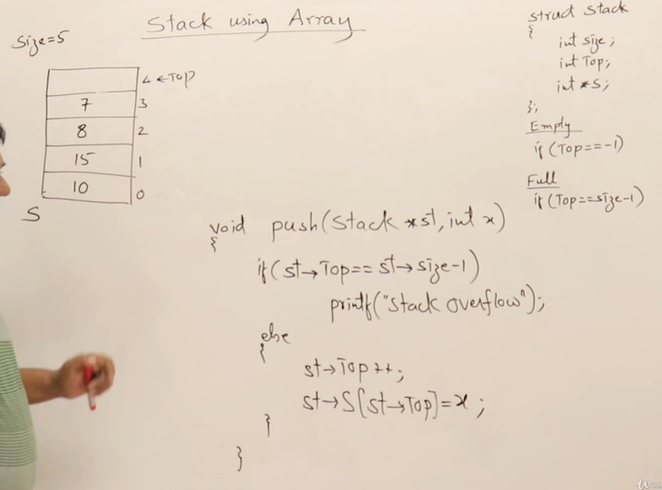
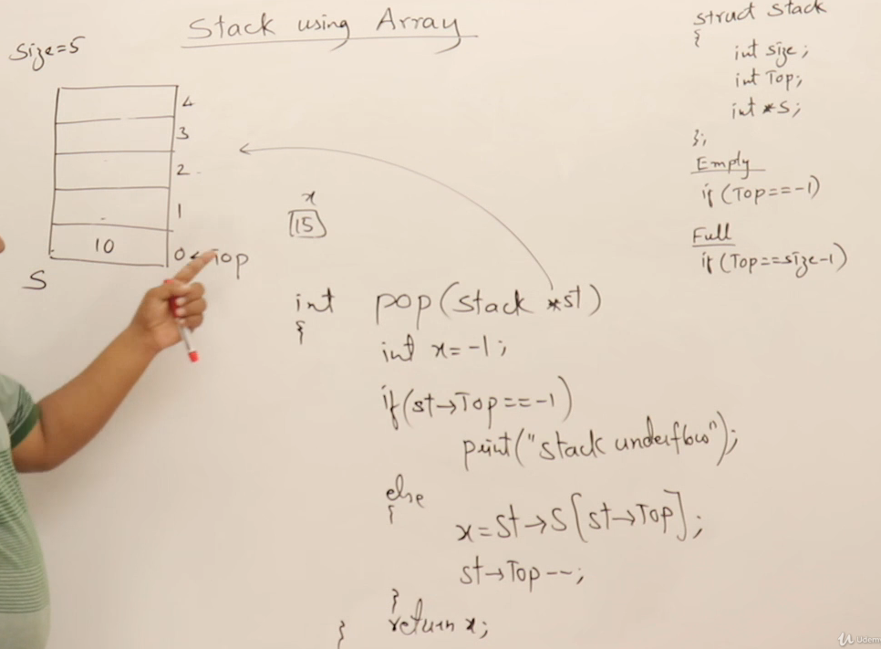
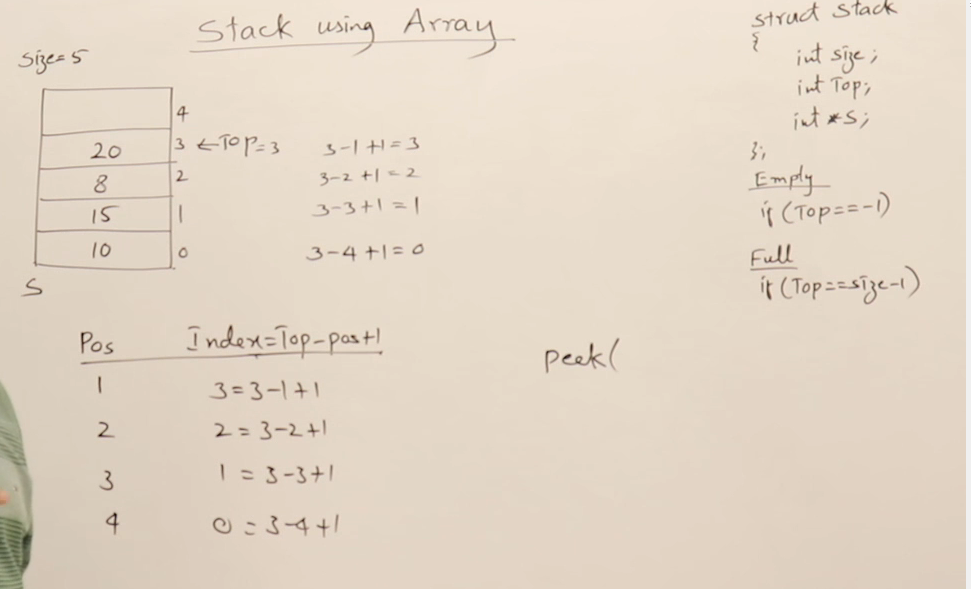
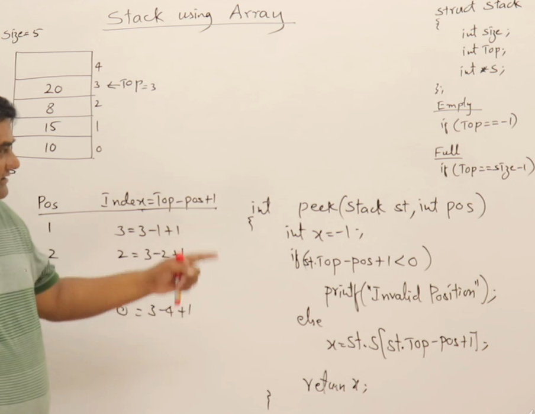
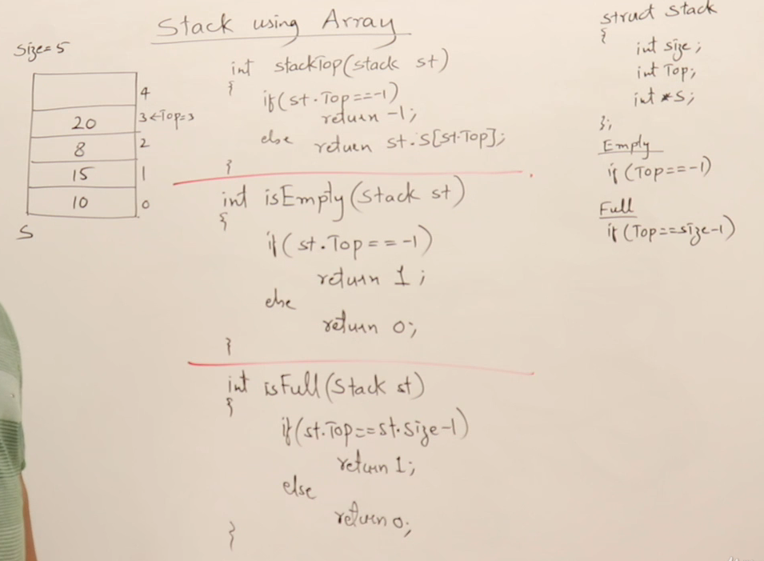

## STack Using LinkList
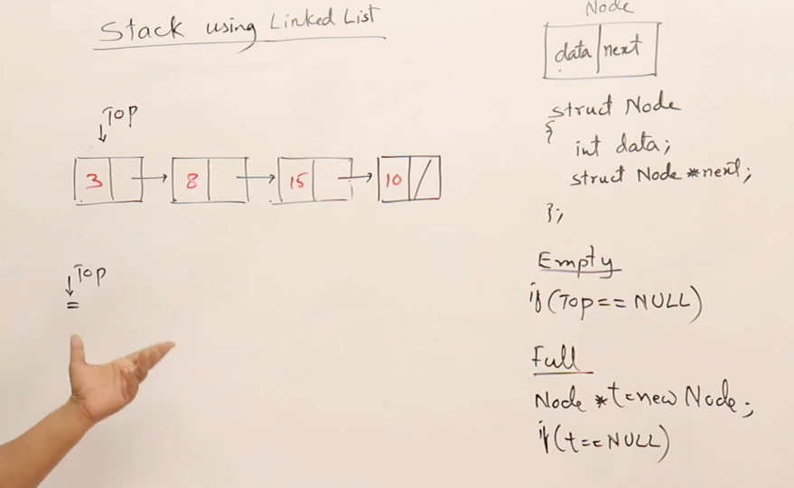

## Stack Operations using Linked List
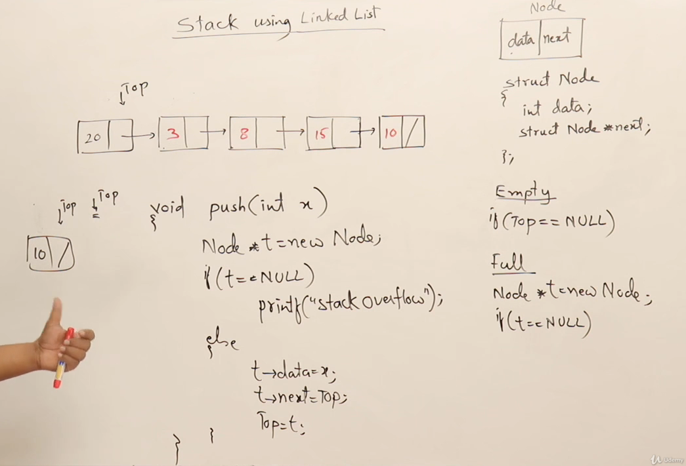

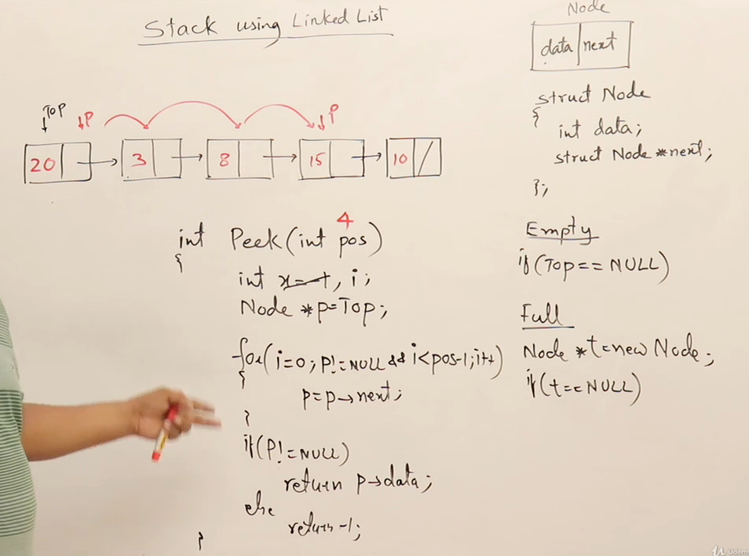
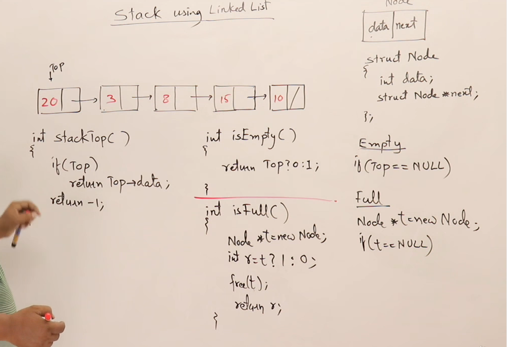

## Parenthesis Matching
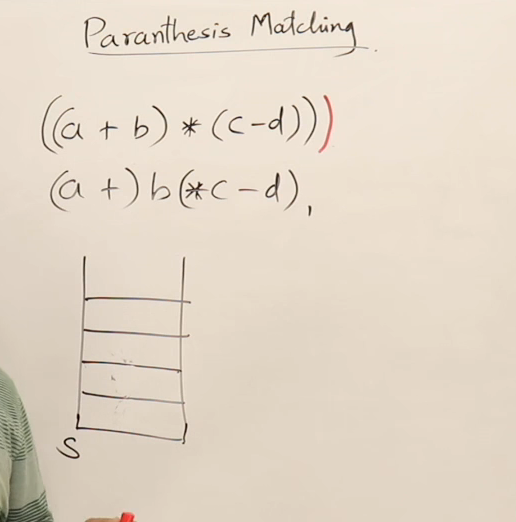

## Program for parentheisis matching
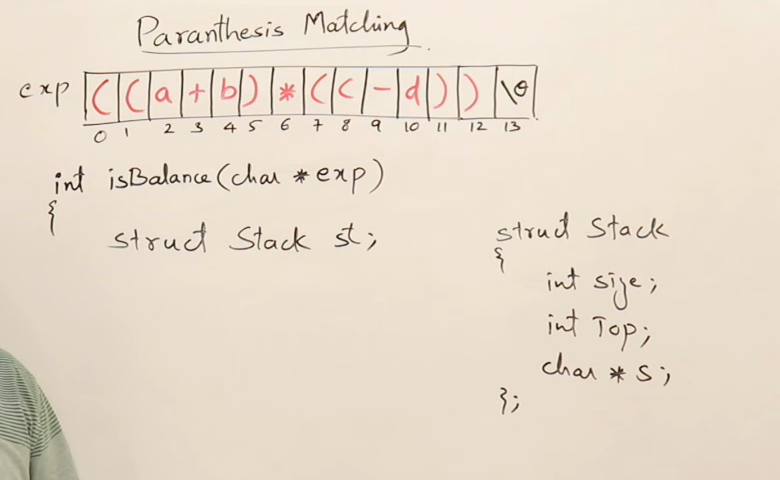
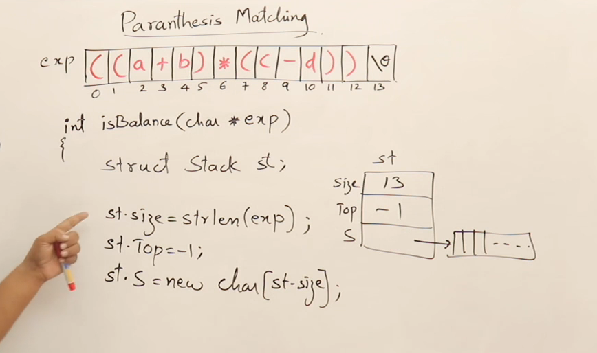
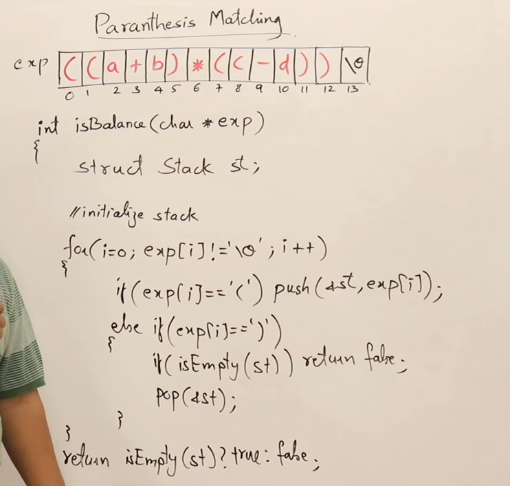