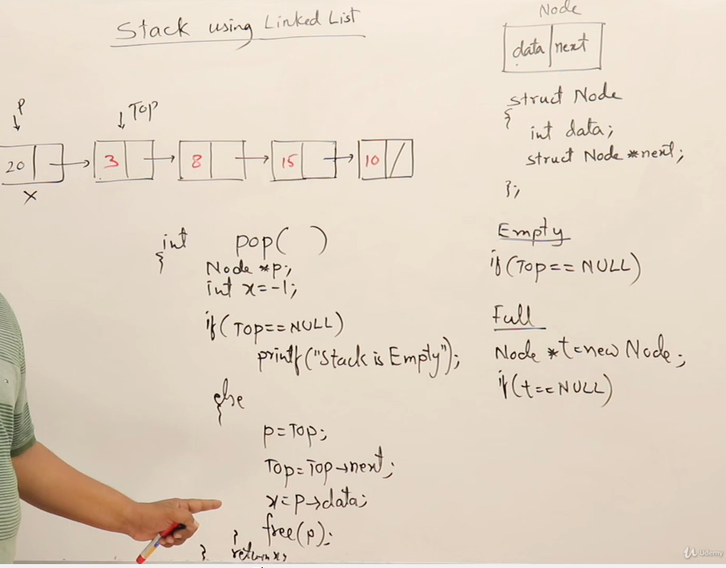
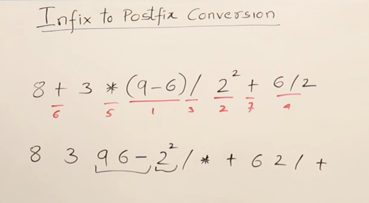
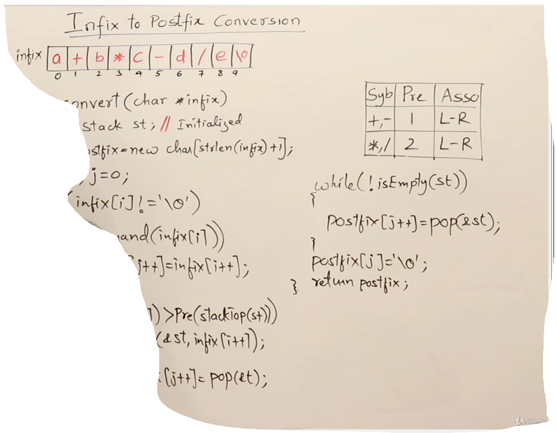

## Stack
## Introduction to STACK

## Stack Using Array

## Implementation of stask using Array

## STack Using LinkList

## Stack Operations using Linked List

## Parenthesis Matching

## Program for parentheisis matching

## More on Parenthesis matching

## Infix to postfix conversion

## Associativity and Unary Operators

## Infix to postfix Conversion

## Infix to postfix Conversion method 2

## Program to convert  Infix to postfix Conversion

## Infix to Postfix with Associativity and Parenthesis

## Evaluation of POSTFIX expression.

## Program for evaluation of postfix expression

