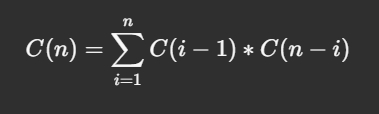
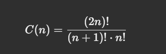

# Tree Data Structures

## 1. Introduction to Trees

A **tree** is a hierarchical data structure consisting of nodes connected by edges.

### Key Properties of Trees
- **Nodes**: Elements of the tree.
- **Edges**: Connections between nodes.
- **Root**: The topmost node of the tree.
- **Parent**: A node with child nodes.
- **Child**: A node that descends from a parent.
- **Siblings**: Nodes with the same parent.
- **Leaf Node**: A node without any children.
- **Internal Node**: A node with at least one child.
- **Degree of Node**: Number of children a node has.
- **Degree of Tree**: Maximum degree of any node in the tree.
- **Ancestors**: All nodes on the path from a node to the root.
- **Descendants**: All nodes reachable from a particular node.
- **Level**: Distance from the root (root is at level 1).
- **Height of Tree**: Length of the longest path from the root to a leaf node.
- **Forest**: A collection of disjoint trees.

### Example Tree Structure
```
        A (Root)
       /|\
      B C D
     / \   \
    E   F   G
       /
      H
```
- Root: A
- Parent of B: A
- Children of B: E, F
- Siblings of B: C, D
- Leaf Nodes: E, H, G
- Degree of B: 2
- Height: 3

## 2. Terminology

| Term             | Definition                                        |
|------------------|--------------------------------------------------|
| **Root**         | Top node of a tree.                              |
| **Parent**       | Node directly connected above a child.            |
| **Child**        | Node directly connected below a parent.           |
| **Siblings**     | Nodes sharing the same parent.                    |
| **Leaf Node**    | Node with no children.                            |
| **Internal Node**| Node with at least one child.                     |
| **Degree**       | Number of children a node has.                    |
| **Height**       | Longest path from the root to any leaf.           |
| **Depth/Level**  | Distance from the root to a node.                 |
| **Ancestors**    | Nodes along the path from a node to the root.     |
| **Descendants**  | Nodes reachable from a node.                      |
| **Subtree**      | Any tree formed from a node and its descendants.  |
| **Forest**       | Collection of disjoint trees.                     |

## 3. Binary Trees

A **binary tree** is a tree where each node has at most **two children**.

### Properties of Binary Trees
1. Each node has **0, 1, or 2** children.
2. Left child and right child are distinct.

### Example Binary Tree
```
         A
        / \
       B   C
      / \    \
     D   E    F
```

- Root: A
- Left child of A: B
- Right child of A: C
- Degree of B: 2
- Height: 3

### Types of Binary Trees
1. **Full Binary Tree**: Every node has **0 or 2** children.
2. **Complete Binary Tree**: All levels except the last are filled, and nodes are left-aligned.
3. **Perfect Binary Tree**: All internal nodes have **two** children, and all leaf nodes are at the same level.
4. **Skewed Binary Tree**: All nodes have only one child (either left-skewed or right-skewed).

### Example of Binary Tree Types
```
1. Full Binary Tree:
       A
      / \
     B   C
    / \    \
   D   E    F

2. Complete Binary Tree:
       A
      / \
     B   C
    / \
   D   E

3. Perfect Binary Tree:
       A
      / \
     B   C
    / \ / \
   D  E F  G

4. Left-Skewed Binary Tree:
       A
      /
     B
    /
   C
```

## 4. Applications of Trees
1. **Hierarchical Data Representation**: File systems, organization charts.
2. **Binary Search Trees (BST)**: Efficient searching and sorting.
3. **Expression Trees**: Represent arithmetic expressions.
4. **Decision Trees**: Used in machine learning for classification tasks.

---

# Number of Binary Trees for a Given Set of Nodes

## 1. Understanding the Problem
Given **n nodes**, the task is to find how many **unique Binary Search Trees (BSTs)** or **Binary Trees** can be constructed.

### Example:
For **n = 3**, the unique BSTs are:

```
    1         1          2          3        3
     \         \       / \        /        /
      2         3     1   3      1        2
       \       /                 \      /
        3     2                   2    1
```
Total: **5** unique BSTs.

## 2. Catalan Number Formula
The number of unique BSTs with `n` nodes is given by the **nth Catalan number**.

### Formula:


Or, in closed form:



## 3. Recursive Explanation
For each node chosen as the root:

- Left subtree has nodes from `1` to `i-1`
- Right subtree has nodes from `i+1` to `n`

Total number of BSTs for `n` nodes:


## 4. Dynamic Programming Approach
We can compute the number of BSTs using **Bottom-Up DP**.

### Pseudo-code:
```python
# Number of unique BSTs
n = 5
catalan = [0] * (n + 1)
catalan[0] = 1
catalan[1] = 1

for i in range(2, n + 1):
    for j in range(1, i + 1):
        catalan[i] += catalan[j - 1] * catalan[i - j]

print(catalan[n])
```

### Complexity Analysis
- **Time Complexity**: \(O(n^2)\) (Due to the nested loop).
- **Space Complexity**: \(O(n)\) (To store the Catalan array).

## 5. Examples and Outputs

| n  | Catalan Number | Binary Trees |
|----|----------------|--------------|
| 0  | 1              | 1            |
| 1  | 1              | 1            |
| 2  | 2              | 2            |
| 3  | 5              | 5            |
| 4  | 14             | 14           |
| 5  | 42             | 42           |

## 6. Visualizing the Process

For **n = 3**, the recursion unfolds as:

```
C(3) = C(0) * C(2) + C(1) * C(1) + C(2) * C(0)
     = 1 * 2 + 1 * 1 + 2 * 1
     = 5
```

### Recursive Tree Diagram

```
          C(3)
         / | \
      C(0) C(1) C(2)
        |    |    /  \
        1    1  C(0) C(1)
               |    |
               1    1
```

Each level breaks down the problem until reaching base cases `C(0)` and `C(1)`.

## 7. Applications of Catalan Numbers
- Counting BSTs.
- Parenthesizing expressions.
- Possible mountain ranges.
- Valid sequences of parentheses.

Understanding the **Catalan numbers** gives insight into many combinatorial structures beyond just binary trees.


# Understanding Binary Tree Height and Node Formulas

## 1. Introduction
In this topic, we discuss the relationship between the height of a binary tree and the number of nodes it can contain. We derive formulas for:
- Minimum and maximum number of nodes given a binary tree height.
- Minimum and maximum height given the number of nodes in a binary tree.

---

## 2. Definitions
- **Height (H)**: The length of the longest path from the root node to a leaf node. Height is measured from **0** (a single node tree has height 0).
- **Nodes (N)**: The total number of elements (vertices) in the tree.

---

## 3. Formulas for Nodes Given Height

### Minimum Number of Nodes
The minimum number of nodes occurs when the tree is a **skewed tree** (each node has only one child).

**Formula:**
\[ N_{min} = H + 1 \]

| Height (H) | Minimum Nodes (N) |
|------------|-------------------|
| 0          | 1                 |
| 1          | 2                 |
| 2          | 3                 |
| 3          | 4                 |

**Example:**
For height \( H = 3 \), minimum nodes \( N = 3 + 1 = 4 \).

```
      O
       \
        O
         \
          O
           \
            O
```

### Maximum Number of Nodes
The maximum number of nodes occurs when the tree is a **perfect binary tree** (all levels are completely filled).

**Formula:**
\[ N_{max} = 2^{H+1} - 1 \]

| Height (H) | Maximum Nodes (N) |
|------------|-------------------|
| 0          | 1                 |
| 1          | 3                 |
| 2          | 7                 |
| 3          | 15                |

**Example:**
For height \( H = 3 \),
\[
N = 2^{3+1} - 1 = 16 - 1 = 15
\]

```
          O
       /     \
      O       O
     / \     / \
    O   O   O   O
   / \ / \ / \ / \
  O  O O O O O O O
```

---

## 4. Formulas for Height Given Nodes

### Minimum Height
The minimum height occurs when the tree is a **perfect binary tree**.

**Formula:**
\[ H_{min} = \lfloor \log_2(N + 1) - 1 \rfloor \]

| Nodes (N)  | Minimum Height (H) |
|------------|--------------------|
| 1          | 0                  |
| 3          | 1                  |
| 7          | 2                  |
| 15         | 3                  |

**Example:**
For \( N = 15 \),
\[
H = \log_2(15 + 1) - 1 = \log_2(16) - 1 = 4 - 1 = 3
\]

### Maximum Height
The maximum height occurs when the tree is a **skewed tree**.

**Formula:**
\[ H_{max} = N - 1 \]

| Nodes (N)  | Maximum Height (H) |
|------------|--------------------|
| 1          | 0                  |
| 3          | 2                  |
| 7          | 6                  |
| 15         | 14                 |

**Example:**
For \( N = 7 \),
\[
H = 7 - 1 = 6
\]

---

## 5. Summary of Key Formulas

| Condition                 | Formula                    |
|---------------------------|----------------------------|
| Minimum Nodes (N)         | \( H + 1 \)                |
| Maximum Nodes (N)         | \( 2^{H+1} - 1 \)          |
| Minimum Height (H)        | \( [ log_2(N + 1) - 1] \)  |
| Maximum Height (H)        | \( N - 1 \)                |

---

## 6. Practical Implications
Understanding these formulas helps in optimizing algorithms that work with binary trees, such as:
- **Binary Search Trees (BST)**: Performance depends on tree height.
- **Balanced Trees**: Aim to keep height minimal for faster operations.
- **Memory Usage**: Knowing node bounds helps with space estimation.

These concepts are fundamental for competitive programming, database indexing, and efficient data storage.

Here's a cleaned and organized summary of the transcript, including a diagram to illustrate the relationship between internal and external nodes in a binary tree.

---

## **Relationship Between Internal Nodes and External Nodes in a Binary Tree**

In this session, we explore how internal and external nodes relate in a binary tree and derive a general formula that holds true for all binary trees.

---

### **Key Definitions:**
1. **Internal Nodes:** Nodes with at least one child (Degree ≥ 1).  
2. **External Nodes (Leaves):** Nodes with no children (Degree = 0).  
3. **Degree of a Node:** The number of children a node has.  

---

### **Understanding the Degree of Nodes:**
We categorize nodes based on their degree:  

- **Degree 2:** Nodes with **two children** (full internal nodes).  
- **Degree 1:** Nodes with **one child** (partial internal nodes).  
- **Degree 0:** Nodes with **no children** (leaf nodes or external nodes).  

---

### **Example Breakdown:**

Consider the following binary tree:

```
        A
      /   \
     B     C
    / \   / \
   D   E F   G
          \
           H
```

In this tree:  

- **Degree 2 nodes:** A, B, C (3 nodes)  
- **Degree 1 nodes:** F (1 node)  
- **Degree 0 nodes (Leaves):** D, E, G, H (4 nodes)  

---

### **Observation and Formula:**

From analyzing multiple examples, we derive a consistent relationship:

\[
\text{Number of leaves (degree 0)} = \text{Number of full internal nodes (degree 2)} + 1
\]

In the example above:
- Degree 2 nodes = 3  
- Degree 0 nodes = 4  
- Formula holds: \( 4 = 3 + 1 \)  

---

### **Why Does This Relationship Hold?**

1. Each internal node (degree 2) contributes two children.  
2. A binary tree grows by adding leaves, which increases the count of external nodes.  
3. For every new internal node added, exactly **one new leaf** is created.  

Thus, the number of leaves is always **one more** than the number of full internal nodes.

In any binary tree:

\[
\text{Number of Leaves} = \text{Number of Full Internal Nodes} + 1
\]

This formula is a fundamental property of binary trees and holds true regardless of tree structure.

### 📚 **Strict Binary Trees (Proper Binary Trees)**

---

### 🔍 **Definition:**
A **Strict Binary Tree** (also called a **Proper Binary Tree**) is a type of binary tree where **every node** must have:
- **Exactly 0 children (leaf node)**, or
- **Exactly 2 children (internal node)**  

👉 **No node** can have exactly **1 child** in a strict binary tree.

---

### 🌳 **Examples of Strict and Non-Strict Binary Trees:**

1. ✅ **Strict Binary Tree:**
```
        A
      /   \
     B     C
    / \   / \
   D   E F   G
```
All nodes either have **0 or 2 children**.

---

2. ❌ **Non-Strict Binary Tree:**
```
        A
      /   
     B    
    / \  
   C   D  
```
Node **A** has only **1 child** (B), which **violates** the strict binary tree property.

---

### 📏 **Properties of a Strict Binary Tree:**

1. **Total Nodes Formula:**  
If there are \( n \) **internal nodes**, then the **total nodes** \( N \) in the tree is:

\[
N = 2n + 1
\]

2. **Leaf Nodes Formula:**  
In a strict binary tree, the number of **leaf nodes (L)** is related to the number of **internal nodes (I)**:

\[
L = I + 1
\]

3. **Height of the Tree (h):**  
A strict binary tree with height \( h \) will have:

\[
2h + 1 \text{ total levels.}
\]

4. **Minimum and Maximum Nodes:**
   - **Minimum nodes** (Perfect Tree): \( N = 2h + 1 \)
   - **Maximum nodes**: \( N = 2^{h+1} - 1 \)

---

### 📊 **Valid vs. Invalid Examples:**

| **Tree**                        | **Strict Binary Tree?** | **Reason**                      |
|----------------------------------|-------------------------|----------------------------------|
| `A → (B, C)`                    | ✅ Yes                  | Every node has 0 or 2 children. |
| `A → (B, NULL)`                 | ❌ No                   | Node **A** has **1** child.     |
| `A → (B, C)` → `(D, NULL)`      | ❌ No                   | Node **D** has **1** child.     |
| `A → (B, C)` → `(D, E)`         | ✅ Yes                  | All nodes have 0 or 2 children. |

---

### 📌 
1. A **Strict Binary Tree** requires **0 or 2 children** per node.  
2. **Leaf Nodes** \( L \) = **Internal Nodes** \( I \) + 1.  
3. Essential for algorithms like **tree traversal**, **height calculations**, and **balanced tree operations**.

